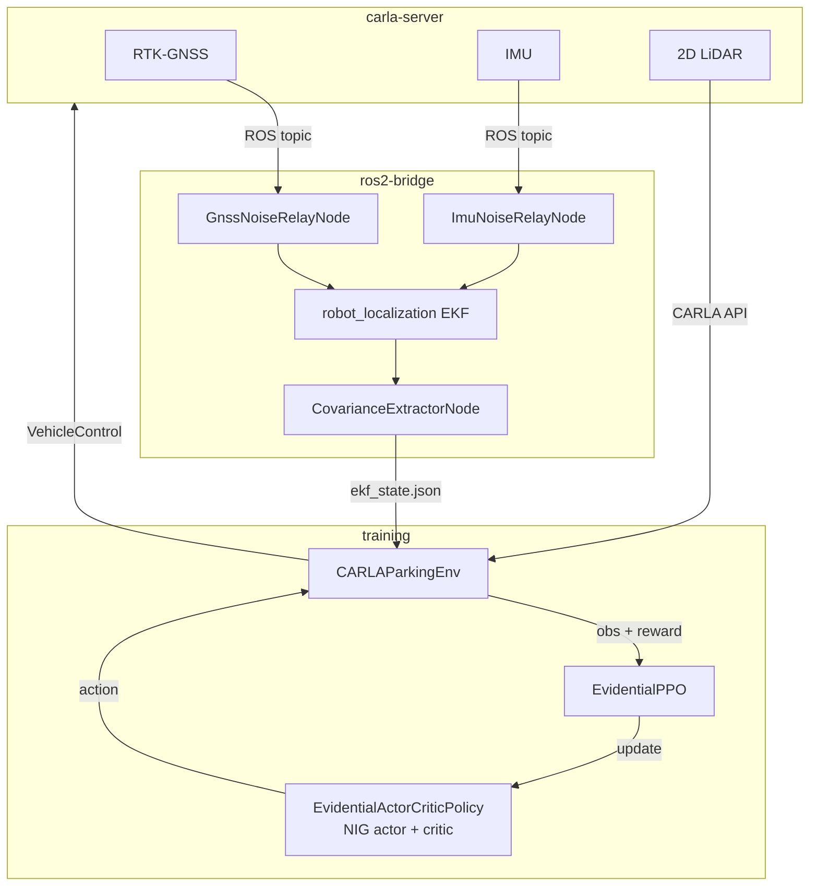

# Uncertainty-Conditioned RL with Evidential Policy Networks

> Propagating EKF localisation uncertainty through evidential deep learning policies
> for autonomous parking under degraded GNSS conditions.


MSc Artificial Intelligence dissertation by Antonio Galdes, September 2026.
**[Read the full document](docs/AntonioGaldes_Dissertation.pdf)**

---

## Overview

RL parking policies are usually developed on the assumption that localisation is
reliable. In operational parking areas, however, RTK-GNSS accuracy can fall silently
from centimetres to metres during a manoeuvre. The pose estimate remains available and
plausible throughout, so a vehicle with no channel to carry that change commits to the
manoeuvre regardless.

Two mechanisms are examined on a PPO [1] parking agent, one supplying uncertainty and
the other allowing the actor to use it. On the input side, an EKF [2] fusing RTK-GNSS
with an IMU passes its posterior covariance into the observation. On the output side,
that signal is consumed by an evidential Normal-Inverse-Gamma actor head [3], which
produces per-action epistemic and aleatoric estimates in a single forward pass. Training
runs in CARLA [4] under an always-on GNSS fix-state Markov chain, and the reward pays
for the outcome alone. Uncertainty is thus observed but never rewarded, so any
uncertainty-dependent behaviour must emerge on its own.

---

## Demonstrations

The evidential policy parking in CARLA, followed by a chase camera. The clip spans an
episode boundary, so the car sits parked, the episode resets, and a different target
bay is approached. Blue outlines mark the bays and green the episode's target.

<p align="center">
  
</p>

The 2D bird's-eye viewer. The GNSS fix state climbs back up the ladder as the car
closes on the bay, moving from degraded in red through standalone in orange and RTK
float in amber to RTK fixed in green. The chain is neighbour-only, so a recovery never
skips a rung.

<p align="center">
  
</p>

> The ring is the tier's **configured** 1-sigma GNSS noise, not the EKF's live
> covariance. Degraded injects zero-mean 5 m noise, but the fused estimate stays
> sub-metre most of the time, so the posterior separation between tiers is milder than
> the ring suggests.

---

## Results

A 2x2 factorial ablation switches each mechanism on and off independently. All four
arms share one architecture, one hyperparameter configuration and one curriculum. Each
was trained on three seeds and evaluated over 600 pooled episodes per condition.

<p align="center">
  
</p>

| Arm | Covariance in obs | Actor head | Success at anchor | Under GNSS drift |
|-----|-------------------|------------|-------------------|------------------|
| `vanilla_ppo` | No | Gaussian | 23.8% | 27.3% |
| `input_uncertainty` | Yes | Gaussian | 25.2% | 28.5% |
| `output_uncertainty` | No | Evidential NIG | 19.0% | 20.0% |
| **`full_method`** | **Yes** | **Evidential NIG** | **45.8%** | **52.5%** |

Supplying the covariance to the evidential actor raised parking success by **26.8 to
36.2 pp** across the three trainable conditions, more than doubling the rate of the
identical actor denied that input. Every bootstrap interval excludes zero. The same
input on a standard Gaussian head shifted success by between -2.7 and +1.3 pp, a range
including zero throughout. The effect is therefore a synergy rather than an additive
benefit of either part.

Median final position error is lowest under the full method in all three trainable
conditions, at 0.76 m, 0.41 m and 0.64 m.

**The behaviour was not rewarded.** No uncertainty term appears in the reward and no
slow-down is scripted, yet braking intensifies as the filter reports greater positional
uncertainty, at a Spearman correlation of +0.41 against +0.22 for the covariance-blind
arm. The covariance supplies the timing of the response and the evidential head
supplies its effort. Only the combination pays.

The contrast is positive in all nine matched-seed comparisons, at margins of +16.0 to
+59.0 pp, whereas the standard-head contrast varies in sign across seeds.

The full analysis, including the calibration of the filter covariance, the behavioural
breakdown and the bounds placed on these claims, is set out in
[the dissertation](docs/AntonioGaldes_Dissertation.pdf).

<p align="center">
  
</p>

Training follows a six-stage single-phase curriculum that widens one difficulty axis at
a time, progressing on budget rather than on performance. Twelve chains were run, being
four arms across three seeds, at ten million policy decisions each and roughly two
weeks of continuous GPU time.

---

## Contributions

1. Raw EKF covariance features as policy observations for ego-vehicle parking control,
   with the ablation establishing the benefit as causal and as conditional on an
   uncertainty-capable head.
2. An actor-side NIG evidential head on a continuous-control policy-gradient agent,
   with the variance-collapse pathology inherent to that placement diagnosed and
   mitigated.
3. Evidence that uncertainty-conditioned behaviour can be emergent, arising with no
   uncertainty term in the reward.
4. A characterisation of the conditions under which a single-head NIG actor separates
   its epistemic and aleatoric channels, and of why model-free RL does not supply them.
5. A reproducible evaluation asset, being a de-confounded four-condition sweep under
   controlled GNSS degradation with a fixed three-seed protocol.

---

## How it works



The observation is 13-dimensional at its maximum, comprising EKF speed and yaw rate,
three covariance features from the diagonal, the relative target bay pose in the ego
body frame, and five hemispheric LiDAR clearance features. The action is
`[steer, throttle, brake]` with no reverse gear, and the task is forward perpendicular
bay parking. CARLA ground truth is used for reward computation alone and is never
observable to the agent, which keeps the observation path identical between simulation
and a real vehicle. The evidential head is applied to the actor alone, not the critic.

PPO is trained through Stable-Baselines3 [5], and the filter is the `robot_localization`
implementation [2]. The ablation and seed protocol follow the reporting practice
recommended for RL comparisons [6].

---

## Repository map

```
uncertainty_rl/       Main package
  networks/             Evidential NIG policy, SB3 integration
  envs/                 CARLA Gymnasium parking environment, safety wrapper
  training/             PPO training loop, Optuna tuning
  evaluation/           Condition sweep, metrics (CSVs only, no figures)
  ros2/                 EKF bridge, GNSS and IMU noise relay nodes
  utils/                Constants, geometry, covariance features
configs/              YAML only, nothing hardcoded in source
scripts/              Layout generation, inspectors, visualiser, analysis
tests/                Unit and integration tiers
docs/                 Dissertation PDF, detailed notes, media
  detailed_notes/       Implementation notes keyed to dissertation sections
```

### What `docs/detailed_notes/` is

The dissertation is the canonical account of the design and its justification. The
detailed notes are the implementation layer beneath it: the index layouts, parameter
provenance, runtime configuration and code maps that a reader needs in order to work on
the source, but which would bloat the dissertation or an inline comment.

Each note names the dissertation section that owns its topic and records only what that
section leaves out, so the two are complements rather than copies. Where a note and the
dissertation ever disagree, the dissertation is correct and the note is stale. A per-file
index, with the canonical section for each, is in
[docs/detailed_notes/README.md](docs/detailed_notes/README.md).

---

## Getting started

```bash
make docker-build && make docker-up      # build and start the three-container stack
make docker-train STAGE=1 BASELINE=full_method
```

- **[SETUP.md](SETUP.md)** covers installation, the container architecture and the
  first run.
- **[USAGE.md](USAGE.md)** covers layout generation, the visualisers, configuration,
  the ablation study and the results layout.
- **[COMMANDS.md](COMMANDS.md)** is the complete Make target reference.

---

## Documentation

| Topic | README |
|-------|--------|
| Installation and first run | [SETUP.md](SETUP.md) |
| Day-to-day operation | [USAGE.md](USAGE.md) |
| All Make targets with variables and GPU requirements | [COMMANDS.md](COMMANDS.md) |
| Python package overview, subpackage map | [uncertainty_rl/README.md](uncertainty_rl/README.md) |
| Evidential NIG networks, actor head, loss design | [uncertainty_rl/networks/README.md](uncertainty_rl/networks/README.md) |
| Observation space, reward function, action space, env config | [uncertainty_rl/envs/README.md](uncertainty_rl/envs/README.md) |
| PPO training loop, Optuna tuning, callbacks | [uncertainty_rl/training/README.md](uncertainty_rl/training/README.md) |
| Evaluation conditions, metrics, result plots | [uncertainty_rl/evaluation/README.md](uncertainty_rl/evaluation/README.md) |
| Constants, covariance utilities, geometry helpers | [uncertainty_rl/utils/README.md](uncertainty_rl/utils/README.md) |
| ROS 2 nodes, EKF pipeline, topic names, launch files | [uncertainty_rl/ros2/README.md](uncertainty_rl/ros2/README.md) |
| Test suite structure, tiers, running tests | [tests/README.md](tests/README.md) |
| Scripts overview, all Make targets | [scripts/README.md](scripts/README.md) |
| Floor plan modules, LotBuilder DSL, coordinate frame | [scripts/layouts/README.md](scripts/layouts/README.md) |
| CARLA inspector modes, CLI flags | [scripts/inspect/README.md](scripts/inspect/README.md) |
| 2D visualiser, JSONL schema, Pygame controls | [scripts/visualise/README.md](scripts/visualise/README.md) |
| Sim deployment config files and their consumers | [configs/deployment/sim/README.md](configs/deployment/sim/README.md) |
| Detailed notes index, with the canonical dissertation section for each | [docs/detailed_notes/README.md](docs/detailed_notes/README.md) |
| LotBuilder DSL full reference | [scripts/layouts/BUILDER.md](scripts/layouts/BUILDER.md) |

---

## References

[1] J. Schulman, F. Wolski, P. Dhariwal, A. Radford, and O. Klimov, "Proximal policy
    optimization algorithms," 2017, arXiv:1707.06347. [Online]. Available:
    https://arxiv.org/abs/1707.06347

[2] T. Moore and D. Stouch, "A generalized extended Kalman filter implementation for the
    Robot Operating System," in *Intelligent Autonomous Systems 13 (IAS-13)*, vol. 302,
    Cham, Switzerland: Springer, 2015, pp. 335-348,
    doi: [10.1007/978-3-319-08338-4_25](https://doi.org/10.1007/978-3-319-08338-4_25).

[3] A. Amini, W. Schwarting, A. Soleimany, and D. Rus, "Deep evidential regression," in
    *Advances in Neural Information Processing Systems*, vol. 33, 2020, pp. 14927-14937.

[4] A. Dosovitskiy, G. Ros, F. Codevilla, A. Lopez, and V. Koltun, "CARLA: An open urban
    driving simulator," in *Proc. 1st Annual Conf. Robot Learning (CoRL)*, vol. 78,
    PMLR, 2017, pp. 1-16.

[5] A. Raffin, A. Hill, A. Gleave, A. Kanervisto, M. Ernestus, and N. Dormann,
    "Stable-Baselines3: Reliable reinforcement learning implementations," *Journal of
    Machine Learning Research*, vol. 22, no. 268, pp. 1-8, 2021. [Online]. Available:
    http://jmlr.org/papers/v22/20-1364.html

[6] P. Henderson, R. Islam, P. Bachman, J. Pineau, D. Precup, and D. Meger, "Deep
    reinforcement learning that matters," in *Proc. AAAI Conf. Artificial Intelligence*,
    2018, pp. 3207-3214,
    doi: [10.1609/aaai.v32i1.11694](https://doi.org/10.1609/aaai.v32i1.11694).

The full bibliography is in the dissertation,
[docs/AntonioGaldes_Dissertation.pdf](docs/AntonioGaldes_Dissertation.pdf).

---

## Citation

```bibtex
@mastersthesis{Galdes2026UncertaintyRL,
  author  = {Galdes, Antonio},
  title   = {Uncertainty-Conditioned Reinforcement Learning with Evidential Policy
             Networks for Autonomous Systems},
  school  = {University of Malta, Faculty of Information and Communication Technology},
  type    = {{MSc} dissertation},
  year    = {2026},
  month   = {September},
}
```

---

## Academic use

The code and the dissertation are provided for academic reference. Citation is
requested where either is drawn upon.
