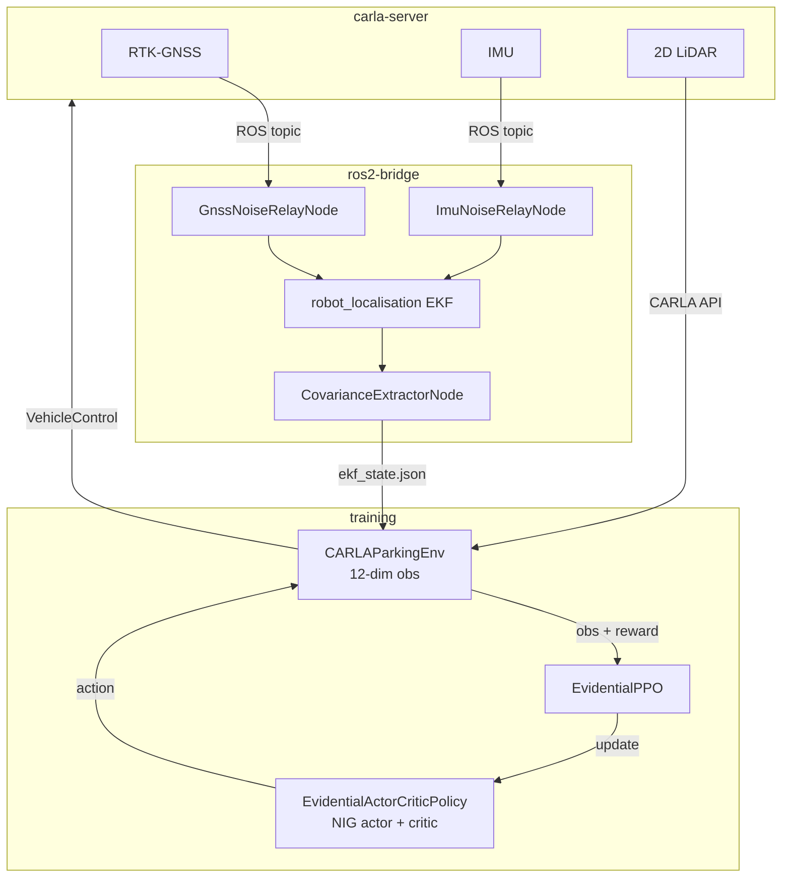
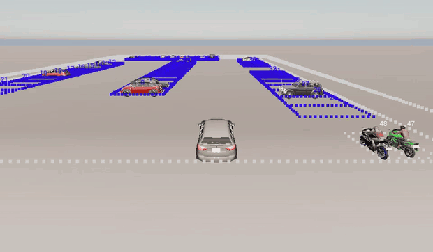

# Uncertainty-Conditioned RL with Evidential Policy Networks

> Propagating EKF localisation uncertainty through evidential deep learning policies
> for safer autonomous parking under degraded GNSS conditions.


---

## About This Project

The system trains a reinforcement learning agent to park an autonomous vehicle in a
known parking lot using RTK-GNSS, IMU, and 2D LiDAR. The lot geometry (bay positions,
perimeter, pedestrian zones) is known via a pre-computed layout YAML. What varies
is *how accurately the vehicle can localise itself within that known layout* - the
RTK-GNSS fix state drifts from centimetre-level (RTK fixed) to metre-level (standalone
or degraded), and the policy must respond accordingly.

Two layers of uncertainty are propagated through the policy:

- **Localisation uncertainty** - how confident is the EKF about where the vehicle is
  within the known lot layout? (from RTK-GNSS fix state via `robot_localisation`)
- **Policy uncertainty** - how confident is the actor about what action to take?
  (from the evidential NIG distribution)

Both are quantified online in a single forward pass using Normal-Inverse-Gamma (NIG)
evidential distributions, enabling principled safety handoffs when either layer
signals high uncertainty.

---

## System Overview



---

## Demos

<!-- gif:placeholder name="training_convergence" caption="PPO training convergence - episode reward and success rate over 1M steps" -->


<!-- gif:placeholder name="vis_2d" caption="Detachable 2D bird's-eye visualiser during a live training run" -->


<!-- gif:placeholder name="carla_3d" caption="3D CARLA spectator view - evidential policy navigating the rectangular lot" -->


---

## Installation

Everything runs inside Docker. You need Git, Docker Engine, Make, and the
NVIDIA Container Toolkit. No Python, CARLA, or ROS 2 installation on the host is required.

### 1 - Install Docker Engine (Ubuntu)

```bash
sudo apt update && sudo apt install -y make git curl
curl -fsSL https://get.docker.com | sh
sudo usermod -aG docker $USER && newgrp docker
```

### 2 - Install NVIDIA Container Toolkit

```bash
curl -fsSL https://nvidia.github.io/libnvidia-container/gpgkey \
  | sudo gpg --dearmor -o /usr/share/keyrings/nvidia-container-toolkit-keyring.gpg
curl -s -L https://nvidia.github.io/libnvidia-container/stable/deb/nvidia-container-toolkit.list \
  | sed 's#deb https://#deb [signed-by=/usr/share/keyrings/nvidia-container-toolkit-keyring.gpg] https://#g' \
  | sudo tee /etc/apt/sources.list.d/nvidia-container-toolkit.list
sudo apt update && sudo apt install -y nvidia-container-toolkit
sudo nvidia-ctk runtime configure --runtime=docker && sudo systemctl restart docker
```

Verify GPU passthrough:

```bash
docker run --rm --gpus all nvidia/cuda:12.0.0-base-ubuntu22.04 nvidia-smi
```

### 3 - Clone and Build

```bash
git clone <repo-url>
cd Uncertainty-Conditioned-RL-with-Evidential-Policy-Networks-for-Autonomous-Systems
make docker-build            # first build - bakes ROS 2 nodes into images (~15-20 min)
make docker-up               # start CARLA + ROS 2 + training stack
make docker-ps               # verify all three services are healthy
```

### Container Architecture

Three containers orchestrated via `docker-compose.yml`:

| Container | Image Base | Contents |
|-----------|-----------|----------|
| `carla-server` | CARLA 0.9.16 | Headless simulation with GPU passthrough |
| `ros2-bridge` | ROS 2 Jazzy | CARLA bridge, `robot_localisation` EKF, noise relay nodes |
| `training` | NGC PyTorch 24.10 | Stable-Baselines3, evidential networks, rclpy (Humble) |

Code directories are bind-mounted. Edits on the host reflect immediately inside containers.

### Host Python Setup

Two categories of command run on the host rather than inside Docker:

| Command | Why it runs on the host |
|---------|------------------------|
| `make visualise`, `make eval-visualise-2d` | Opens a Pygame window - Docker containers are headless |
| `make generate-layouts` | Writes layout PNGs via Matplotlib - no CARLA or GPU needed |

All of these use the project's `.venv/` virtual environment, which the Makefile manages automatically:

```bash
make install   # one-time setup: creates .venv/ and installs the package + dev dependencies
```

---

## Quick Start

```bash
# 1. Start the full stack
make docker-up

# 2. Run training (1M steps)
make docker-train

# 3. Attach the 2D visualiser at any time (host terminal, non-blocking)
make visualise

# 4. Run evaluation across all 9 uncertainty conditions
make docker-eval

# 5. Stop when done
make docker-down
```

---

## Architecture

```
Uncertainty-Conditioned-RL.../
|
|-- uncertainty_rl/                    Main Python package
|   |
|   |-- networks/                      Evidential deep learning policy
|   |   |-- evidential_policy.py       EvidentialLayer, EvidentialPolicyNetwork,
|   |   |                              UncertaintyConditionedActor
|   |   +-- sb3_integration.py         EvidentialDistribution,
|   |                                  EvidentialActorCriticPolicy, EvidentialPPO
|   |
|   |-- envs/                          Gymnasium environments
|   |   |-- sim/carla_parking.py       CARLAParkingEnv (12-dim obs, 2-dim action)
|   |   |-- real/deployment_utils.py   RealWorldDeployment
|   |   |-- real/inference_loop.py     RealWorldInferenceLoop
|   |   |-- _parking_core.py           Shared pure logic: obs build, reward,
|   |   |                              load_floor_plan, wait_for_ekf
|   |   +-- safety_wrapper.py          SafetyWrapper (uncertainty-gated actions)
|   |
|   |-- training/                      RL training pipeline
|   |   |-- train_ppo.py               PPO loop, config loading, callbacks
|   |   |-- tune_hyperparams.py        Optuna hyperparameter search
|   |   +-- Dockerfile                 NGC PyTorch 24.10 + SB3 + rclpy (Humble)
|   |
|   |-- evaluation/                    Condition-sweep evaluation
|   |   +-- evaluate.py                EvaluationMetrics, evaluate_agent,
|   |                                  evaluate_across_conditions,
|   |                                  plot_evaluation_results
|   |
|   |-- ros2/                          ROS 2 bridge to robot_localisation EKF
|   |   |-- uncertainty_rl_ros2/
|   |   |   |-- covariance_extractor.py  CovarianceExtractorNode,
|   |   |   |                            CovarianceMonitorNode
|   |   |   +-- sensor_relay/
|   |   |       |-- gnss_noise_relay.py  GnssNoiseRelayNode
|   |   |       +-- imu_noise_relay.py   ImuNoiseRelayNode
|   |   +-- Dockerfile                 ROS 2 Jazzy + CARLA bridge +
|   |                                  robot_localisation
|   |
|   +-- utils/                         Shared utilities (no CARLA or ROS 2 deps)
|       |-- constants.py               VEHICLE_STATE_DIM=1, ACTION_DIM=2, thresholds
|       |-- covariance_utils.py        extract_2d_covariance_features
|       |-- geometry.py                point_in_polygon, wrap_angle_symmetric,
|       |                              _compute_relative_target_pose
|       |-- logging.py                 DebugLogger (per-step structured output)
|       |-- visualisation.py           Matplotlib plots, VisStateWriter
|       +-- actuation_calibration.py   Real-vehicle gain / deadband / bias mapping
|
|-- configs/                           YAML only - nothing hardcoded in source
|   |-- train_config.yaml              PPO + evidential hyperparameters
|   |-- eval_config.yaml               9-condition evaluation sweep
|   |-- ros2_config.yaml               EKF topics and QoS settings
|   |-- deployment/sim/env_config.yaml CARLA env, sensors, GNSS noise profiles
|   |-- deployment/sensor_config.yaml  Physical sensor mounts and specs
|   |-- deployment/agent_config.yaml   include_covariance, safety thresholds
|   |-- layouts/                       Pre-computed lot YAMLs (do not edit by hand)
|   |-- baselines/                     4 ablation override configs (2x2 study)
|   +-- training/tuning_config.yaml    Optuna study settings and search bounds
|
|-- scripts/                           Offline tooling (never imported by training)
|   |-- layouts/                       Floor plan modules + generate_layouts.py
|   |-- inspect/                       CARLA debug overlay (lot_inspector.py)
|   |-- visualise/                     Detachable 2D Pygame viewer + demo driver
|   +-- colours/                       Shared visualisation colour palette
|
|-- tests/                             pytest suite - unit and integration tiers
|-- documentation/                     Technical notes
+-- docker-compose.yml                 Three-container stack orchestration
```

---

## Layout Generation

Parking lot geometry (bay positions, perimeter corners, pedestrian zones, patrol paths)
is pre-computed offline and stored in `configs/layouts/`.

### Generate YAMLs and PNGs (no CARLA needed)

```bash
make generate-layouts                      # all layouts
make generate-layouts LAYOUT=rectangle     # single layout
```

Writes `configs/layouts/{rectangle,trapezoid,irregular_a}.yaml` and
`outputs/layouts/*.png`. Inspect the PNGs to confirm bay placement.

### Three Floor Plans

| Layout | Bays | OOD | Training use | Description |
|--------|------|-----|-------------|-------------|
| `rectangle` | 54 | No | Training + evaluation | Rectangular lot with 7 left-wall perp bays, centred heterogeneous cluster, 12 bottom perp, 7 bottom angled, 6 right-wall angled, 2 motorcycle bays. 3 spawns: left, bottom-centre, top-right. |
| `trapezoid` | 49 | No | Training + evaluation | Trapezoid lot (front=60 m, rear=40 m, depth=50 m). Two central perp clusters, angled perimeter bays, left-wall angled and perp groups. |
| `irregular_a` | 58 | Yes | OOD evaluation only | Irregular polygon lot (held out from training). |

### Verify Layout in CARLA

```bash
make docker-inspect INSPECT_LAYOUT=rectangle                     # Bird's Eye Inspection
make docker-inspect-sensors INSPECT_LAYOUT=rectangle             # Sensor Mount Inspection
```

> **Further reading:** [scripts/layouts/README.md](scripts/layouts/README.md) - floor plan module conventions, LotBuilder DSL, coordinate frame, adding a new layout.

---

## Visualisation

### 2D Bird's-Eye View (detachable, no training overhead)

Attach and detach the Pygame visualiser at any time without restarting training.
The env writes frames to `outputs/vis_history.jsonl` only when the visualiser is active.

```bash
make visualise           # open viewer (close window to detach - training unaffected)
make eval-visualise-2d   # load checkpoint + demo drive + 2D viewer
```

Shows: lot boundary, bay outlines (blue = perpendicular, yellow = angled, violet = parallel),
target bay (green), parked NPCs (orange), patrol NPC (red), pedestrians (magenta),
ego vehicle (cyan) with heading arrow and 50-step trail.

### 3D CARLA Spectator View

```bash
make docker-eval-visualise-3d                         # default checkpoint
make docker-eval-visualise-3d CHECKPOINT=path/to/model
```

### Live Inspect Modes

```bash
make docker-inspect-live INSPECT_SENSOR=lidar         # live LiDAR scan overlay
make docker-inspect-dryrun MANUAL=true                # drive manually through the lot
```

> **Further reading:** [scripts/visualise/README.md](scripts/visualise/README.md) - JSONL frame schema, Pygame controls, signal-file protocol.
> [scripts/inspect/README.md](scripts/inspect/README.md) - all inspector modes, CLI flags, Make targets.

---

## Configuration

All hyperparameters live in `configs/` YAML files - never hardcoded in source.

| File | Purpose | Key parameters |
|------|---------|---------------|
| `train_config.yaml` | PPO + evidential training | `learning_rate` (3e-4), `n_steps` (2048), `batch_size` (256), `net_arch` ([256,256]), `evidential.lambda_reg` (0.001), `total_timesteps` (1,000,000) |
| `eval_config.yaml` | 9-condition sweep | `eval_conditions`, `n_episodes` (100), `success_criteria` |
| `deployment/sim/env_config.yaml` | CARLA env settings | `max_steps` (1750), `success_dwell_steps` (5), `carla_sensors.*`, `gnss_noise_profiles` path |
| `deployment/agent_config.yaml` | Agent behaviour | `include_covariance`, `include_obstacle_obs`, safety thresholds |
| `deployment/sim/gnss_noise_profiles.yaml` | RTK fix-state tiers + Markov transition matrix | `rtk_fixed` (2 cm, 30%), `rtk_float` (36 cm, 30%), `standalone` (1.8 m, 25%), `degraded` (5 m, 15%) |
| `training/tuning_config.yaml` | Optuna search | `n_trials` (40), `timesteps_per_trial` (100,000), `eval_metric` (`env/success_rate`) |
| `baselines/*.yaml` | Ablation overrides | 4 configs for the 2x2 ablation study |

> **Further reading:** [configs/deployment/sim/README.md](configs/deployment/sim/README.md) - full breakdown of the sim config files and what consumes each key.

---

## Hyperparameter Tuning

```bash
# 1. Edit configs/training/tuning_config.yaml (n_trials, timesteps_per_trial, seed)
# 2. Run Optuna study
make docker-tune

# 3. Best params are automatically written to configs/train_config.yaml
# 4. Normal training now uses tuned values
make docker-train
```

> **Further reading:** [uncertainty_rl/training/README.md](uncertainty_rl/training/README.md) - full training pipeline, Optuna search space, callback descriptions.

---

## Ablation Study (2x2)

Four baselines controlled by `configs/baselines/` override files:

| Baseline | obs_dim | Policy | Uncertainty input | Policy output |
|----------|---------|--------|------------------|--------------|
| `vanilla_ppo` | 9 | Standard MLP | None | Gaussian |
| `input_uncertainty` | 12 | Standard MLP | EKF covariance | Gaussian |
| `output_uncertainty` | 9 | Evidential NIG | None | NIG |
| `full_method` | 12 | Evidential NIG | EKF covariance | NIG |


> **Further reading:** [uncertainty_rl/evaluation/README.md](uncertainty_rl/evaluation/README.md) - all 9 eval conditions, metrics definitions, output plots.

---

## Useful Commands Reference

| Command | Purpose | GPU? |
|---------|---------|------|
| `make docker-up` | Start all containers | Yes |
| `make docker-down` | Stop all containers | No |
| `make docker-train` | Full training run | Yes |
| `make docker-train-short` | 10k-step smoke test | Yes |
| `make docker-tune` | Optuna tuning | Yes |
| `make docker-eval` | Evaluation sweep | Yes |
| `make docker-shell` | Interactive shell in training container | Yes |
| `make docker-test-unit` | Run Unit tests | No |
| `make docker-verify` | All checks in container | No |
| `make generate-layouts` | Regenerate lot YAMLs + PNGs | No |
| `make visualise` | Live 2D bird's-eye viewer | No |
| `make verify` | Local lint + typecheck + sanity | No |

See [COMMANDS.md](COMMANDS.md) for the full reference, including accepted variables, and GPU requirements.

---

## Documentation

Each subpackage and script directory has its own README with deeper detail.

| Topic | README |
|-------|--------|
| Python package overview, subpackage map | [uncertainty_rl/README.md](uncertainty_rl/README.md) |
| Evidential NIG networks, dual-encoder actor, loss design | [uncertainty_rl/networks/README.md](uncertainty_rl/networks/README.md) |
| Observation space, reward function, action space, env config | [uncertainty_rl/envs/README.md](uncertainty_rl/envs/README.md) |
| PPO training loop, Optuna tuning, callbacks | [uncertainty_rl/training/README.md](uncertainty_rl/training/README.md) |
| Evaluation conditions, metrics, result plots | [uncertainty_rl/evaluation/README.md](uncertainty_rl/evaluation/README.md) |
| Constants, covariance utilities, geometry helpers | [uncertainty_rl/utils/README.md](uncertainty_rl/utils/README.md) |
| ROS 2 nodes, EKF pipeline, topic names, launch files | [uncertainty_rl/ros2/README.md](uncertainty_rl/ros2/README.md) |
| Test suite structure, tiers, running tests | [tests/README.md](tests/README.md) |
| Scripts overview, all Make targets | [scripts/README.md](scripts/README.md) |
| Floor plan modules, LotBuilder DSL, coordinate frame | [scripts/layouts/README.md](scripts/layouts/README.md) |
| CARLA inspector modes, CLI flags | [scripts/inspect/README.md](scripts/inspect/README.md) |
| 2D visualiser, JSONL schema, Pygame controls | [scripts/visualise/README.md](scripts/visualise/README.md) |
| Sim deployment config files and their consumers | [configs/deployment/sim/README.md](configs/deployment/sim/README.md) |
| Technical notes index (NIG init, obs space, EKF, layouts) | [docs/detailed_notes/README.md](docs/detailed_notes/README.md) |
| LotBuilder DSL full reference | [scripts/layouts/BUILDER.md](scripts/layouts/BUILDER.md) |
| All Make targets with variables and GPU requirements | [COMMANDS.md](COMMANDS.md) |
<!-- 
---

## Publications

- Dissertation thesis (2026, in preparation).
- Conference paper (TBC). -->

---

## Citation

If you use this work, please cite:

```bibtex
@mastersthesis{Galdes2026UncertaintyRL,
  author  = {Galdes, Antonio},
  title   = {Uncertainty-Conditioned Reinforcement Learning with Evidential Policy
             Networks for Autonomous Systems},
  school  = {University of Malta, Faculty of ICT},
  year    = {2026},
}
```

---

## Licence

TODO

---

## Acknowledgements

[CARLA](https://carla.org/) |
[Stable-Baselines3](https://stable-baselines3.readthedocs.io/) |
[Gymnasium](https://gymnasium.farama.org/) |
[ROS 2](https://docs.ros.org/) |
[robot_localization](https://docs.ros.org/en/jazzy/p/robot_localization/) |
[Evidential Deep Learning (Amini et al. 2020)](https://arxiv.org/abs/1910.02600)
