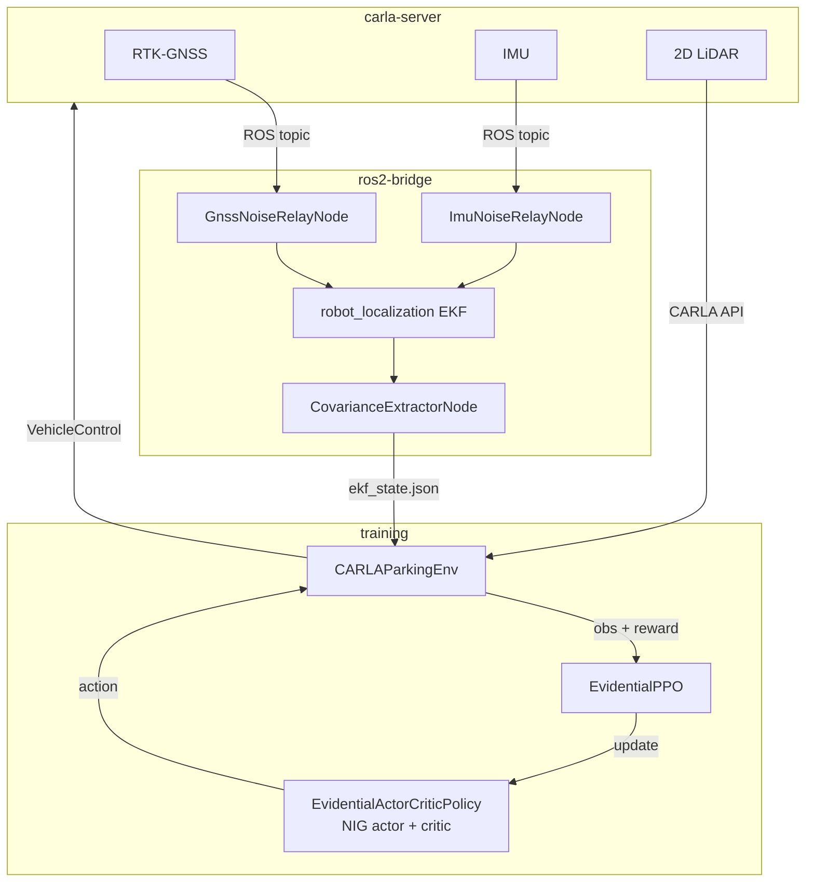

# Uncertainty-Conditioned RL with Evidential Policy Networks

> Propagating EKF localisation uncertainty through evidential deep learning policies
> for autonomous parking under degraded GNSS conditions.


MSc Artificial Intelligence dissertation by Antonio Galdes, September 2026.
**[Read the full document](docs/AntonioGaldes_Dissertation.pdf)**

---

## Overview

A parking policy depends on its position estimate, generated here by RTK-corrected GNSS
fused with an IMU through an EKF [2]. That accuracy is not constant. The position is
accurate to within 1 cm while the satellite solution holds, then only to within a
decimetre and afterwards a metre as that solution is lost. A policy trained on the
estimate alone receives no evidence of a decline along that hierarchy of fix states, so
the bay entry relies on a position that may be several metres inaccurate.

The remedy examined on a PPO [1] agent is a dual-layer uncertainty architecture. The
input layer incorporates localisation uncertainty into the observation as three pose
standard deviations taken from the EKF covariance diagonal. The output layer represents
uncertainty over the selected action through an evidential Normal-Inverse-Gamma head [3],
one forward pass producing a state-conditioned aleatoric variance together with an
epistemic estimate.

Both layers are trained together in CARLA [4] and are observed rather than rewarded, the
reward being based solely on outcomes, so any uncertainty-dependent behaviour must emerge
unprompted.

---

## Demonstrations

The recording below follows the evidential policy through two consecutive episodes from a
chase camera. The vehicle first comes to rest in its target bay, the episode is then
reset, and a second bay is approached. Bays are outlined in blue and the active target in
green.

<p align="center">
  
</p>

The second recording comes from a 2D bird's-eye viewer, documented in
[scripts/visualise/README.md](scripts/visualise/README.md). The GNSS fix state climbs
back up the hierarchy as the vehicle closes on the bay, passing from degraded in red
through standalone in orange and RTK float in amber to RTK fixed in green. Transitions
are permitted only between neighbouring tiers, so a recovery never skips a rung.

The conditioned behaviour is legible in the telemetry beneath the lot. Under the degraded
tier the vehicle brakes and holds station rather than commit to a bay it cannot locate,
and the approach is resumed once the fix recovers to float and then fixed. No such
withholding is scripted anywhere in the reward, as noted under [Results](#results).

<p align="center">
  
</p>

> The ring is the tier's **configured** 1-sigma GNSS noise, not the EKF's live
> covariance. Degraded injects zero-mean 5 m noise, but the fused estimate stays
> sub-metre most of the time, so the posterior separation between tiers is milder than
> the ring suggests.

---

## Results

Each mechanism is switched on and off independently in a 2x2 factorial ablation. One
architecture, one hyperparameter configuration and one curriculum are shared by all four
arms, every one of them trained on three seeds and evaluated over 600 pooled episodes per
condition. The conditions themselves are set out in
[uncertainty_rl/evaluation/README.md](uncertainty_rl/evaluation/README.md).

<p align="center">
  
</p>

| Arm | Covariance in obs | Actor head | Success at anchor | Under GNSS drift |
|-----|-------------------|------------|-------------------|------------------|
| `vanilla_ppo` | No | Gaussian | 23.8% | 27.3% |
| `input_uncertainty` | Yes | Gaussian | 25.2% | 28.5% |
| `output_uncertainty` | No | Evidential NIG | 19.0% | 20.0% |
| **`full_method`** | **Yes** | **Evidential NIG** | **45.8%** | **52.5%** |

Incorporating the EKF covariance into the evidential actor enhanced parking success by
**26.8 to 36.2 pp** on the trained lot, and every seed favoured the covariance, with a
margin of +16.0 pp in the closest pairing. The same input, meanwhile, yielded no
measurable benefit on a standard Gaussian actor. The effect is therefore an interaction
between the two mechanisms rather than an additive benefit of either part taken alone.

**The behaviour was not rewarded.** No uncertainty term appears in the reward and no
slow-down is scripted, yet braking is observed to intensify as the filter reports greater
positional uncertainty. The timing of the response is supplied by the covariance and its
effort by the evidential head, neither part paying in isolation.

The uncertainty the same head reports over its own actions proves less tractable than the
uncertainty supplied to it, the epistemic and aleatoric estimates remaining inseparable in
practice under model-free reinforcement learning. The cause is attributed to the
construction of the head rather than to the conditions of evaluation.

The full analysis, including the calibration of the filter covariance, the behavioural
breakdown and the bounds placed on these claims, is set out in
[the dissertation](docs/AntonioGaldes_Dissertation.pdf).

<p align="center">
  
</p>

Training follows a six-stage single-phase curriculum in which one difficulty axis is
widened at a time, progression being scheduled on budget rather than gated on measured
performance. Twelve chains were run, being four arms across three seeds, at ten million
policy decisions each and roughly two weeks of continuous GPU time. The per-stage
settings are given in
[configs/deployment/sim/curriculum/README.md](configs/deployment/sim/curriculum/README.md).

---

## Contributions

1. Raw EKF covariance features as policy observations for ego-vehicle parking control,
   with the ablation establishing the benefit as causal and as conditional on an
   uncertainty-capable head.
2. An actor-side NIG evidential head on a continuous-control policy-gradient agent,
   with the variance-collapse pathology inherent to that placement diagnosed and
   mitigated.
3. Evidence that uncertainty-conditioned behaviour can be emergent, arising with no
   uncertainty term in the reward.
4. A characterisation of the conditions required for a single-head NIG actor to separate
   its epistemic and aleatoric channels, together with an account of the reason
   model-free RL does not supply them.
5. A reproducible evaluation asset, being a de-confounded four-condition sweep under
   controlled GNSS degradation with a fixed three-seed protocol.

---

## System Architecture



The observation is 13-dimensional at its maximum, comprising EKF speed and yaw rate,
three covariance features taken from the diagonal, the relative target bay pose in the
ego body frame, and five hemispheric LiDAR clearance features. The action is
`[steer, throttle, brake]` with no reverse gear, the task being forward perpendicular
bay parking. CARLA ground truth is reserved for reward computation and is never made
observable to the agent, so the observation path is identical in simulation and on a
real vehicle. The evidential head is applied to the actor alone and not to the critic.
Both spaces are specified in full in
[uncertainty_rl/envs/README.md](uncertainty_rl/envs/README.md).

PPO is trained through Stable-Baselines3 [5], and the filter is the `robot_localization`
implementation [2]. The ablation and seed protocol follow the reporting practice
recommended for RL comparisons [6]. EKF state is passed from the bridge to the training
container through a shared JSON file rather than over DDS, a decision explained in
[uncertainty_rl/ros2/README.md](uncertainty_rl/ros2/README.md).

---

## Repository map

```
uncertainty_rl/       Main package
  networks/             Evidential NIG policy, SB3 integration
  envs/                 CARLA Gymnasium parking environment, safety wrapper
  training/             PPO training loop, Optuna tuning
  evaluation/           Condition sweep, metrics (CSVs only, no figures)
  ros2/                 EKF bridge, GNSS and IMU noise relay nodes
  utils/                Constants, geometry, covariance features
configs/              YAML only, nothing hardcoded in source
scripts/              Layout generation, inspectors, visualiser, analysis
tests/                Unit and integration tiers
docs/                 Dissertation PDF, detailed notes, media
  detailed_notes/       Implementation notes keyed to dissertation sections
```

### The role of `docs/detailed_notes/`

The canonical account of the design and its justification is the dissertation. Beneath it
sit the detailed notes, forming the implementation layer: index layouts, parameter
provenance, runtime configuration and code maps, all of them needed to work on the source
yet too granular for the dissertation or for an inline comment.

Each note names the dissertation section that owns its topic and records only the
remainder, so the two are complements rather than copies. Should a note and the
dissertation ever disagree, the dissertation is correct and the note is stale. A per-file
index, giving the canonical section for each, is in
[docs/detailed_notes/README.md](docs/detailed_notes/README.md).

---

## Getting started

```bash
make docker-build && make docker-up      # build the images and start the stack
make docker-train STAGE=1 BASELINE=full_method
```

Every workflow is driven through a Make target, the recipes setting the paths,
environment and container context each command depends upon. Three documents cover the
remainder:

- **[SETUP.md](SETUP.md)** for installation, the container architecture and the first
  run.
- **[USAGE.md](USAGE.md)** for layout generation, the visualisers, configuration, the
  ablation study and the results layout.
- **[COMMANDS.md](COMMANDS.md)** for the complete Make target reference.

---

## Documentation

| Topic | README |
|-------|--------|
| Installation and first run | [SETUP.md](SETUP.md) |
| Day-to-day operation | [USAGE.md](USAGE.md) |
| All Make targets with variables and GPU requirements | [COMMANDS.md](COMMANDS.md) |
| Python package overview, subpackage map | [uncertainty_rl/README.md](uncertainty_rl/README.md) |
| Evidential NIG networks, actor head, loss design | [uncertainty_rl/networks/README.md](uncertainty_rl/networks/README.md) |
| Observation space, reward function, action space, env config | [uncertainty_rl/envs/README.md](uncertainty_rl/envs/README.md) |
| PPO training loop, Optuna tuning, callbacks | [uncertainty_rl/training/README.md](uncertainty_rl/training/README.md) |
| Evaluation conditions, metrics, result plots | [uncertainty_rl/evaluation/README.md](uncertainty_rl/evaluation/README.md) |
| Constants, covariance utilities, geometry helpers | [uncertainty_rl/utils/README.md](uncertainty_rl/utils/README.md) |
| ROS 2 nodes, EKF pipeline, topic names, launch files | [uncertainty_rl/ros2/README.md](uncertainty_rl/ros2/README.md) |
| Test suite structure, tiers, running tests | [tests/README.md](tests/README.md) |
| Scripts overview, all Make targets | [scripts/README.md](scripts/README.md) |
| Floor plan modules, LotBuilder DSL, coordinate frame | [scripts/layouts/README.md](scripts/layouts/README.md) |
| CARLA inspector modes, CLI flags | [scripts/inspect/README.md](scripts/inspect/README.md) |
| 2D visualiser, JSONL schema, Pygame controls | [scripts/visualise/README.md](scripts/visualise/README.md) |
| GNSS chain and TensorBoard diagnostics, CLI flags | [scripts/diagnostics/README.md](scripts/diagnostics/README.md) |
| Sim deployment config files and their consumers | [configs/deployment/sim/README.md](configs/deployment/sim/README.md) |
| Detailed notes index, with the canonical dissertation section for each | [docs/detailed_notes/README.md](docs/detailed_notes/README.md) |
| LotBuilder DSL full reference | [scripts/layouts/BUILDER.md](scripts/layouts/BUILDER.md) |

---

## References

[1] J. Schulman, F. Wolski, P. Dhariwal, A. Radford, and O. Klimov, "Proximal policy
    optimization algorithms," 2017, arXiv:1707.06347. [Online]. Available:
    https://arxiv.org/abs/1707.06347

[2] T. Moore and D. Stouch, "A generalized extended Kalman filter implementation for the
    Robot Operating System," in *Intelligent Autonomous Systems 13 (IAS-13)*, vol. 302,
    Cham, Switzerland: Springer, 2015, pp. 335-348,
    doi: [10.1007/978-3-319-08338-4_25](https://doi.org/10.1007/978-3-319-08338-4_25).

[3] A. Amini, W. Schwarting, A. Soleimany, and D. Rus, "Deep evidential regression," in
    *Advances in Neural Information Processing Systems*, vol. 33, 2020, pp. 14927-14937.

[4] A. Dosovitskiy, G. Ros, F. Codevilla, A. Lopez, and V. Koltun, "CARLA: An open urban
    driving simulator," in *Proc. 1st Annual Conf. Robot Learning (CoRL)*, vol. 78,
    PMLR, 2017, pp. 1-16.

[5] A. Raffin, A. Hill, A. Gleave, A. Kanervisto, M. Ernestus, and N. Dormann,
    "Stable-Baselines3: Reliable reinforcement learning implementations," *Journal of
    Machine Learning Research*, vol. 22, no. 268, pp. 1-8, 2021. [Online]. Available:
    http://jmlr.org/papers/v22/20-1364.html

[6] P. Henderson, R. Islam, P. Bachman, J. Pineau, D. Precup, and D. Meger, "Deep
    reinforcement learning that matters," in *Proc. AAAI Conf. Artificial Intelligence*,
    2018, pp. 3207-3214,
    doi: [10.1609/aaai.v32i1.11694](https://doi.org/10.1609/aaai.v32i1.11694).

The full bibliography is in the dissertation,
[docs/AntonioGaldes_Dissertation.pdf](docs/AntonioGaldes_Dissertation.pdf).

---

## Citation

```bibtex
@mastersthesis{Galdes2026UncertaintyRL,
  author  = {Galdes, Antonio},
  title   = {Uncertainty-Conditioned Reinforcement Learning with Evidential Policy
             Networks for Autonomous Systems},
  school  = {University of Malta, Faculty of Information and Communication Technology},
  type    = {{MSc} dissertation},
  year    = {2026},
  month   = {September},
}
```

---

## Academic use

The code and the dissertation are provided for academic reference. Citation is
requested where either is drawn upon.
