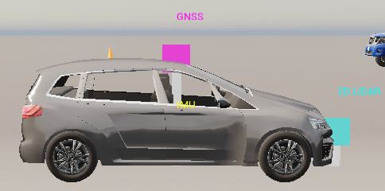

# Usage

Day-to-day operation of the stack. Installation is covered in [SETUP.md](SETUP.md),
and every Make target with its accepted variables in [COMMANDS.md](COMMANDS.md).

All workflows are driven through Make targets. `docker compose`, `pytest`, `python`,
`pip` and the linters are never invoked directly, since the targets set the paths,
environment and container context each command depends on.

---

## Layout Generation

Parking lot geometry, comprising bay positions, perimeter corners, pedestrian zones
and patrol paths, is pre-computed offline and stored in `configs/layouts/`. Neither
CARLA nor a GPU is required.

```bash
make generate-layouts                      # all layouts
make generate-layouts LAYOUT=rectangle     # single layout
```

The target writes `configs/layouts/{rectangle,trapezoid,irregular_a}.yaml` together
with `outputs/raw_derived/layouts/*.png`. The PNGs are inspected to confirm bay
placement.

### Three Floor Plans

| Layout | Bays | OOD | Training use | Description |
|--------|------|-----|-------------|-------------|
| `rectangle` | 47 perpendicular, 2 motorcycle | No | Training + evaluation | Rectangular lot, perpendicular bays across a centre row, top row, bottom rows, and left and right walls, plus two always-empty motorcycle bays in the corner. Three spawns give varied approach angles. |
| `trapezoid` | 39 | Yes | OOD evaluation only | Trapezoid lot, held out from training, with perpendicular bays in central clusters plus perimeter rows along the tapered walls. |
| `irregular_a` | 30 | Yes | OOD evaluation only | Five-sided irregular lot, held out from training, with perpendicular bays along the bottom, left, right, diagonal and top-flat walls. |

Bay counts are read from the generated `configs/layouts/*.yaml`. Regeneration through
`make generate-layouts` is required whenever a floor plan module changes.

The reported evaluation uses `irregular_a` as the out-of-distribution probe. Results on
it are given in the [root README](README.md#results).

### Verify Layout in CARLA

```bash
make docker-inspect INSPECT_LAYOUT=rectangle             # bird's-eye inspection
make docker-inspect-sensors INSPECT_LAYOUT=rectangle     # sensor mount inspection
```

> **Further reading:** [scripts/layouts/README.md](scripts/layouts/README.md) covers
> floor plan module conventions, the LotBuilder DSL, the coordinate frame and the
> procedure for adding a layout.

---

## Visualisation

### 2D Bird's-Eye View

The Pygame visualiser is detachable and imposes no training overhead. It may be
attached and detached at any time without restarting training, and the environment
writes frames to `outputs/vis_history.jsonl` only while it is active.

```bash
make visualise           # open viewer (closing the window detaches, training unaffected)
make eval-visualise-2d BASELINE=full_method CHECKPOINT=seed42_11062026-0628
```

Displayed are the lot boundary, bay outlines in blue for perpendicular bays and grey
for motorcycle bays, the target bay in green, parked NPCs in orange, the patrol NPC in
red, pedestrians in magenta, and the ego vehicle in cyan with a heading arrow and a
50-step trail.

### 3D CARLA Spectator View

```bash
make docker-eval-visualise-3d BASELINE=full_method CHECKPOINT=seed42_11062026-0628
```

### Live Inspect Modes

```bash
make docker-inspect-live INSPECT_SENSOR=lidar         # live LiDAR scan overlay
make docker-inspect-dryrun MANUAL=true                # drive manually through the lot
make docker-inspect-sensors SENSORS_VIEW=birds_eye INSPECT_ZOOM=close
```

The sensor inspector renders the GNSS and IMU mounts together with the LiDAR
field-of-view arc, which is the means by which mount geometry is checked against
`configs/deployment/sensor_config.yaml`.

<p align="center">
  
</p>

> **Further reading:** [scripts/visualise/README.md](scripts/visualise/README.md) for
> the JSONL frame schema, Pygame controls and signal-file protocol, and
> [scripts/inspect/README.md](scripts/inspect/README.md) for all inspector modes and
> their CLI flags.

---

## Configuration

Every tuneable hyperparameter lives in a `configs/` YAML file and none are hardcoded
in source. Structural constants, namely the observation and action dimensions and the
success thresholds, live in
[`uncertainty_rl/utils/constants.py`](uncertainty_rl/utils/constants.py).

Settings change as the project iterates. Rather than duplicate concrete values here,
where they would fall out of date at the next checkpoint, the table below names the
file that owns each setting. Live values are read from the YAML directly.

| File | What it owns |
|------|--------------|
| [`train_config.yaml`](configs/train_config.yaml) | PPO hyperparameters, evidential settings, training schedule |
| [`eval_config.yaml`](configs/eval_config.yaml) | Evaluation condition sweep |
| [`ros2_config.yaml`](configs/ros2_config.yaml) | EKF, GNSS relay and IMU relay node parameters |
| [`deployment/sim/env_config.yaml`](configs/deployment/sim/env_config.yaml) | CARLA environment: episode length, sensors, parking scenarios, curriculum overrides |
| [`deployment/agent_config.yaml`](configs/deployment/agent_config.yaml) | Observation flags and safety thresholds, shared between sim and real |
| [`deployment/sensor_config.yaml`](configs/deployment/sensor_config.yaml) | Physical sensor mounts and specifications, shared between sim and real |
| [`deployment/sim/gnss_noise_profiles.yaml`](configs/deployment/sim/gnss_noise_profiles.yaml) | RTK fix-state tiers and the Markov transition matrix |
| [`training/tuning_config.yaml`](configs/training/tuning_config.yaml) | Optuna study and search-space bounds |
| [`baselines/*.yaml`](configs/baselines/) | Override files for the 2x2 ablation study |

> **Further reading:** [configs/deployment/sim/README.md](configs/deployment/sim/README.md)
> gives a full breakdown of the sim config files and the consumer of each key.

---

## Ablation Study

Four arms are selected through the override files in `configs/baselines/`:

| Baseline | Covariance in observation | Actor head | Observation dim |
|----------|---------------------------|------------|-----------------|
| `vanilla_ppo` | No | Gaussian | 10 |
| `input_uncertainty` | Yes | Gaussian | 13 |
| `output_uncertainty` | No | Evidential NIG | 10 |
| `full_method` | Yes | Evidential NIG | 13 |

Observation dimensions are derived at runtime from `include_covariance` and
`include_obstacle_obs` through `compute_obs_dim()`. The full seed matrix is run with:

```bash
make run-seed-leg              # trains every arm and stage, then evaluates the final stage
make run-seed-leg DRY_RUN=1    # print the plan without running it
```

The seeds are set inside `scripts/training/run_seed_leg.sh`. The target is idempotent, so
completed work is skipped and a crashed leg resumes by re-running. It is long-running and
best started under `tmux`.

Reported results use seeds 42, 123 and 7, with 200 episodes per arm per condition per
seed, giving 600 pooled episodes per cell.

---

## Hyperparameter Tuning

```bash
# 1. Edit configs/training/tuning_config.yaml (n_trials, timesteps_per_trial, seed)
make docker-tune

# 2. Best parameters are written back to configs/train_config.yaml
make docker-train STAGE=1 BASELINE=full_method
```

> **No tuning was performed for the reported results.** A single committed
> configuration was applied identically to all four arms and all three seeds. Tuning
> per arm would have made the configuration a fifth experimental variable and
> confounded the ablation, at the acknowledged cost of ranking each arm at one
> operating point rather than at its best. The tuning pipeline is retained for future
> work. See
> [docs/detailed_notes/training/ablation_hpo_methodology.md](docs/detailed_notes/training/ablation_hpo_methodology.md).

---

## Results Layout

`outputs/` is gitignored and splits into three tiers according to how each artefact is
produced. Only `raw/` costs simulation time, and everything downstream of it
regenerates in minutes.

```
outputs/
|-- raw/                      Written ONLY by training and evaluation. CSVs, no figures.
|   |-- evaluation_results/     Per-run condition sweeps (make docker-eval)
|   |-- bay_successes/          Per-bay success tallies (training + eval)
|   +-- demo_traces/            Per-episode traces (make eval-visualise-2d)
|
|-- raw_derived/              Intermediate, regenerated from raw/ by scripts/analysis/
|   |-- cross_seed_analysis/    Pooled + per-seed robustness (make analyse-cross-seed)
|   |-- ablation_analysis/      Single-seed contrasts (make analyse-ablation)
|   |-- gate_analysis/          Single-seed gate ROC (make analyse-gate)
|   |-- training/               Seed-averaged curves (make training-curves)
|   |-- layouts/                Lot PNGs (make generate-layouts)
|   +-- per_run_figures/        Per-run diagnostic panels (make run-figures)
|
+-- main_analysis/            The deliverable. No duplicates of anything above.
    |-- figures/                Written directly by make figures
    |-- summaries/              Derived CSVs, recomputed from raw/ (make analysis-bundle)
    |-- values/                 The pooled CSVs those summaries are read from
    +-- MANIFEST.md             What each artefact is and where it came from
```

The boundary is enforced in code. No plotting library is imported by
`uncertainty_rl/evaluation/`, and the analysis modules under `scripts/analysis/` write
CSVs alone. Every figure originates in `scripts/analysis/figures/`, which is the single
rendering point.

Rebuilding everything downstream of a completed evaluation:

```bash
make analyse-cross-seed STAGE=6   # pooled CSVs
make training-curves              # TensorBoard scalars -> CSV
make figures                      # figures, into main_analysis/figures/
make analysis-bundle              # summaries + values + MANIFEST
```

Of the seven conditions defined in `configs/eval_config.yaml`, four are reported. The
two held-tier conditions are dropped by `drop_held_tiers()` because pinning a single
fix state for a whole episode is not ecologically representative of a fix state that
degrades mid-manoeuvre. The LiDAR condition is dropped by `drop_unreported()` because
LiDAR never enters the EKF, leaving the localisation standard deviation pinned at its
floor. Both filters live in `scripts/analysis/ablation.py`, where the reasoning is
documented alongside the code.

---

## Testing

```bash
make docker-test-unit         # unit tests, in the container, since torch lives there
make docker-test-integration  # requires the full stack
make verify                   # lint + typecheck + import, exactly what CI runs
```

CARLA and ROS 2 tests are marked `@pytest.mark.integration`. CI runs the CPU-only
checks on every push and pull request, with neither GPU nor Docker available to it.
