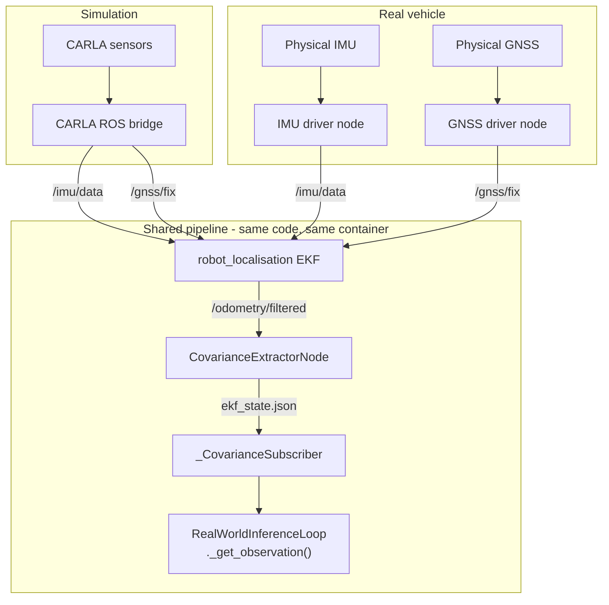

# Real-World Deployment

Notes on the sim-to-real transfer architecture: surveyed datum, EKF frame
calibration, actuation calibration, and the GNSS/IMU data flow on the
physical vehicle.

---

## Sensor data flow

On the real vehicle the data flow mirrors simulation exactly, with hardware
drivers replacing the CARLA ROS bridge:



`CovarianceExtractorNode` and `_CovarianceSubscriber` are unchanged between
sim and real. The only difference is what publishes `/imu/data` and `/gnss/fix`.

### GNSS driver

`GnssNoiseRelayNode` (ros2/) is the sim-side GNSS driver - it converts CARLA
sensor output to `sensor_msgs/NavSatFix`. On the real vehicle replace it with
the appropriate hardware driver:

- Standard ROS 2 drivers (`nmea_navsat_driver`, `ublox_ros`, etc.) publish
  `sensor_msgs/NavSatFix` natively - no custom code needed, just launch
  alongside `robot_localisation`.
- If the GPS provides raw lat/lon via serial or UDP, write a small node
  (~60-80 lines) that reads the hardware and publishes `sensor_msgs/NavSatFix`
  to `/gnss/fix`.

`robot_localisation`'s `navsat_transform_node` handles lat/lon to local-frame
projection - already configured in `ros2_config.yaml`.

### IMU driver

Any ROS 2 driver publishing `sensor_msgs/Imu` to `/imu/data` works. The EKF
configuration in `ros2_config.yaml` (`imu0_config`) expects orientation,
angular velocity, and linear acceleration.

---

## EKF frame calibration

The EKF runs in an odom frame that resets at node startup. The inference loop
must map this odom frame to the lot layout frame (the coordinate system used
in `configs/layouts/*.yaml`).

`calibrate_ekf_frame_offset()` in `envs/_parking_core.py` computes the
2D rigid body transform `(tx, ty, cos_r, sin_r, r)` such that:

```
world_x = cos_r * odom_x - sin_r * odom_y + tx
world_y = sin_r * odom_x + cos_r * odom_y + ty
world_yaw = odom_yaw + r
```

It works by:
1. Waiting for the EKF pose to converge (consecutive readings within
   `pos_stable_threshold` and `yaw_stable_threshold`).
2. Using a known reference point (`world_x`, `world_y`, `world_yaw`) and the
   current EKF odom reading to solve for the offset.

In simulation the reference point is the vehicle spawn position from the
layout YAML. On the real vehicle it is the surveyed datum point from
`real_world_datum.yaml` (`lot_x`, `lot_y`, `heading_deg`).

Note: `ekf_state.json` stores y in ROS REP-103 convention (y-left). The
inference loop and sim env both negate y before applying the transform to
match the lot layout frame (y-up / north).

---

## Surveyed datum (`real_world_datum.yaml`)

The datum is a physical marker at the test site whose position has been
measured in two frames:

- **UTM frame**: `utm_easting`, `utm_northing` (metres). Used to verify the
  measurement against a map; not consumed by code directly.
- **Lot layout frame**: `lot_x`, `lot_y` (metres), `heading_deg` (degrees).
  This is what `RealWorldDeployment.reference_pose()` returns and what
  `calibrate_ekf_frame_offset()` uses as its world reference.

**All values are unmeasured placeholders until a site survey is performed.**
Measure with a total station or GNSS RTK receiver relative to the lot layout
origin used when generating `configs/layouts/*.yaml`.

---

## Actuation calibration (`actuation_calibration.yaml`)

Physical actuators (steering rack and a bipolar drive channel) do not respond
linearly to normalised [-1, 1] policy outputs. The action space is 2-dimensional:
`[steering, drive]`, where drive is bipolar (positive engages forward throttle,
negative engages the friction brake; there is no reverse gear).
`ActuationCalibration` applies a per-channel affine map:

```
physical_cmd = gain * policy_output + bias
```

with an optional deadband region around zero where the output is clamped.

**All values are identity (uncalibrated) until a calibration run is
performed.** Procedure: command a sweep of policy outputs, measure the
physical response (encoder counts, IMU, video), fit gain/bias/deadband per
channel.

`RealWorldDeployment.calibrate_action(steering, drive)` applies the
calibration and returns the calibrated `(steering, drive)` pair. It returns
the inputs unchanged if the calibration file is absent or set to identity.

---

## Files

| File | Purpose |
|------|---------|
| `uncertainty_rl/envs/real/deployment_utils.py` | `RealWorldDeployment`: datum loading, target bay lookup, actuation calibration |
| `uncertainty_rl/envs/real/inference_loop.py` | `RealWorldInferenceLoop`: full inference loop with `@todo(AG)` stubs for vehicle interface |
| `configs/deployment/real/real_world_datum.yaml` | Surveyed datum (unmeasured placeholders) |
| `configs/deployment/real/actuation_calibration.yaml` | Actuator calibration (identity placeholders) |
| `configs/deployment/real/mission.yaml` | Target bay ID and layout file for one deployment mission |
| `uncertainty_rl/envs/_parking_core.py` | `calibrate_ekf_frame_offset()`, `build_observation()`, `extract_obstacle_features()` |
| `uncertainty_rl/envs/covariance_subscriber.py` | `_CovarianceSubscriber`: file-based EKF state reader |
