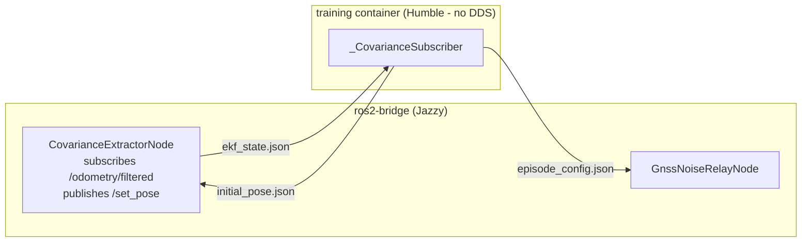

# ros2_architecture

Extracted from `uncertainty_rl/envs/covariance_subscriber.py` and `uncertainty_rl/ros2/`.

## DDS-bypass via shared JSON files

The training container uses ROS 2 Humble (Ubuntu 22.04 NGC base). The ros2-bridge
container uses ROS 2 Jazzy (Ubuntu 24.04). These are different DDS domains - direct
topic subscription across distros would require careful QoS negotiation and can silently
fail. The chosen design avoids DDS entirely at the Python training boundary:



All three files live on a Docker shared volume (`outputs/`) mounted read-write in both
containers. The shared volume is a tmpfs-backed bind mount - read latency is negligible
compared to the 20 Hz EKF publish rate.

## Atomicity

All writes use `tempfile + os.replace`:
```python
with open(tmp_path, "w") as f:
    json.dump(data, f)
os.replace(str(tmp_path), str(target_path))
```
`os.replace` is atomic on POSIX (rename syscall). The reader never sees a partial write.

## Sequence-number guard (stale-data prevention)

Every JSON file includes a monotonically increasing `seq` field. `_CovarianceSubscriber`
records `_valid_after_seq` at each episode reset (`invalidate()`) and only accepts
files with `seq > _valid_after_seq`. This prevents the training loop from consuming
an EKF state written before the episode reset, even if the file has not yet been
overwritten when the loop checks it.

This is more reliable than `mtime`-based guards: Docker container clocks can differ
by up to a few milliseconds on some host configurations, causing `mtime` comparisons
to give false-positives (accepting a stale file as fresh).

## File paths (configurable)

Default paths (single-worker):
- `ekf_state.json` - `/workspace/outputs/ekf_state.json`
- `initial_pose.json` - `/workspace/outputs/initial_pose.json`
- `episode_config.json` - `/workspace/outputs/episode_config.json`

Per-worker paths for parallel training (multi-worker):
- Set via `ros2_config["ekf_state_file"]` in train_config.yaml, or
- `EKF_STATE_FILE` / `INITIAL_POSE_FILE` / `EPISODE_CONFIG_FILE` environment variables
  (set per container in `docker-compose.env_workers.yml`).

## Per-file semantics

| File | Written by | Read by | Purpose |
|------|-----------|---------|---------|
| `ekf_state.json` | CovarianceExtractorNode (~20 Hz) | _CovarianceSubscriber (per step) | EKF pose + covariance for observation |
| `initial_pose.json` | _CovarianceSubscriber (per episode reset) | CovarianceExtractorNode | Signal spawn pose for /set_pose |
| `episode_config.json` | _CovarianceSubscriber (per episode reset) | GnssNoiseRelayNode, ImuNoiseRelayNode | Signal per-episode noise parameters + datum |

## COG heading derivation (GnssNoiseRelayNode)

Course Over Ground (COG) heading is derived entirely from successive noisy GNSS
positions - no CARLA ground truth or API calls. The heading is forward-only:
no reverse-motion disambiguation is performed, which is consistent with the
forward-only action space (no reverse gear).

Heading variance is the error propagation of `atan2(dy, dx)` from two
independent noisy fixes:

```
var(heading) = 2 * sigma_pos^2 / displacement^2
```

`sigma_pos` is read from the input message's position covariance (using the
larger of the two axis sigmas when noise is anisotropic), so the same logic
works in sim (covariance stamped by this node) and in real deployments
(covariance supplied by the receiver).

Publication is gated on three conditions:

1. **Minimum displacement**: per-step displacement >= `cog_min_displacement_m`
   (default 0.05 m). Filters out pure-noise updates at standstill.
2. **IMU not stationary**: the stamped IMU subscription detects ZUPT-clamped
   zeros on `angular_velocity.z` and `linear_acceleration.x/y`. While ZUPT is
   active, COG is suppressed regardless of GNSS displacement.
3. **Variance ceiling**: candidate heading variance must be below `pi^2/3`
   (variance of a uniform distribution on `[-pi, pi]`). An observation more
   uncertain than "any angle" is not published.

The first GNSS fix pair that passes all three gates initialises the COG state.
There is no spawn-yaw seeding; the EKF runs on `imu0` yaw-rate prediction
until COG becomes available.

## Sim-real parity additions

The sensor relay nodes apply several effects observed in real RTK / inertial
hardware. These are gated behind `enable_gnss_noise` / `enable_imu_noise` master
switches and are skipped on the real-vehicle launch (`real_vehicle.launch.py`)
because the physical sensors already exhibit them.

| Effect | Where | Rationale |
|--------|-------|-----------|
| GNSS east/north anisotropy | `GnssNoiseRelayNode._resample_anisotropy()` | Real receivers have unequal east/north variances driven by satellite geometric dilution of precision. Sampled per episode with `aniso_ratio_max` (default 1.5) and geometric mean preserved at unity so the tier's nominal sigma is unchanged on average. |
| GNSS per-callback dropout | `GnssNoiseRelayNode._gnss_callback()` | Cycle slips and brief satellite occlusions cause RTK receivers to skip individual fixes. Sampled at rate `gnss_dropout_probability` (default 0.02). The EKF goes open-loop on position for that tick. |
| Tier-mapped NavSatStatus | `GnssNoiseRelayNode._apply_tier()` | The outgoing `NavSatFix.status` is stamped with `STATUS_GBAS_FIX` for RTK fixed/float and `STATUS_FIX` for standalone/degraded, matching what a real u-blox ZED-F9P-05B would publish at each fix state. Real-API parity for downstream consumers. |
| IMU per-axis scale-factor error | `ImuNoiseRelayNode` | Real gyros/accelerometers have residual multiplicative scale errors after factory calibration (`+-0.5 %` for the VN-100). Modelled as `out = scale * truth + bias + noise`. Resampled per episode together with the in-run bias. |

## Markov fix-state transitions (GnssNoiseRelayNode)

Mid-episode RTK fix-state degradation is modelled as a discrete-time Markov
chain over four tiers: `rtk_fixed`, `rtk_float`, `standalone`, `degraded`.

```
                 rtk_fixed  rtk_float  standalone  degraded
rtk_fixed      [  0.9950,   0.0050,    0.0000,     0.0000 ]
rtk_float      [  0.0030,   0.9920,    0.0050,     0.0000 ]
standalone     [  0.0000,   0.0040,    0.9930,     0.0030 ]
degraded       [  0.0000,   0.0000,    0.0050,     0.9950 ]
```

Transition probabilities are overridden by `gnss_noise_profiles.yaml` at
runtime. The initial tier for each episode is set by the training container
via `episode_config.json`; subsequent per-step transitions are sampled by
the node using `np.random.default_rng()` (single persistent Generator instance,
no per-callback allocation).

## See also

- `uncertainty_rl/envs/covariance_subscriber.py` - `_CovarianceSubscriber`
- `uncertainty_rl/ros2/uncertainty_rl_ros2/covariance_extractor.py` - `CovarianceExtractorNode`
- `uncertainty_rl/ros2/uncertainty_rl_ros2/sensor_relay/gnss_noise_relay.py` - `GnssNoiseRelayNode`
