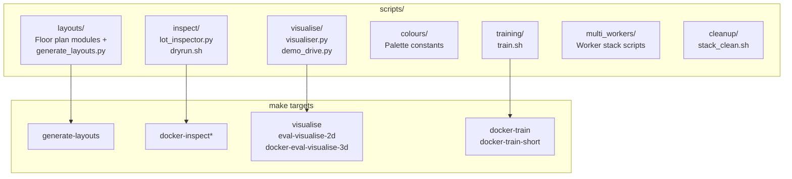

# scripts/

Offline tooling for layout generation, CARLA inspection, live visualisation, and multi-worker orchestration. None of these scripts are imported by the training pipeline - they are invoked exclusively via `make` targets.

## Quick reference

| Task | Command |
|------|---------|
| Generate all lot YAMLs + PNGs | `make generate-layouts` |
| Generate one layout | `make generate-layouts LAYOUT=trapezoid` |
| Train (full run) | `make docker-train` |
| Train (10k step smoke-test) | `make docker-train-short` |
| Inspect layout in CARLA | `make docker-inspect INSPECT_LAYOUT=rectangle` |
| Inspect sensor placement | `make docker-inspect-sensors` |
| Live training overlay (CARLA spectator) | `make docker-inspect-live` |
| Full pipeline dryrun (manual drive) | `make docker-inspect-dryrun` |
| 2D bird's-eye visualiser (live) | `make visualise` |
| Checkpoint demo + 2D viewer | `make eval-visualise-2d` |
| Checkpoint demo + 3D CARLA view | `make docker-eval-visualise-3d` |

## Directory map



## Subdirectories

### `layouts/`

Parking lot floor plan modules and the `generate_layouts.py` orchestrator.

```bash
make generate-layouts                   # All three layouts
make generate-layouts LAYOUT=rectangle  # Single layout
```

Writes `configs/layouts/<name>.yaml` and `outputs/layouts/<name>.png` for each layout. Never edit the YAML files by hand - regenerate from the floor plan Python modules. See [layouts/README.md](layouts/README.md) for the layout module reference and [layouts/BUILDER.md](layouts/BUILDER.md) for the `LotBuilder` DSL.

### `inspect/`

Unified CARLA debug overlay inspector (`lot_inspector.py`) for visually verifying lot geometry and sensor placement. Entry point for all inspection modes.

```bash
make docker-inspect INSPECT_LAYOUT=rectangle   # Layout boundary + bay overlay
make docker-inspect-sensors                    # Sensor placement on layout
make docker-inspect-live                       # Live CARLA spectator during training
make docker-inspect-dryrun                     # Full pipeline dryrun (manual drive)
```

See [inspect/README.md](inspect/README.md) for the full argument reference.

### `visualise/`

Detachable 2D bird's-eye visualiser and checkpoint demo driver. The viewer runs on the host - no CARLA connection needed.

```bash
make visualise                                         # Live 2D view during training
make eval-visualise-2d                                 # Checkpoint + headless CARLA + 2D view
make eval-visualise-2d CHECKPOINT=path/to/model.zip    # Custom checkpoint
make docker-eval-visualise-3d                          # Checkpoint + CARLA 3D spectator view
```

The env writes frames only when `outputs/.vis_active` exists (created by the visualiser on start, removed on close). See [visualise/README.md](visualise/README.md) for the signal file protocol and JSONL schema.

<!-- gif:placeholder name="visualiser_2d" caption="Detachable 2D bird's-eye visualiser during a parking episode" -->


### `colours/`

Single source of truth for all visualisation colours (bay types, pedestrian zones, patrol path, lot boundary, ego vehicle, actor overlays). Import from here; never hardcode hex values in any script.

```python
from scripts.colours import HEX_EGO, HEX_TARGET_BAY, BAY_HEX
```

See `scripts/colours/__init__.py` for the full palette reference.

### `training/`

Shell helpers invoked inside the training container.

- `train.sh` - runs `train_ppo.py` with ROS 2 / DDS noise filtered from stderr; forwards extra arguments to the Python script.

```bash
make docker-train        # Full training run
make docker-train-short  # 10k step smoke-test
```

### `multi_workers/`

Multi-worker stack orchestration for parallel CARLA training (`workers_up.sh`, `workers_down.sh`, `workers_build.sh`, `ensure_stack.sh`). Used when `parallel_workers > 1` in `configs/train_config.yaml`.

### `cleanup/`

Stack teardown helper (`stack_clean.sh`). Removes dangling containers and volumes after interrupted runs.

## See also

- [scripts/layouts/README.md](layouts/README.md) - layout module reference and regeneration
- [scripts/inspect/README.md](inspect/README.md) - inspector argument reference
- [scripts/visualise/README.md](visualise/README.md) - visualiser protocol and JSONL schema
- `scripts/colours/__init__.py` - palette constants
- [uncertainty_rl/README.md](../uncertainty_rl/README.md) - package overview
