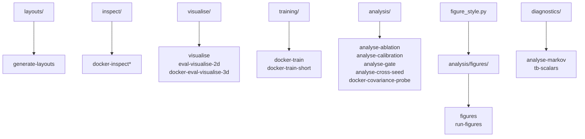

# scripts/

Offline tooling for results analysis, figure rendering, layout generation, CARLA inspection, live visualisation, and multi-worker orchestration. None of these scripts are imported by the training pipeline - they are invoked exclusively via `make` targets.

**Where the boundary sits.** `uncertainty_rl/evaluation/` is the *producer*: it runs the episode sweep in the container and writes raw CSVs, importing no plotting library. `scripts/analysis/` is the *consumer*: everything that reads those CSVs - statistics, tables and every figure - lives here and runs host-side on pandas alone.

## Quick reference

| Task | Command |
|------|---------|
| Generate all lot YAMLs + PNGs | `make generate-layouts` |
| Generate one layout | `make generate-layouts LAYOUT=trapezoid` |
| Train (full run) | `make docker-train` |
| Train (10k step smoke-test) | `make docker-train-short` |
| Inspect layout in CARLA | `make docker-inspect INSPECT_LAYOUT=rectangle` |
| Inspect sensor placement | `make docker-inspect-sensors` |
| Live sensor overlay in windowed CARLA | `make docker-inspect-live INSPECT_SENSOR=lidar` |
| Full pipeline dryrun (manual drive) | `make docker-inspect-dryrun` |
| Manually drive a named eval condition | `make docker-inspect-eval-dryrun SCENARIO=anchor_deployment` |
| 2D bird's-eye visualiser (live) | `make visualise` |
| Checkpoint demo + 2D viewer | `make eval-visualise-2d` |
| Checkpoint demo + 3D CARLA view | `make docker-eval-visualise-3d` |
| Multi-seed leg (all arms, all stages, then eval) | `make run-seed-leg` |
| Diagnose GNSS tier Markov chain | `make analyse-markov` |
| Cross-arm covariance contrast + degradation slope | `make analyse-ablation` |
| EKF covariance calibration (std vs error) | `make analyse-calibration` |
| Safety-gate ROC (EKF-std vs epistemic) | `make analyse-gate` |
| Pool every seed into the headline tables | `make analyse-cross-seed` |
| Causal covariance-input probe | `make docker-covariance-probe BASELINE=full_method CHECKPOINT=<leaf>` |
| Every reported figure | `make figures` |
| Assemble the curated `outputs/main_analysis/` set | `make analysis-bundle` |

## Directory map

Each directory points down to the `make` targets that invoke it.



`colours/`, `multi_workers/` and `cleanup/` have no direct target of their own.

## Subdirectories

### `layouts/`

Parking lot floor plan modules and the `generate_layouts.py` orchestrator.

```bash
make generate-layouts                   # All three layouts
make generate-layouts LAYOUT=rectangle  # Single layout
```

Writes `configs/layouts/<name>.yaml` and `outputs/raw_derived/layouts/<name>.png` for each layout. Never edit the YAML files by hand - regenerate from the floor plan Python modules. See [layouts/README.md](layouts/README.md) for the layout module reference and [layouts/BUILDER.md](layouts/BUILDER.md) for the `LotBuilder` DSL.

### `inspect/`

Unified CARLA debug overlay inspector (`lot_inspector.py`) for visually verifying lot geometry and sensor placement. Entry point for all inspection modes.

```bash
make docker-inspect INSPECT_LAYOUT=rectangle              # Layout boundary + bay overlay
make docker-inspect-sensors INSPECT_LAYOUT=rectangle      # Sensor placement on layout
make docker-inspect-live INSPECT_SENSOR=lidar             # Live sensor overlay in windowed CARLA
make docker-inspect-dryrun STAGE=1 MANUAL=true            # Full curriculum-stage pipeline (manual drive)
make docker-inspect-eval-dryrun SCENARIO=anchor_deployment  # Drive a named eval condition (no checkpoint)
```

`dryrun.sh` streams the inspect container's logs and tears the stack down on exit; it is mode-agnostic, driving both dryrun targets. Inspector classes live in `inspect/inspectors/`. See [inspect/README.md](inspect/README.md) for the full argument reference.

### `visualise/`

Detachable 2D bird's-eye visualiser and checkpoint demo driver. The viewer runs on the host - no CARLA connection needed.

```bash
make visualise                                                   # Live 2D view during training
make eval-visualise-2d                                           # Checkpoint + headless CARLA + 2D view
make eval-visualise-2d BASELINE=full_method CHECKPOINT=6_42_11062026-0628  # Custom checkpoint (bare names)
make docker-eval-visualise-3d                                    # Checkpoint + CARLA 3D spectator view
```

Alongside `visualiser.py` (the viewer) and `demo_drive.py` (loads a checkpoint and drives deterministic CARLA episodes), the directory holds `gnss_tiers.py` (tier sigma, description and severity colour read from `gnss_noise_profiles.yaml`, so no tier is hardcoded in the viewer), `recorder.py` (`FrameRecorder`, raw frames piped to the host ffmpeg for MP4 capture) and `eval_visualise_2d.sh` (the demo container, log stream and viewer orchestration behind `make eval-visualise-2d`).

The env writes frames only when `outputs/.vis_active` exists (created by the visualiser on start, removed on close). Recording and `make clip` need the **host** ffmpeg binary (`make check-host-deps`); it is deliberately absent from every image because the viewer is host-side.

**`make eval-visualise-2d` tears the whole stack down before it starts**, so it will stop a training run in progress. See [visualise/README.md](visualise/README.md) for the signal file protocol and JSONL schema.

### `colours/`

Single source of truth for all visualisation colours (bay types, pedestrian zones, patrol path, lot and out-of-bounds boundary, ego vehicle, actor overlays, sensor mounts and FOV arcs). Import from here, and never hardcode hex values in any script.

```python
from scripts.colours import HEX_EGO, HEX_TARGET_BAY, BAY_HEX
```

See `scripts/colours/__init__.py` for the full palette reference.

### `training/`

Shell helpers invoked inside the training container.

- `train.sh` - runs `train_ppo.py` with ROS 2 and DDS noise filtered from stderr, forwarding extra arguments to the Python script. Fixes the config, log and checkpoint paths; everything else is passed through from the make recipe.
- `tune.sh` - the Optuna wrapper, running `uncertainty_rl.training.tune_hyperparams` as a module with ROS 2 logging redirected. Invoked by `make docker-tune`. **No tuning run was ever performed** - every reported result uses the committed defaults.
- `run_seed_leg.sh` - the multi-seed orchestrator behind `make run-seed-leg`. Trains the four arms (`vanilla_ppo`, `input_uncertainty`, `output_uncertainty`, `full_method`) through stages 1-6 for seeds 42, 123 and 7, resume-chaining each stage, then evaluates the final stage only (both SafetyWrapper variants for the evidential arms) and writes the suite tables. It is idempotent, skipping completed work so a crashed leg resumes on re-run.

```bash
make docker-train        # Full training run
make docker-train-short  # 10k step smoke-test
make run-seed-leg        # Every arm and stage, then eval. Long-running; use tmux
```

### `multi_workers/`

Multi-worker stack orchestration for parallel CARLA training (`workers_up.sh`, `workers_down.sh`, `workers_build.sh`, `ensure_stack.sh`). Used when `parallel_workers > 1` in `configs/train_config.yaml`.

### `cleanup/`

Stack teardown helper (`stack_clean.sh`). Removes dangling containers and volumes after interrupted runs.

### `diagnostics/`

Standalone CPU-only diagnostics with no CARLA or ROS 2 dependency.

Nothing here reads a results tree - that is `analysis/`.

- `markov_analyser.py` - offline diagnostic for the GNSS tier Markov chain (stationary distribution, mean dwell per tier, time to first contiguous good window).
- `tb_read.py` - TensorBoard scalar trajectories (tag selection, smoothing, tails, CSV export, multi-run comparison).

Both carry more flags than the Make targets forward; the full surface is in
[diagnostics/README.md](diagnostics/README.md).

```bash
make analyse-markov                              # Defaults from gnss_noise_profiles.yaml
make analyse-markov N_EPISODES=10000 N_STEPS=1750
make tb-scalars LOG=logs/<baseline>/<leaf> ARGS="--match success --last 10"
```

### `analysis/`

Host-side (and one in-container) analysis tooling that turns an eval run's CSVs into the reported input-covariance and uncertainty results. Run only after an eval has written results under `outputs/raw/evaluation_results/seed_<N>/<baseline>/<leaf>/`.

```bash
make analyse-ablation          # Cross-arm covariance contrast + degradation slope
make analyse-calibration       # Is the EKF covariance honest (std vs actual error)?
make analyse-gate              # EKF-std vs evidential-epistemic safety-gate ROC
make analyse-cross-seed        # Pool every seed into the headline + per-seed robustness
make analysis-bundle           # Assemble the curated outputs/main_analysis/ set
```

Host-side scripts are read-only, consuming the eval CSVs and writing report files only. The remaining targets, the per-script reference and the CSV schema are in [analysis/README.md](analysis/README.md).

### `analysis/figures/`

Every rendered figure. Presentation only: these modules read CSVs and draw them, and never recompute a statistic, so a figure can be redrawn at any time without moving a reported number.

- `build.py` - the pooled figure set, one entry point for all of them. Figures are addressed by name, the nine ids being `ablation_by_condition`, `behaviour_by_std`, `degradation_tiers`, `ekf_calibration`, `ekf_sawtooth`, `gate_roc`, `lot_layouts`, `seed_robustness` and `training_curves`.
- `run_figures.py` - the per-run panels, rebuilt from a run's `evaluation_results.csv`.
- [`scripts/figure_style.py`](figure_style.py) - the one house style, at the `scripts/` root rather than inside `figures/`. Every figure imports it as `from scripts import figure_style as fs`, and nothing sets rcParams, picks a colour, or builds a legend by hand.

```bash
make figures                 # Every figure, into outputs/main_analysis/figures
make figures FIG=gate_roc    # A single figure, by id
make run-figures             # Per-run panels, into outputs/raw_derived/per_run_figures
make run-figures RUN_DIR=outputs/raw/evaluation_results/seed_42/full_method/<leaf>/without_wrapper
```

## See also

- [scripts/layouts/README.md](layouts/README.md) - layout module reference and regeneration
- [scripts/analysis/README.md](analysis/README.md) - eval analysis tooling and CSV schema
- [scripts/inspect/README.md](inspect/README.md) - inspector argument reference
- [scripts/visualise/README.md](visualise/README.md) - visualiser protocol and JSONL schema
- [scripts/layouts/BUILDER.md](layouts/BUILDER.md) - the `LotBuilder` DSL
- `scripts/colours/__init__.py` - palette constants
- `scripts/figure_style.py` - figure house style (rcParams, palette, legends)
- [uncertainty_rl/README.md](../uncertainty_rl/README.md) - package overview
- [docs/AntonioGaldes_Dissertation.pdf](../docs/AntonioGaldes_Dissertation.pdf) - the reported method and results
