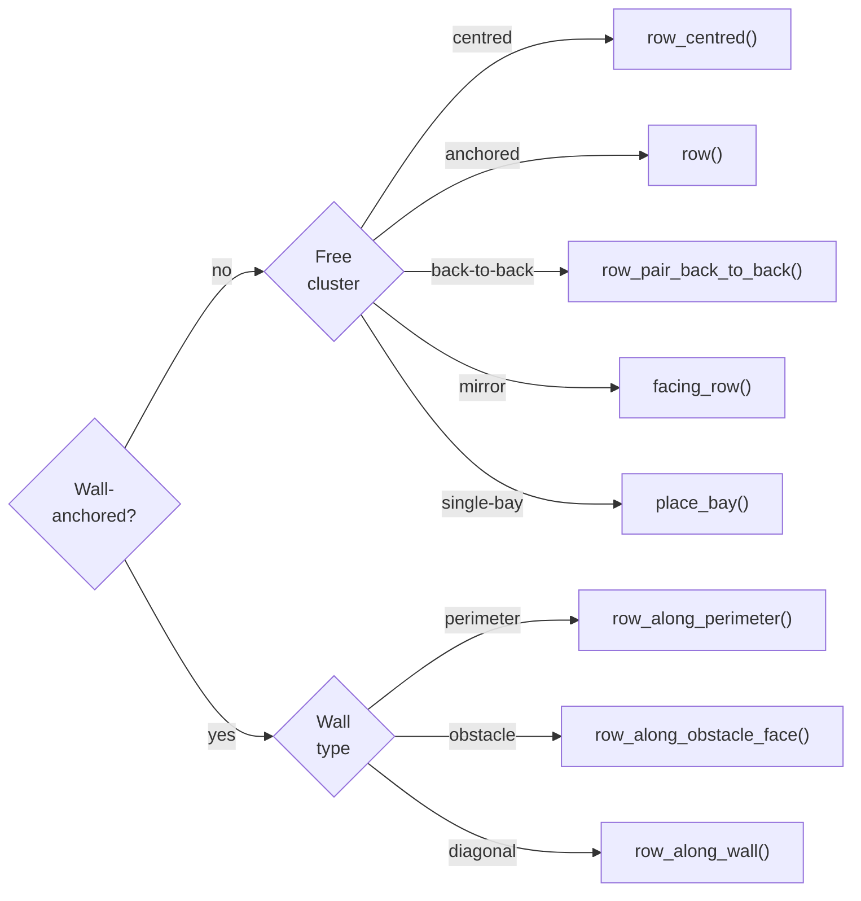

# Layout Builder DSL Reference

Reference for `scripts/layouts/builder.py` - the declarative DSL used by every
floor plan module. Floor plans import only from this file, and `common.py` is the
engine (world-frame transform, YAML output, PNG plot) and is never imported
directly by floor plan modules.

## Table of Contents

1. [Quick start](#quick-start)
2. [Module-level constants](#module-level-constants)
3. [Module-level helpers](#module-level-helpers)
4. [`LotBuilder`](#lotbuilder)
5. [`BayGroup`](#baygroup)
6. [`PedestrianZone`](#pedestrianzone)
7. [`PatrolPath`](#patrolpath)
8. [Placement method selection guide](#placement-method-selection-guide)
9. [Coordinate convention](#coordinate-convention)
10. [Validation](#validation)

---

## Quick start

```python
from scripts.layouts.builder import LotBuilder, PatrolPath, PedestrianZone

ORIGIN_X, ORIGIN_Y, ORIGIN_Z = 2.0, 22.5, 0.3
HEADING_DEG = 0.0
OOD = False


def generate():
    lot = LotBuilder(
        name="my_layout",
        corners=[(-5.0, 0.0), (60.0, 0.0), (60.0, 45.0), (-5.0, 45.0)],
    )

    # Place bays.
    perp_row = lot.row_along_perimeter("perpendicular", n=12, wall=0)
    far_row = lot.row_along_perimeter("perpendicular", n=4, wall=2)

    # Spawns: exactly one primary, at least one extra.
    lot.spawn(x=-2.0, y=22.5, yaw_deg=0.0, primary=True)
    lot.spawn(x=30.0, y=3.0, yaw_deg=90.0)

    # Patrol path.
    patrol = PatrolPath()
    y_aisle = patrol.aisle_y(below=perp_row, above=far_row)
    patrol.add(0.0, y_aisle)
    lot.set_patrol(patrol)

    # Pedestrian zones.
    lot.add_zone(PedestrianZone.along_row(perp_row, side="north"))

    return lot.build()
```

---

## Module-level constants

| Name | Value | Purpose |
|------|------:|---------|
| `BAY_DIMS` | dict | Width / depth / aisle for `perpendicular` and `angled`. |
| `BAYS_PER_TYPE` | `5` | Reference target for bay counts per type per layout. Advisory only - nothing in the builder reads it. |
| `WALL_GAP` | `0.5` | Default minimum clearance from any bay corner to the perimeter (`LotBuilder(wall_gap=...)` overrides it per lot). |
| `PED_STRIP` | `3.0` | Default width of a pedestrian zone strip. |
| `PED_MARGIN` | `0.5` | Default end-inset of a pedestrian zone strip. |

`BAY_DIMS` follows German EAR 05 / EU harmonised practice (FGSV 2005):

| Bay type | width (m) | depth (m) | aisle (m) |
|----------|----------:|----------:|----------:|
| `perpendicular` | 3.1 | 5.7 | 6.0 |
| `angled` | 3.1 | 5.85 | 3.6 |

These two are the only registered types. Parallel bays are out of scope, since bay
geometry is not the experimental variable, and passing `bay_type="parallel"` raises. A
one-off bay with custom dimensions can still be placed through `place_bay`.

---

## Module-level helpers

### `angled_corner_clearance(lot, angle_deg=45.0) -> float`

Returns the default along-wall clearance for the first angled bay: the distance from the wall start point to the first bay centre such that the nearest bay corner clears the wall end by `wall_gap`. Intended for floor plan modules that pack angled rows from a corner - none of the three current layouts uses angled bays, so nothing calls it today.

| Parameter | Description |
|-----------|-------------|
| `lot` | `LotBuilder` instance (provides `dims` and `wall_gap`). |
| `angle_deg` | Bay angle relative to the inward wall normal (degrees). Default 45.0. |

### `validate_bays_in_polygon` and `warn_narrow_corridors`

Both are exported at module level and both run automatically inside
`LotBuilder.build()`. See [Validation](#validation) for their signatures and behaviour.

---

## `LotBuilder`

The top-level container for a parking lot. Construct one per layout, populate it with bays/spawns/zones/patrol/obstacles, then call `build()`.

### `LotBuilder(name, corners, wall_gap=WALL_GAP)`

| Parameter | Type | Description |
|-----------|------|-------------|
| `name` | `str` | Floor plan name (used in validator messages). |
| `corners` | `Sequence[Point]` | Lot perimeter polygon as a sequence of `(x, y)` tuples in **CCW order**. |
| `wall_gap` | `float` | Minimum clearance between any bay corner and the perimeter. |

After construction, `lot.dims` exposes `BAY_DIMS` and `lot.wall_gap` exposes the wall-gap value. `lot.dims` is the module-level `BAY_DIMS` dict itself, not a copy - never mutate it in a floor plan module, since every other lot shares it.

Wall index `wall` follows CCW polygon order: wall 0 is `corners[0]->corners[1]`, wall 1 is `corners[1]->corners[2]`, and so on.

### Polygon helpers

| Method | Returns | Description |
|--------|---------|-------------|
| `wall_x(wall)` | `float` | x-coord of an axis-aligned vertical perimeter wall. Raises if the wall is not vertical. |
| `wall_y(wall)` | `float` | y-coord of an axis-aligned horizontal perimeter wall. Raises if the wall is not horizontal. |

### Bay placement

#### `row(bay_type, n, anchor, direction, yaw_deg, spacing=None, bay_extras=None)`

Place an axis-aligned row of `n` bays starting at `anchor`. `direction` is one of `"east"`, `"west"`, `"north"`, `"south"`. `spacing` defaults to bay width.

#### `row_centred(bay_type, n, centre, direction, yaw_deg, spacing=None, bay_extras=None)`

Same as `row()` but centres the cluster at `centre` instead of anchoring at the first bay. The anchor is auto-computed as `centre - (n-1)/2 * spacing` along `direction`.

#### `row_pair_back_to_back(bay_type, n, centre, direction, gap, yaws=None, spacing=None, bay_extras=None)`

Place two homogeneous facing rows with `gap` between their **back faces**, centred at `centre`. Returns `(row_a, row_b)`. Default yaws:

| `direction` | `yaws` | Stack axis |
|-------------|--------|------------|
| `"east"` / `"west"` | `(90, 270)` | Rows stacked along y. |
| `"north"` / `"south"` | `(0, 180)` | Rows stacked along x. |

#### `row_along_wall(bay_type, n, wall_p0, wall_p1, bay_angle_deg, side="ccw", start_along=None, pack_from="start", centred=False, bay_extras=None)`

Place a row along an arbitrary wall segment (perimeter or interior).

| Parameter | Description |
|-----------|-------------|
| `wall_p0`, `wall_p1` | Wall endpoints. |
| `bay_angle_deg` | Bay yaw relative to inward normal: `0` is perpendicular (back to wall), `+/-45` angled, `+/-90` parallel-to-wall, and `180` head-in. |
| `side` | `"ccw"` for walls in CCW polygon order, or `"cw"` when traversing in reverse. |
| `start_along` | Distance from `wall_p0` to first bay centre. Defaults to natural corner clearance. |
| `pack_from` | `"start"` (from `wall_p0`) or `"end"` (from `wall_p1`). |
| `centred` | `True` ignores `start_along` and centres the cluster in the wall span. |

#### `row_along_perimeter(bay_type, n, wall, bay_angle_deg=0.0, centred=False, start_along=None, pack_from="start", bay_extras=None)`

Wrapper around `row_along_wall` that takes a perimeter wall index. Inward direction is auto-detected from CCW polygon order.

#### `row_along_obstacle_face(bay_type, n, obstacle, face, bay_angle_deg=180.0, centred=True, start_along=None, pack_from="start", bay_extras=None)`

Place a row alongside one face of an axis-aligned interior obstacle. `obstacle` is `(x_min, x_max, y_min, y_max)`, and `face` is `"north"`, `"south"`, `"east"`, or `"west"`. Default `bay_angle_deg=180` = head-in parking (bay nose toward obstacle).

#### `facing_row(twin, gap, n=None, bay_extras=None)`

Place a row facing an existing row across an aisle of `gap` (nose-face to nose-face). The new row sits on the nose side of `twin`, with its own nose pointing back toward `twin`. Same bay type, spacing, and count as `twin` unless `n` is given.

#### `place_bay(bay_type, x, y, yaw_deg, width=None, depth=None, bay_extras=None)`

Place a single bay at `(x, y)`. A `bay_type` in `BAY_DIMS` takes its footprint from the table unless `width` / `depth` override it; any other `bay_type` (e.g. `"motorcycle"`) requires both explicitly, else `ValueError`. Returns a one-bay `BayGroup` whose `direction` is always `(1, 0)` regardless of `yaw_deg` - a single bay has no row axis, so use `bbox` rather than the row-relative `PedestrianZone` sides.

Pass `bay_extras={"always_empty": True}` to keep a bay out of the target pool; `common.to_world_frame` carries `always_empty` and `occupant` through to the YAML. The `occupant` field only takes effect for `bay_type="motorcycle"`, whose fixed occupant bypasses the per-episode occupancy draw, and its value must match a name the spawner recognises.

### Spawns

#### `spawn(x, y, yaw_deg, primary=False)`

Add a spawn transform. Exactly one `primary=True` spawn is required (entrance gate), and at least one extra (`primary=False`) is mandatory.

### Pedestrian zones, patrol, obstacles

| Method | Description |
|--------|-------------|
| `add_zone(zone)` | Append a `PedestrianZone`. |
| `set_patrol(patrol)` | Set the `PatrolPath` for this lot. |
| `add_obstacle(x_min, x_max, y_min, y_max)` | Add an axis-aligned interior obstacle rectangle. |

### Build

#### `build() -> Dict[str, Any]`

Validate and emit the layout dict. Checks the spawns first, raising `ValueError` if no primary spawn or no extra spawn was registered, then runs three validators over the pooled bays:

- `validate_bays_in_polygon` - raises `ValueError` if any bay corner lies outside the lot polygon.
- `warn_narrow_corridors` - warns if any pair of facing bays has < 6 m clearance.
- `_warn_bays_close_to_wall` - warns if any bay corner is within `wall_gap` of the perimeter.

Returned dict keys: `corners`, `bays`, `spawn`, `extra_spawns`, `patrol_waypoints`, `pedestrian_zones`, `obstacles` (present only when obstacles were added). `patrol_waypoints` is `[]` when `set_patrol()` was never called.

---

## `BayGroup`

Returned by every bay-placement method. Exposes the placed bays plus geometry metadata so `PedestrianZone` and `PatrolPath` helpers can reference faces without recomputing them.

### Properties

| Property | Type | Description |
|----------|------|-------------|
| `bay_type` | `str` | `perpendicular` or `angled`, or a custom name when the dimensions are given explicitly through `place_bay`. |
| `bays` | `List[Dict]` | Underlying bay dicts in placement order. |
| `count` | `int` | Number of bays. |
| `direction` | `(dx, dy)` | Unit vector along which successive bays advance. |
| `normal` | `(nx, ny)` | Unit vector pointing in the nose direction. |
| `bay_width` | `float` | Bay width (perpendicular to nose). |
| `bay_depth` | `float` | Bay depth (along nose). |
| `spacing` | `float` | Centre-to-centre spacing. |
| `bbox` | `(x_min, x_max, y_min, y_max)` | Axis-aligned bbox of all bay rectangles. |

### Face accessors (axis-aligned rows only)

| Property | Description |
|----------|-------------|
| `nose_y` | y-coord of the nose face. Valid only when nose normal is along the y-axis. |
| `back_y` | y-coord of the back face. Valid only when nose normal is along the y-axis. |
| `nose_x` | x-coord of the nose face. Valid only when nose normal is along the x-axis. |
| `back_x` | x-coord of the back face. Valid only when nose normal is along the x-axis. |

For non-axis-aligned rows (e.g. 45-deg angled bays), use `bbox` instead.

---

## `PedestrianZone`

Axis-aligned pedestrian strip (`x_min` / `x_max` / `y_min` / `y_max`) in local frame.

### Constructors

#### `PedestrianZone(x_min, x_max, y_min, y_max)`

Direct construction with explicit bounds. Raises `ValueError` if the extent is zero or negative.

#### `PedestrianZone.along_row(group, side, strip=PED_STRIP, margin=PED_MARGIN)`

Strip alongside one face of a row's bbox. `side` is one of:

- `"north"` / `"south"` / `"east"` / `"west"` - bbox-aligned cardinal side. Works for any row.
- `"nose"` / `"back"` / `"left"` / `"right"` - relative to the row's nose direction. Requires an axis-aligned row.

#### `PedestrianZone.between_rows(group_a, group_b, margin=PED_MARGIN)`

Strip in the gap between two facing rows. Auto-detects whether the rows are stacked vertically or horizontally based on bbox overlap.

#### `PedestrianZone.beside_wall(wall_p0, wall_p1, strip=PED_STRIP, inward=True, along_range=None, margin=PED_MARGIN)`

Strip along an axis-aligned wall segment. `inward=True` places the strip on the interior side. `along_range` clips the strip to a sub-range along the wall direction. Only axis-aligned walls are supported; a sloped wall needs a hand-built zone with explicit bounds.

### Serialisation

#### `to_dict() -> Dict[str, float]`

Returns `{x_min, x_max, y_min, y_max}` for `common.to_world_frame`. Called by `build()`; floor plan modules do not call it directly.

---

## `PatrolPath`

Ordered list of patrol waypoints in local frame. Waypoint order is the user's responsibility - there is no auto-routing.

The `Edge` type accepted by `aisle_x` / `aisle_y` is:

- A single `BayGroup` - uses its bbox.
- A list of `BayGroup` - uses the union of bboxes.
- A raw `float` - treated as a virtual axis-aligned edge at that coordinate (useful for "midpoint to a notional internal boundary at x=0").

### Methods

| Method | Description |
|--------|-------------|
| `add(x, y)` | Append a raw `(x, y)` waypoint. Returns `self` for chaining. |
| `aisle_y(below, above)` | Y-midpoint between the upper edge of `below` and the lower edge of `above`. |
| `aisle_x(left, right)` | X-midpoint between the right edge of `left` and the left edge of `right`. |
| `add_diag_from_prev(x_direction, target_y)` | Append a 45-deg diagonal connector from the previous waypoint to `target_y`. `x_direction` is `"left"` (decreasing x) or `"right"` (increasing x). Raises `ValueError` on an empty path. |
| `to_list()` | Returns `[{x, y}, ...]` for `common.to_world_frame`. Called by `build()`; floor plan modules do not call it directly. |

`patrol.waypoints` is the raw `List[Tuple[float, float]]` behind these helpers.

### Example

The four-waypoint loop used by all three layouts - derive the two aisle y-values and the
two aisle x-values from the rows that bound them, then walk the corners:

```python
patrol = PatrolPath()
y_lower = patrol.aisle_y(below=[bottom_perp, bottom_right_perp], above=centre_perp)
y_upper = patrol.aisle_y(below=centre_perp, above=top_perp)
# A raw float stands in for a virtual edge where no bay row bounds the aisle.
x_left = patrol.aisle_x(left=LEFT_X + 1.5, right=centre_perp)
x_right = patrol.aisle_x(left=centre_perp, right=right_perp)
patrol.add(x_left, y_lower)
patrol.add(x_right, y_lower)
patrol.add(x_right, y_upper)
patrol.add(x_left, y_upper)
lot.set_patrol(patrol)
```

`add_diag_from_prev()` is available for 45-deg connectors between waypoints, but no current
layout needs one.

---

## Placement method selection guide



---

## Coordinate convention

All coordinates are in **local frame** - a right-handed math frame with Y-up, yaw CCW-positive, and origin at the lot's `(0, 0)` corner. The orchestrator `generate_layouts.py` applies rotation and translation via `common.to_world_frame` and converts to **CARLA's left-handed frame** (Y rightward, yaw CW-positive) by negating Y and yaw.

`ORIGIN_X` / `ORIGIN_Y` constants in floor plan modules are in **CARLA frame** (left-handed). Never write CARLA-frame coordinates into a `LotBuilder` call. Work in local frame and let the orchestrator transform.

Bay yaw conventions (local frame):

| `yaw_deg` | Nose direction |
|----------:|----------------|
| 0 | +X (east) |
| 90 | +Y (north) |
| 180 | -X (west) |
| 270 | -Y (south) |

---

## Validation

`LotBuilder.build()` runs three validators automatically. The first two are also exported as module-level functions.

### `validate_bays_in_polygon(bays, corners, shape_name, margin=0.05)`

Raises `ValueError` if any bay corner lies outside the (slightly expanded) lot polygon. The `margin` allows for floating-point tolerance on flush bays.

### `warn_narrow_corridors(bays, shape_name, min_width=6.0)`

Prints a warning for each pair of facing bays separated by less than `min_width`. Defaults to the EAR 05 minimum aisle width of 6 m. Non-fatal - review before deployment.

### `LotBuilder._warn_bays_close_to_wall()` (internal)

Prints a warning for each bay corner within `wall_gap` of any perimeter segment. Catches accidentally flush bays without the conventional clearance.

---

## File map

```
scripts/layouts/
|-- builder.py           # this library (LotBuilder, BayGroup, PedestrianZone, PatrolPath)
|-- common.py            # engine: world-frame transform, YAML writer, PNG plotter
|-- generate_layouts.py  # orchestrator: calls module.generate() then engine functions
|-- BUILDER.md           # this document
|-- README.md            # scripts/layouts/ onboarding and usage guide
|-- CLAUDE.md            # working contract for editing floor plan modules
|-- __init__.py          # package marker
+-- floor_plans/
    |-- __init__.py      # re-exports each module's generate()
    |-- rectangle.py     # training layout (47 perpendicular + 2 motorcycle)
    |-- trapezoid.py     # OOD evaluation layout (39 bays)
    +-- irregular_a.py   # OOD evaluation layout (30 bays)
```
