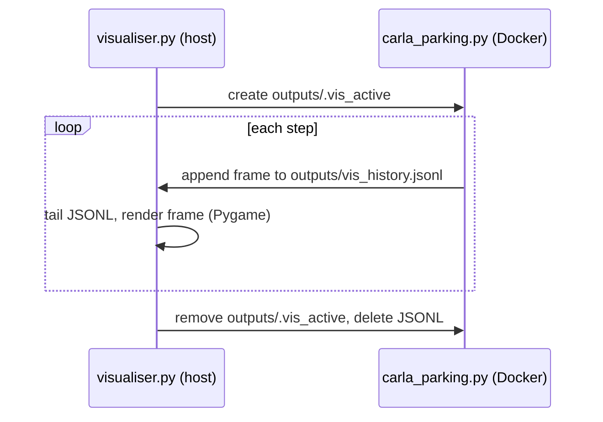

# scripts/visualise/

Detachable 2D bird's-eye Pygame visualiser for CARLA parking training and evaluation. Runs on the host machine - no CARLA connection, no Docker, no GPU required.

## Quick reference

| Task | Command |
|------|---------|
| Open 2D viewer (training already running) | `make visualise` |
| Load checkpoint + headless CARLA + 2D viewer | `make eval-visualise-2d` |
| Load checkpoint + CARLA 3D spectator | `make docker-eval-visualise-3d` |
| Custom checkpoint | `make eval-visualise-2d BASELINE=full_method CHECKPOINT=6_42_22062026-1502` |
| Record the drive to MP4 | `make eval-visualise-2d RECORD=true ...` |
| Watch without writing trace CSVs | `make eval-visualise-2d TRACE=false ...` |
| Cut a GIF from a recording | `make clip VIDEO=outputs/recordings/<stamp>.mp4 START=00:05 END=00:20` |
| Check the host ffmpeg dependency | `make check-host-deps` |

> `make eval-visualise-2d` tears the whole Docker stack down before it starts
> (workers and compose, orphans included), so it **will stop a training run in
> progress**. `TRACE=false` only suppresses the demo's own CSVs; it does not make
> the target read-only.

## How it works

The environment appends one JSON line per step to `outputs/vis_history.jsonl` (via `_write_vis_state()` in `carla_parking.py`) whenever the signal file `outputs/.vis_active` exists. The visualiser creates that file on start and removes it on close, so the env only writes frames while the window is open.

The visualiser tails the JSONL file in real time, groups lines into episodes, and renders each frame with Pygame. The static scene (lot boundary, bay outlines, parked vehicles) is pre-rendered to a surface once per episode and blitted; only dynamic elements (ego, patrol NPCs, pedestrians, trail) are redrawn each frame.



The end of one episode, with the GNSS fix state recovering as the car closes on the bay:
the panel climbs degraded (red) to standalone (orange) to RTK float (amber) to RTK fixed
(green), and the car parks once localisation is trustworthy again. The Markov chain is
neighbour-only, so a recovery never skips a rung - the float step here lasts a few tenths
of a second.

<p align="center">
  
</p>

## File protocol

| File | Written by | Read by |
|------|-----------|---------|
| `outputs/vis_history.jsonl` | `carla_parking.py` (`_write_vis_state()`) | `LiveVisualiser._read_new_frames()` |
| `outputs/.vis_active` | `LiveVisualiser.__init__()` | `carla_parking.py` (guards writes) |

## JSONL schema

Each line is a complete frame dict. All coordinates are in CARLA world frame.

| Key | Type | Contents |
|-----|------|----------|
| `episode_id` | int | Monotonic episode counter |
| `episode_step` | int | Step index within episode |
| `sim_time` | float | Accumulated simulation time (s) |
| `carla_time` | float | CARLA world elapsed seconds |
| `carla_sync` | bool | Synchronous mode on/off |
| `carla_fixed_dt` | float | Configured simulation fixed timestep (s) |
| `carla_timestep` | float | Effective CARLA timestep used for `sim_time` |
| `floor_plan` | str | Layout name (`rectangle`, `trapezoid`, `irregular_a`) |
| `ego` | dict | `{x, y, yaw, vx, vy, speed, gt_vyaw, ekf_speed, ekf_vyaw, gnss_tier}` - ground-truth pose/velocity, the EKF speed and yaw rate, and the **live** GNSS fix-state tier (it tracks the mid-episode Markov drift, not just the tier sampled at reset) |
| `action` | dict | `{steer, throttle, brake}` - last clamped action applied to the vehicle |
| `trajectory` | list | `[[x, y], ...]` ego trail (last N steps) |
| `actors` | list | NPC/static vehicles: `[{x, y, yaw, type}]` where `type` is `"npc"` or `"static"` |
| `pedestrians` | list | `[{x, y}]` for each pedestrian |
| `target_bay` | dict | `{x, y, yaw, width, depth, bay_type, bay_id}` |
| `bays` | list | All bay dicts in the current layout |
| `corners` | list | Lot perimeter polygon vertices `[{x, y}, ...]` |
| `end_reason` | str | Last frame only: `"success"`, `"collision"`, `"out_of_bounds"`, or `"timeout"`. Written for downstream consumers; the viewer does not render it |
| `debug` | dict | Optional: per-step diagnostics from `DebugLogger.step_debug_dict()` |

## Layers drawn (back to front)

1. Lot boundary polygon (light grey fill)
2. Bay outlines (blue). The angled/parallel styles are retained for a future layout but never fire: every layout in this project is perpendicular-only
3. Target bay (bright green, thick outline + heading arrows for nose-in and nose-out)
4. Ego trajectory trail (faded cyan, capped at 500 points)
5. GNSS uncertainty ring - a translucent disc around the ego car whose radius is the current tier's `metric_stddev_m` in world metres. This is the tier's **configured 1-sigma GNSS noise**, not the EKF's live covariance estimate
6. Static parked vehicles (orange rectangles)
7. Ego vehicle (cyan rectangle + heading arrow)
8. HUD band, below the map: the GNSS tier card (tier name on a filled colour card, with the tier's 1-sigma position accuracy beneath it), the context line (floor plan, step, sim time, plus the episode number under `SHOW_EPISODE=true`), the speed/action line, and the debug line (only when `debug: true`)
9. Legend panel (right-hand side), including the GNSS tier colour key

## GNSS tier presentation

Both the card and the ring are driven by `configs/deployment/sim/gnss_noise_profiles.yaml` via `gnss_tiers.py` - nothing about the tiers is hardcoded in the viewer. Each tier contributes its `metric_stddev_m`, which sets both the ring radius and the accuracy figure on the card. Severity follows declaration order in the YAML, best fix first, and drives the green-amber-orange-red ramp. Adding a tier to the YAML is enough to make it render.

The card is always filled, so a tier change reads as a colour change within a fixed shape rather than as a panel appearing and disappearing. The accuracy figure is stated once, as `Position known to +/- X m (1-sigma)`; the tier's YAML `description` is deliberately not drawn, since it restates the same number and changes too fast to read on video.

## Recording

`RECORD=true` starts recording on launch; the `R` key toggles it at any time, which is the easier route when you want to skip the 30-60 s CARLA start-up and capture only the interesting part of a drive. Recording state is reported on the console rather than on screen, so nothing about the capture appears in the window or the video. Files land in `outputs/recordings/<DD-MM-YYYY-HHMMSS>.mp4` and are finalised on Ctrl+C or window close.

`make clip` cuts a segment out of a recording, using ffmpeg's two-pass palette pipeline for GIFs (markedly better than a naive conversion on flat vector-style graphics):

```
make clip VIDEO=outputs/recordings/<stamp>.mp4 START=00:05 END=00:20 FORMAT=gif WIDTH=800 FPS=15
make clip VIDEO=outputs/recordings/<stamp>.mp4 START=12 END=28 FORMAT=mp4 WIDTH=1280
```

`START`/`END` accept `MM:SS` or plain seconds. This is how the `docs/media/` GIF placeholders get filled.

### Capturing a tier comparison

To show what the policy does at each fix state, pin the tier so a whole drive runs at one level, then record each in turn:

```
make eval-visualise-2d LAYOUT=rectangle BASELINE=full_method \
  CHECKPOINT=6_42_22062026-1502 STAGE=6 REALTIME=true \
  GNSS_TIER=fixed RECORD=true TRACE=false
```

Repeat with `GNSS_TIER=float`, `standalone`, `degraded` - identical layout, checkpoint and policy, with only the fix state changing. Leave `GNSS_TIER=` empty for the live Markov chain, which is what shows the transitions and the recovery; use the `R` key there to record only once the tier card changes colour.

### Episode number

The HUD context line omits the episode number by default, since it is run bookkeeping that means nothing to an audience watching a recording. Pass `SHOW_EPISODE=true` to either viewer target (or `--show-episode` when running `visualiser.py` directly) to put `Ep: N` back between the floor plan and the step count.

## Controls

| Key | Action |
|-----|--------|
| R | Start/stop MP4 recording |
| F | Toggle fullscreen |
| ESC / Q | Exit (removes signal file) |

## Package structure

| File | Purpose |
|------|---------|
| `visualiser.py` | `LiveVisualiser` class + CLI entry point (`python scripts/visualise/visualiser.py`) |
| `demo_drive.py` | Loads a checkpoint and drives deterministic CARLA episodes for visual inspection. Per-decision trace logging is on by default: each episode is written to `outputs/raw/demo_traces/<baseline>/<checkpoint_leaf>/<DD-MM-YYYY-HHMMSS>/episode_<N>.csv` with one row per policy decision (intermediate `action_repeat` ticks are skipped, so no all-zero filler rows). Alongside the step/reward/success columns it carries the delivered `*_cmd` commands (post-clamp, as actually applied to CARLA), the ground-truth and EKF pose columns, the live `gnss_tier` / `gnss_multiplier`, and `epistemic` / `aleatoric` (the evidential policy uncertainty, mean over action axes; `NaN` for a non-evidential policy). See `_TRACE_COLUMNS` for the authoritative list. Written under `outputs/` because that is the directory bind-mounted into the demo container. Pass `--no-trace` (or `TRACE=false`) to disable. |
| `gnss_tiers.py` | Loads GNSS tier presentation data (sigma, description, severity colour) from the profiles YAML, so no tier detail is hardcoded in the viewer |
| `recorder.py` | `FrameRecorder` - pipes rendered frames to `ffmpeg` as raw RGB to produce an MP4. Emits on a wall-clock accumulator at a fixed rate, so playback speed is truthful even though the viewer's loop is uncapped |
| `eval_visualise_2d.sh` | Orchestration for `make eval-visualise-2d`: starts the demo container detached, streams its logs with a `[demo]` prefix, runs the viewer in the foreground, and stops the demo with SIGTERM on exit so it flushes its eval `bay_successes.csv` before the container is removed. |
| `__init__.py` | Package marker - sets non-interactive Matplotlib backend |

## Window dimensions

| Component | Size |
|-----------|------|
| Map viewport | 900 px wide; height is fitted to the lot's aspect ratio, clamped to 300-900 px |
| Legend panel | `160 x UI_SCALE` px wide (240 px at the default scale) |
| HUD band | Below the map, sized from the font metrics |
| FPS cap | 120 Hz |

Font sizes, the legend width and stroke widths are all multiplied by `--ui-scale` (`UI_SCALE`, default 1.5), so the whole interface can be enlarged for a projector or a recording with one value.

## Dependencies

Pygame, numpy and PyYAML, all installed in the project `.venv/` (via `make install`). Colours are imported from `scripts/colours/` - the single source of truth for the full visualisation palette.

Recording and `make clip` additionally need the **host** `ffmpeg` binary. The viewer runs on the host (only `demo_drive.py` runs in a container), so ffmpeg is not installed in any image - `make check-host-deps` verifies it, and the recording targets call that check for you. Install with `sudo apt-get install ffmpeg`. Everything except recording works without it.

## See also

- [scripts/README.md](../README.md) - all Make targets overview
- `scripts/colours/__init__.py` - colour palette reference
- [scripts/analysis/README.md](../evaluation/README.md) - eval analysis tooling that consumes the demo/eval CSVs
- [uncertainty_rl/envs/README.md](../../uncertainty_rl/envs/README.md) - `CARLAParkingEnv` that writes the JSONL frames
