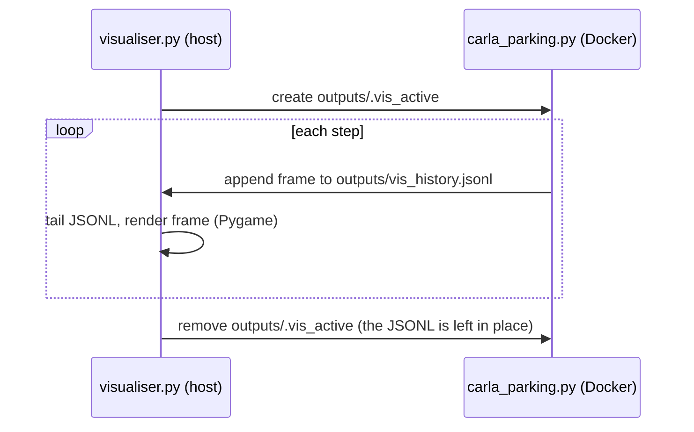

# scripts/visualise/

Detachable 2D bird's-eye Pygame visualiser for CARLA parking training and evaluation. Runs on the host machine - no CARLA connection, no Docker, no GPU required.

## Quick reference

| Task | Command |
|------|---------|
| Open 2D viewer (training already running) | `make visualise` |
| Load checkpoint + headless CARLA + 2D viewer | `make eval-visualise-2d` |
| Load checkpoint + CARLA 3D spectator | `make docker-eval-visualise-3d` |
| Custom checkpoint | `make eval-visualise-2d BASELINE=full_method CHECKPOINT=6_42_22062026-1502` |
| Watch without writing trace CSVs | `make eval-visualise-2d TRACE=false ...` |
| Watch a specific training worker | `make visualise WORKER=1` |
| Record an MP4 from the start | `make visualise RECORD=true` (or press R at any time) |
| Cut a GIF from the newest recording | `make clip START=00:05 END=00:20 FORMAT=gif` |

`CHECKPOINT` is the bare run leaf (`<stage>_<seed>_<DDMMYYYY-HHMM>`), not a path; the
recipes reconstruct `checkpoints/<baseline>/<leaf>/final_model` from it.
Recording and `make clip` need the **host** `ffmpeg` binary - check with
`make check-host-deps`. It is deliberately absent from every image, since the viewer is
host-side.

> `make eval-visualise-2d` tears the whole Docker stack down before it starts
> (workers and compose, orphans included), so it **will stop a training run in
> progress**. `TRACE=false` only suppresses the demo's own CSVs and does not make
> the target read-only.

## How it works

The environment appends one JSON line per step to `outputs/vis_history.jsonl` (via `_write_vis_state()` in `carla_parking.py`) whenever the signal file `outputs/.vis_active` exists. The visualiser creates that file on start and removes it on close, so the env only writes frames while the window is open.

The visualiser tails the JSONL file in real time and renders with Pygame. Each poll draws only the newest line read, dropping any backlog so the window cannot fall behind the env. A change in `episode_id` is what marks an episode boundary: the static scene (lot boundary, bay outlines, target bay, parked vehicles) is pre-rendered to a surface once per episode and blitted, so only dynamic elements (ego, patrol NPCs, pedestrians, trail, ring) are redrawn each frame. Before the first line arrives the window shows a diagnostic waiting splash with the elapsed wait and the state of both protocol files, so a still-loading viewer is distinguishable from a stalled one.

The env re-checks the signal file every 30 steps rather than every step, so writes stop
shortly after the window closes rather than instantly. The viewer re-touches the signal
file on every loop iteration, so a stale cleanup elsewhere cannot silence the stream while
the window is open. The env also truncates the JSONL periodically to bound its size; the
viewer notices the file shrinking and resets its read offset rather than stalling.

Reading the tier panel: its colour tracks the live fix state, climbing from degraded in
red through standalone in orange and RTK float in amber to RTK fixed in green. The ring
drawn around the car is the tier's configured 1-sigma noise, not the EKF's live
covariance, so it overstates the posterior separation between tiers. The fix state moves
on a ladder-only chain - never skipping a rung - defined in
`configs/deployment/sim/gnss_noise_profiles.yaml`, so a recovery is always visible as a
step-by-step climb rather than a jump. The clip below shows one such recovery, and the
[root README](../../README.md#demonstrations) describes the episode it comes from.

  

## File protocol

| File | Written by | Read by |
|------|-----------|---------|
| `outputs/vis_history.jsonl` | `carla_parking.py` (`_write_vis_state()`) | `LiveVisualiser._read_new_frames()` |
| `outputs/.vis_active` | `LiveVisualiser` (created in `__init__()`, re-touched each loop, removed in `run()`) | `carla_parking.py` (guards writes) |

Under multi-worker training each env writes its own history file: worker 0 uses
`outputs/vis_history.jsonl` and worker N uses `outputs/vis_history_N.jsonl` (see
`envs/factory.py`). Pass `WORKER=N` to `make visualise` to watch a specific worker; the
single `.vis_active` signal file is shared, so every worker writes while any viewer is
open.

## JSONL schema

Each line is a complete frame dict. All coordinates are in CARLA world frame.

| Key | Type | Contents |
|-----|------|----------|
| `episode_id` | int | Monotonic episode counter |
| `episode_step` | int | Step index within episode |
| `sim_time` | float | Accumulated simulation time (s) |
| `carla_time` | float | CARLA world elapsed seconds |
| `carla_sync` | bool | Synchronous mode on/off |
| `carla_fixed_dt` | float | Configured simulation fixed timestep (s) |
| `carla_timestep` | float | Effective CARLA timestep used for `sim_time` |
| `floor_plan` | str | Layout name (`rectangle`, `trapezoid`, `irregular_a`) |
| `ego` | dict | `{x, y, yaw, vx, vy, speed, gt_vyaw, ekf_speed, ekf_vyaw, gnss_tier}` - ground-truth pose/velocity, the EKF speed and yaw rate, and the **live** GNSS fix-state tier (it tracks the mid-episode Markov drift, not just the tier sampled at reset) |
| `action` | dict | `{steer, throttle, brake}` - last clamped action applied to the vehicle |
| `trajectory` | list | `[[x, y], ...]` ego trail from the env's bounded deque. Written for downstream consumers; the viewer accumulates its own trail from `ego.x`/`ego.y` instead |
| `actors` | list | NPC/static vehicles: `[{x, y, yaw, type}]` where `type` is `"npc"` or `"static"` |
| `pedestrians` | list | `[{x, y}]` for each pedestrian |
| `target_bay` | dict | `{x, y, yaw, width, depth, bay_type, bay_id}` |
| `bays` | list | All bay dicts in the current layout |
| `corners` | list | Lot perimeter polygon vertices `[{x, y}, ...]` |
| `end_reason` | str | Last frame only: `"success"`, `"collision"`, `"out_of_bounds"`, or `"timeout"`. Written for downstream consumers, and not rendered by the viewer |
| `debug` | dict | Optional: per-step diagnostics from `DebugLogger.step_debug_dict()` |

## Layers drawn (back to front)

The first four are baked into the static surface, rebuilt once per episode by
`_build_static_surface()`; the rest are redrawn every frame.

1. Lot boundary polygon (light grey fill, grey edge)
2. Bay outlines (blue). The angled/parallel styles are retained for a future layout but never fire: every layout in this project is perpendicular-only
3. Target bay (bright green, thick outline + heading arrows for nose-in and nose-out)
4. Static parked vehicles (filled orange rectangles)
5. Ego trajectory trail (translucent cyan polyline, capped at 500 points)
6. GNSS uncertainty ring - a translucent disc around the ego car whose radius is the current tier's `metric_stddev_m` in world metres. This is the tier's **configured 1-sigma GNSS noise**, not the EKF's live covariance estimate. Drawn beneath every actor so it never hides one
7. Patrol NPC vehicles (filled red rectangles)
8. Pedestrians (turquoise dots)
9. Ego vehicle (cyan rectangle + heading arrow)
10. HUD band, below the map: the GNSS tier card (tier name on a filled colour card, with the tier's 1-sigma position accuracy beneath it), the context line (floor plan, step, sim time, plus the episode number under `SHOW_EPISODE=true`), the speed/action line, and the debug line (only when `debug: true` in `env_config.yaml`)
11. Legend panel (right-hand side): ego, parked, target bay, parking bay, ego trail, then the GNSS tier colour key ordered best fix to worst

The map viewport uses CARLA's left-handed frame directly - screen y increases downward,
which matches CARLA y in a bird's-eye view, so no y-flip is applied.

## GNSS tier presentation

Both the card and the ring are driven by
`configs/deployment/sim/gnss_noise_profiles.yaml` via `gnss_tiers.py` - nothing about the
tiers is hardcoded in the viewer. Each tier contributes its `metric_stddev_m`, which sets
both the ring radius and the accuracy figure on the card. Severity follows declaration
order in the YAML, best fix first, and drives the green-amber-orange-red ramp.

Degradation is graceful rather than fatal:

| Situation | Result |
|-----------|--------|
| A fifth tier added to the YAML | Renders, but reuses the worst ramp colour (four colours only) |
| Tier name absent from the YAML | Neutral grey card |
| Frame carries no tier at all | Card reads `NO FIX DATA` |
| YAML missing or malformed | Tier legend and ring dropped; bare tier name on the card |

The card is always filled, so a tier change reads as a colour change within a fixed shape rather than as a panel appearing and disappearing. The accuracy figure is stated once, as `Position known to +/- X m (1-sigma)`. The tier's YAML `description` is deliberately not drawn, since it restates the same number and changes too fast to read on video.

### Episode number

The HUD context line omits the episode number by default, since it is run bookkeeping that means nothing to an audience watching a recording. Pass `SHOW_EPISODE=true` to either viewer target (or `--show-episode` when running `visualiser.py` directly) to put `Ep: N` back between the floor plan and the step count.

## Controls

| Key | Action |
|-----|--------|
| R | Toggle MP4 recording, equivalent to starting with `--record` |
| F | Toggle fullscreen |
| ESC / Q | Exit (removes signal file) |

Closing the window (`QUIT`) and `Ctrl+C` in the launching terminal both exit the same way,
finalising any recording in progress before the signal file is removed.

## CLI flags

The Make targets cover every normal use; these are the underlying flags, for running either
script directly.

`visualiser.py`:

| Flag | Default | Purpose |
|------|---------|---------|
| `--history-file` | `outputs/vis_history.jsonl` | JSONL to tail (`WORKER=N` picks the per-worker file) |
| `--ui-scale` | `1.5` | Font, legend and stroke multiplier (`UI_SCALE`) |
| `--record` | off | Start recording an MP4 immediately (`RECORD=true`) |
| `--record-dir` | `outputs/recordings` | Destination for recorded MP4s (`RECORD_DIR`) |
| `--fps` | `30` | Recording frame rate (`REC_FPS`) |
| `--show-episode` | off | Show `Ep: N` in the HUD context line (`SHOW_EPISODE=true`) |

`demo_drive.py`:

| Flag | Default | Purpose |
|------|---------|---------|
| `--checkpoint` | `checkpoints/final_model` | Model to load (`BASELINE` + `CHECKPOINT`) |
| `--env-config` | `configs/deployment/sim/env_config.yaml` | Environment config |
| `--train-config` | `configs/train_config.yaml` | Supplies `policy_type` for model loading |
| `--baseline` | none | Baseline override YAML (`BASELINE`) |
| `--stage` | none | Curriculum stage whose env override to merge (`STAGE`) |
| `--gnss-tier` | none | Hold one tier (`fixed`, `float`, `standalone`, `degraded`) for the whole drive, bypassing per-episode sampling and the Markov drift (`GNSS_TIER`) |
| `--episodes` | `0` (indefinite) | Episode count |
| `--render` | off | CARLA 3D spectator rendering; needs a display |
| `--playback-speed` | `1.0` | Wall-clock rate relative to simulated time; ignored with `--no-realtime` |
| `--no-realtime` | real time on | Step as fast as CARLA allows (`REALTIME=false`) |
| `--no-trace` | tracing on | Skip the per-episode trace CSVs (`TRACE=false`) |

## Package structure

| File | Purpose |
|------|---------|
| `visualiser.py` | `LiveVisualiser` class + CLI entry point (`python scripts/visualise/visualiser.py`) |
| `demo_drive.py` | Loads a checkpoint and drives deterministic CARLA episodes for visual inspection. Per-decision trace logging is on by default: each episode is written to `outputs/raw/demo_traces/<baseline>/<checkpoint_leaf>/<DD-MM-YYYY-HHMMSS>/episode_<N>.csv` with one row per policy decision (intermediate `action_repeat` ticks are skipped, so no all-zero filler rows). Alongside the step/reward/success columns it carries the delivered `*_cmd` commands (post-clamp, as actually applied to CARLA), the ground-truth and EKF pose columns, the live `gnss_tier` / `gnss_multiplier`, and `epistemic` / `aleatoric` (the evidential policy uncertainty, mean over action axes, and `NaN` for a non-evidential policy). See `_TRACE_COLUMNS` for the authoritative list. Written under `outputs/` because that is the directory bind-mounted into the demo container. Pass `--no-trace` (or `TRACE=false`) to disable. Independently of `--no-trace`, every run also writes per-bay success accounting to `outputs/raw/bay_successes/eval/<same subtree>/bay_successes.csv`, flushed on shutdown so a `Ctrl+C` or a `SIGTERM` from the viewer script still leaves it complete. A checkpoint path without a recognisable training leaf falls back to a flat `<DD-MM-YYYY-HHMMSS>/` subtree for both outputs. |
| `gnss_tiers.py` | Loads GNSS tier presentation data (sigma, description, severity colour) from the profiles YAML, so no tier detail is hardcoded in the viewer |
| `recorder.py` | `FrameRecorder` - pipes rendered frames to `ffmpeg` as raw RGB (CRF 18, `yuv420p`, padded to even dimensions) to produce an MP4. Emits on a wall-clock accumulator at the fixed `--fps` rate, repeating the last surface when the frame stream is dry, so playback speed stays truthful however fast the viewer's own loop renders. `check_ffmpeg()` reports a missing binary instead of raising, so the viewer keeps running without it |
| `eval_visualise_2d.sh` | Orchestration for `make eval-visualise-2d`: starts the demo container detached, streams its logs with a `[demo]` prefix, runs the viewer in the foreground, and stops the demo with SIGTERM on exit so it flushes its eval `bay_successes.csv` before the container is removed. |
| `__init__.py` | Package marker. Pygame only - the viewer has no Matplotlib dependency |

## Window dimensions

| Component | Size |
|-----------|------|
| Map viewport | 900 px wide, with height fitted to the lot's aspect ratio, clamped to 300-900 px |
| Legend panel | `160 x UI_SCALE` px wide (240 px at the default scale) |
| HUD band | Below the map, sized from the font metrics |
| FPS cap | 120 Hz |

Font sizes, the legend width and stroke widths are all multiplied by `--ui-scale` (`UI_SCALE`, default 1.5), so the whole interface can be enlarged for a projector or a recording with one value.

## Dependencies

Pygame, numpy and PyYAML, all installed in the project `.venv/` (via `make install`). Colours are imported from `scripts/colours/` - the single source of truth for the full visualisation palette.

## See also

- [scripts/README.md](../README.md) - all Make targets overview
- `scripts/colours/__init__.py` - colour palette reference
- [scripts/analysis/README.md](../analysis/README.md) - eval analysis tooling that consumes the demo/eval CSVs
- [uncertainty_rl/envs/README.md](../../uncertainty_rl/envs/README.md) - `CARLAParkingEnv` that writes the JSONL frames
