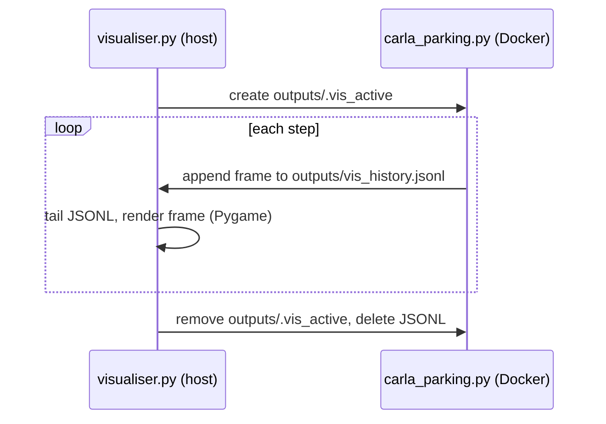
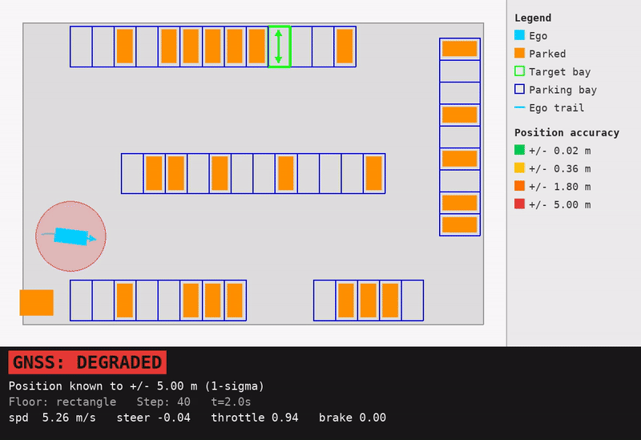

# scripts/visualise/

Detachable 2D bird's-eye Pygame visualiser for CARLA parking training and evaluation. Runs on the host machine - no CARLA connection, no Docker, no GPU required.

## Quick reference

| Task | Command |
|------|---------|
| Open 2D viewer (training already running) | `make visualise` |
| Load checkpoint + headless CARLA + 2D viewer | `make eval-visualise-2d` |
| Load checkpoint + CARLA 3D spectator | `make docker-eval-visualise-3d` |
| Custom checkpoint | `make eval-visualise-2d CHECKPOINT=checkpoints/step_500000` |

## How it works

The environment appends one JSON line per step to `outputs/vis_history.jsonl` (via `_write_vis_state()` in `carla_parking.py`) whenever the signal file `outputs/.vis_active` exists. The visualiser creates that file on start and removes it on close, so the env only writes frames while the window is open.

The visualiser tails the JSONL file in real time, groups lines into episodes, and renders each frame with Pygame. The static scene (lot boundary, bay outlines, parked vehicles) is pre-rendered to a surface once per episode and blitted; only dynamic elements (ego, patrol NPCs, pedestrians, trail) are redrawn each frame.

<!-- gif:placeholder name="visualiser_2d" caption="Detachable 2D bird's-eye visualiser during a parking episode" -->

## File protocol

| File | Written by | Read by |
|------|-----------|---------|
| `outputs/vis_history.jsonl` | `carla_parking.py` (`_write_vis_state()`) | `LiveVisualiser._read_new_frames()` |
| `outputs/.vis_active` | `LiveVisualiser.__init__()` | `carla_parking.py` (guards writes) |

## JSONL schema

Each line is a complete frame dict. All coordinates are in CARLA world frame.

| Key | Type | Contents |
|-----|------|----------|
| `episode_id` | int | Monotonic episode counter |
| `episode_step` | int | Step index within episode |
| `sim_time` | float | Accumulated simulation time (s) |
| `carla_time` | float | CARLA world elapsed seconds |
| `carla_sync` | bool | Synchronous mode on/off |
| `carla_fixed_dt` | float | Configured simulation fixed timestep (s) |
| `carla_timestep` | float | Effective CARLA timestep used for `sim_time` |
| `floor_plan` | str | Layout name (`rectangle`, `trapezoid`, `irregular_a`) |
| `ego` | dict | `{x, y, yaw, vx, vy, speed}` - ego pose and velocity |
| `action` | dict | `{steer, drive, brake}` - last action applied |
| `trajectory` | list | `[[x, y], ...]` ego trail (last N steps) |
| `actors` | list | NPC/static vehicles: `[{x, y, yaw, type}]` where `type` is `"npc"` or `"static"` |
| `pedestrians` | list | `[{x, y}]` for each pedestrian |
| `target_bay` | dict | `{x, y, yaw, width, depth, bay_type, bay_id}` |
| `bays` | list | All bay dicts in the current layout |
| `corners` | list | Lot perimeter polygon vertices `[{x, y}, ...]` |
| `end_reason` | str | Last frame only: `"collision"`, `"success"`, or `"timeout"` |
| `debug` | dict | Optional: per-step diagnostics from `DebugLogger.step_debug_dict()` |

## Layers drawn (back to front)

1. Lot boundary polygon (light grey fill)
2. Bay outlines by type: perpendicular=blue, angled=yellow, parallel=violet
3. Target bay (bright green, thick outline + heading arrows for nose-in and nose-out)
4. Static parked vehicles (orange rectangles)
5. Patrol NPC vehicles (red rectangles)
6. Pedestrians (teal circles)
7. Ego trajectory trail (faded cyan, capped at 500 points)
8. Ego vehicle (cyan rectangle + heading arrow)
9. HUD bar (floor plan, episode, step, sim time)
10. Debug HUD bar (position error, yaw error, speed, reward, covariance, actions) - only when `debug` key is present
11. Legend panel (right-hand side, static)

## Controls

| Key | Action |
|-----|--------|
| F | Toggle fullscreen |
| ESC / Q | Exit (removes signal file) |

## Package structure

| File | Purpose |
|------|---------|
| `visualiser.py` | `LiveVisualiser` class + CLI entry point (`python scripts/visualise/visualiser.py`) |
| `demo_drive.py` | Loads a checkpoint and drives deterministic CARLA episodes for visual inspection |
| `__init__.py` | Package marker - sets non-interactive Matplotlib backend |

## Window dimensions

| Component | Size |
|-----------|------|
| Map viewport | 900 x 900 px |
| Legend panel | 180 px wide (right-hand side) |
| Total window | 1080 x 900 px |
| FPS cap | 120 Hz |

## Dependencies

Pygame and numpy only. Both are installed in the project `.venv/` (via `make install`). Colours are imported from `scripts/colours/` - the single source of truth for the full visualisation palette.

## See also

- [scripts/README.md](../README.md) - all Make targets overview
- `scripts/colours/__init__.py` - colour palette reference
- [uncertainty_rl/envs/README.md](../../uncertainty_rl/envs/README.md) - `CARLAParkingEnv` that writes the JSONL frames
