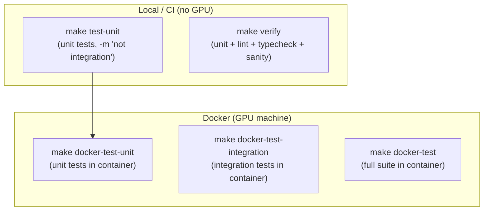

# tests/

pytest suite for `uncertainty_rl`. Two tiers: CPU-only unit tests (no CARLA, no ROS 2, no GPU) and Docker integration tests that run against the full simulation stack.

## At a glance

- Unit tests run on any machine - the env falls back to `carla = None` and `_ROS2_AVAILABLE = False`, returning zero uncertainty features
- Integration tests require the full three-tier Docker stack (CARLA + ROS 2 + training container)
- All tests use the shared fixtures in `conftest.py`

## Test tiers



## Running

```bash
# Unit tests. Use the container: torch is not installed in the host .venv, so
# `make test-unit` fails on the host with ModuleNotFoundError.
make docker-test-unit          # Unit tests in container (no GPU required)

# Host-side checks. These mirror CI exactly and run NO tests.
make verify                    # lint + typecheck + import sanity

# Full stack (Docker + GPU machine)
make docker-test-integration   # Integration tests (needs CARLA + ROS 2)
make docker-test               # Full suite (unit + integration)
```

## Test file inventory

### Unit tests (CPU-only)

| File | What it covers |
|------|---------------|
| `conftest.py` | Shared fixtures: `state_batch`, `single_state`, `train_config`, `eval_config` |
| `test_evidential_policy.py` | `EvidentialLayer`, `EvidentialPolicyNetwork`, `UncertaintyConditionedActor`: output shapes, NIG constraints, uncertainty positivity |
| `test_carla_parking.py` | `CARLAParkingEnv` obs/action shapes, geometry helpers (`point_in_polygon`, `yaw_from_quaternion`, `wrap_angle_symmetric`), `build_observation`, `extract_obstacle_features`, `load_floor_plan`, `wait_for_ekf`, bay sampling, reward, `VisStateWriter` |
| `test_covariance_utils.py` | `extract_2d_covariance_features`, `validate_covariance_matrix`, `get_covariance_dimension`, `make_diagonal_covariance` |
| `test_sb3_integration.py` | SB3 + evidential policy: policy construction, forward pass, action sampling, dual-encoder wiring |
| `test_evaluation.py` | `EvaluationMetrics` container and aggregation, `_scale_sensor_noise` (no CARLA connection) |
| `test_covariance_subscriber.py` | `_CovarianceSubscriber`: JSON file reading, mtime staleness guard, `invalidate()`, `get_latest_uncertainty()`, `get_latest_pose()`, `has_data` |
| `test_train_ppo.py` | `linear_schedule`, `EnvDiagnosticsCallback`, `make_env` helpers (no CARLA required) |
| `test_tune_hyperparams.py` | Optuna sampling, `apply_best_params`, `TrialEvalCallback` (no CARLA or GPU required) |
| `test_safety_wrapper.py` | `SafetyWrapper.apply()`, `step()`, `reset()`, `get_episode_safety_stats()` |
| `test_debug_logger.py` | `DebugLogger`: no-op contract when disabled, dict population when enabled |
| `test_actuation_calibration.py` | `ActuatorMap` (gain, deadband, bias, clamp), `ActuationCalibration` (identity, `from_config`) |
| `test_lidar_noise.py` | SICK TiM571 LiDAR noise model in `SensorManager`: Gaussian range noise, per-point bias, dropout rate |
| `test_bay_success.py` | `BaySuccessTracker`: per-bay success/attempt counting, CSV persistence |
| `test_curriculum_invariants.py` | Curriculum stage invariants: every obs channel live in every stage, architecture keys constant, one axis ramps per stage |
| `test_gnss_noise_relay.py` | `GnssNoiseRelayNode`: Doppler-style velocity / COG model, tier defaults, course-noise helper, and the `gnss_noise_profiles.yaml` mirror invariant |
| `test_observation_norm.py` | `normalise_observation`: fixed physical-range scaling, bounds, channel alignment |
| `test_cross_seed.py` | `scripts/analysis/cross_seed.py`: the pooled aggregator across seeds |
| `test_cross_seed_discovery.py` | `seed_roots()` in `_discovery.py`: locating the per-seed sub-roots |
| `test_gnss_tiers.py` | The visualiser's GNSS tier presentation loader |
| `test_recorder.py` | The visualiser's MP4 `FrameRecorder` |

The last four cover `scripts/`, not the `uncertainty_rl` package.

### Integration tests (Docker + GPU - `@pytest.mark.integration`)

| File | What it covers |
|------|---------------|
| `test_ros2_integration.py` | EKF covariance arrival within timeout, dimension check (3-element vector), non-zero uncertainty in `_get_state()`, EKF pose vs CARLA ground truth (4 tests) |

`test_carla_parking.py` straddles both tiers: it is listed above as a unit test, but one
of its cases carries `@pytest.mark.integration` and so is excluded from unit runs.

## Key fixture constants

These are the constants defined in `conftest.py` itself.

| Constant | Value | Description |
|----------|-------|-------------|
| `STATE_DIM` | 15 | A small arbitrary state dimension for the network fixtures. Deliberately **not** the 13-dim env observation, which keeps unit tests fast and independent of the ablation flags |
| `BATCH_SIZE` | 8 | Default batch size for tensor fixtures |
| `HIDDEN_DIMS` | [64, 64] | Default network architecture for test policies, smaller than production |

Tests that need the real observation dimension call `compute_obs_dim()` directly rather
than reading a fixture. The structural constants themselves (`TOTAL_OBS_DIM`,
`ACTION_DIM` and the rest) live in `uncertainty_rl/utils/constants.py`.

## Coverage map

| Source module | Test file |
|---------------|-----------|
| `networks/evidential_policy.py` | `test_evidential_policy.py` |
| `networks/sb3_integration.py` | `test_sb3_integration.py` |
| `envs/sim/carla_parking.py` | `test_carla_parking.py` |
| `envs/sim/helpers/_sensor_manager.py` | `test_lidar_noise.py` |
| `envs/covariance_subscriber.py` | `test_covariance_subscriber.py` |
| `envs/safety_wrapper.py` | `test_safety_wrapper.py` |
| `training/train_ppo.py` | `test_train_ppo.py` |
| `training/tune_hyperparams.py` | `test_tune_hyperparams.py` |
| `evaluation/evaluate.py` | `test_evaluation.py` |
| `utils/covariance_utils.py` | `test_covariance_utils.py` |
| `utils/logging.py` | `test_debug_logger.py` |
| `utils/actuation_calibration.py` | `test_actuation_calibration.py` |
| `utils/bay_success.py` | `test_bay_success.py` |
| `envs/_parking_core.py` (`normalise_observation`) | `test_observation_norm.py` |
| `ros2/.../sensor_relay/gnss_noise_relay.py` | `test_gnss_noise_relay.py` |
| `configs/deployment/sim/curriculum/*.yaml` | `test_curriculum_invariants.py` |
| `scripts/analysis/cross_seed.py` | `test_cross_seed.py` |
| `scripts/analysis/_discovery.py` | `test_cross_seed_discovery.py` |
| `scripts/visualise/gnss_tiers.py` | `test_gnss_tiers.py` |
| `scripts/visualise/recorder.py` | `test_recorder.py` |
| ROS 2 EKF pipeline | `test_ros2_integration.py` |

## See also

- [uncertainty_rl/README.md](../uncertainty_rl/README.md) - package overview
- [uncertainty_rl/envs/README.md](../uncertainty_rl/envs/README.md) - `CARLAParkingEnv` and `_CovarianceSubscriber`
- [uncertainty_rl/networks/README.md](../uncertainty_rl/networks/README.md) - evidential policy tested by `test_evidential_policy.py` and `test_sb3_integration.py`
