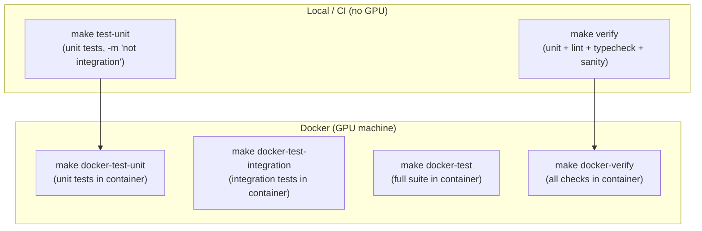

# tests/

pytest suite for `uncertainty_rl`. Two tiers: CPU-only unit tests (no CARLA, no ROS 2, no GPU) and Docker integration tests that run against the full simulation stack.

## At a glance

- Unit tests run on any machine - the env falls back to `carla = None` and `_ROS2_AVAILABLE = False`, returning zero uncertainty features
- Integration tests require the full three-tier Docker stack (CARLA + ROS 2 + training container)
- All tests use the shared fixtures in `conftest.py`

## Test tiers



## Running

```bash
# CPU-only (no Docker needed - same checks run in CI)
make test-unit         # Unit tests only
make verify            # Unit tests + lint + typecheck + import sanity

# Inside Docker (no GPU required for unit tests)
make docker-test-unit          # Unit tests in container
make docker-verify             # All checks in container

# Full stack (Docker + GPU machine)
make docker-test-integration   # Integration tests (needs CARLA + ROS 2)
make docker-test               # Full suite (unit + integration)
```

## Test file inventory

### Unit tests (CPU-only)

| File | What it covers |
|------|---------------|
| `conftest.py` | Shared fixtures: state tensors, config dicts, uncertainty states |
| `test_evidential_policy.py` | `EvidentialLayer`, `EvidentialPolicyNetwork`, `UncertaintyConditionedActor`: output shapes, NIG constraints, uncertainty positivity |
| `test_carla_parking.py` | `CARLAParkingEnv` obs/action shapes, geometry helpers (`point_in_polygon`, `yaw_from_quaternion`, `wrap_angle_symmetric`), `build_observation`, `extract_obstacle_features`, `load_floor_plan`, `wait_for_ekf`, bay sampling, reward, `VisStateWriter` |
| `test_covariance_utils.py` | `extract_2d_covariance_features`, `validate_covariance_matrix`, `get_covariance_dimension`, `make_diagonal_covariance` |
| `test_sb3_integration.py` | SB3 + evidential policy: policy construction, forward pass, action sampling, dual-encoder wiring |
| `test_baseline_configs.py` | All 4 baseline YAMLs load correctly and override only permitted keys |
| `test_evaluation.py` | `EvaluationMetrics` container and aggregation, `_scale_sensor_noise` (no CARLA connection) |
| `test_covariance_subscriber.py` | `_CovarianceSubscriber`: JSON file reading, mtime staleness guard, `invalidate()`, `get_latest_uncertainty()`, `get_latest_pose()`, `has_data` |
| `test_train_ppo.py` | `linear_schedule`, `EnvDiagnosticsCallback`, `make_env` helpers (no CARLA required) |
| `test_tune_hyperparams.py` | Optuna sampling, `apply_best_params`, `TrialEvalCallback` (no CARLA or GPU required) |
| `test_safety_wrapper.py` | `SafetyWrapper.apply()`, `step()`, `reset()`, `get_episode_safety_stats()` |
| `test_debug_logger.py` | `DebugLogger`: no-op contract when disabled, dict population when enabled |
| `test_actuation_calibration.py` | `ActuatorMap` (gain, deadband, bias, clamp), `ActuationCalibration` (identity, `from_config`) |
| `test_lidar_noise.py` | SICK TiM571 LiDAR noise model in `SensorManager`: Gaussian range noise, per-point bias, dropout rate |

### Integration tests (Docker + GPU - `@pytest.mark.integration`)

| File | What it covers |
|------|---------------|
| `test_ros2_integration.py` | EKF covariance arrival within timeout, dimension check (3-element vector), non-zero uncertainty in `_get_state()`, EKF pose vs CARLA ground truth (4 tests) |

## Key fixture constants

| Constant | Value | Description |
|----------|-------|-------------|
| `TOTAL_OBS_DIM` | 12 | vyaw + std_x/y/yaw + dx/dy/dyaw + 5 LiDAR obstacle features |
| `ACTION_DIM` | 3 | Steering, drive, brake |
| `BATCH_SIZE` | 8 | Default batch size for tensor fixtures |
| `HIDDEN_DIMS` | [64, 64] | Default network architecture for test policies |

## Coverage map

| Source module | Test file |
|---------------|-----------|
| `networks/evidential_policy.py` | `test_evidential_policy.py` |
| `networks/sb3_integration.py` | `test_sb3_integration.py` |
| `envs/sim/carla_parking.py` | `test_carla_parking.py` |
| `envs/sim/helpers/_sensor_manager.py` | `test_lidar_noise.py` |
| `envs/_covariance_subscriber.py` | `test_covariance_subscriber.py` |
| `envs/_safety_wrapper.py` | `test_safety_wrapper.py` |
| `training/train_ppo.py` | `test_train_ppo.py` |
| `training/tune_hyperparams.py` | `test_tune_hyperparams.py` |
| `evaluation/evaluate.py` | `test_evaluation.py` |
| `utils/covariance_utils.py` | `test_covariance_utils.py` |
| `utils/logging.py` | `test_debug_logger.py` |
| `utils/actuation_calibration.py` | `test_actuation_calibration.py` |
| `configs/baselines/*.yaml` | `test_baseline_configs.py` |
| ROS 2 EKF pipeline | `test_ros2_integration.py` |

## See also

- [uncertainty_rl/README.md](../uncertainty_rl/README.md) - package overview
- [uncertainty_rl/envs/README.md](../uncertainty_rl/envs/README.md) - `CARLAParkingEnv` and `_CovarianceSubscriber`
- [uncertainty_rl/networks/README.md](../uncertainty_rl/networks/README.md) - evidential policy tested by `test_evidential_policy.py` and `test_sb3_integration.py`
