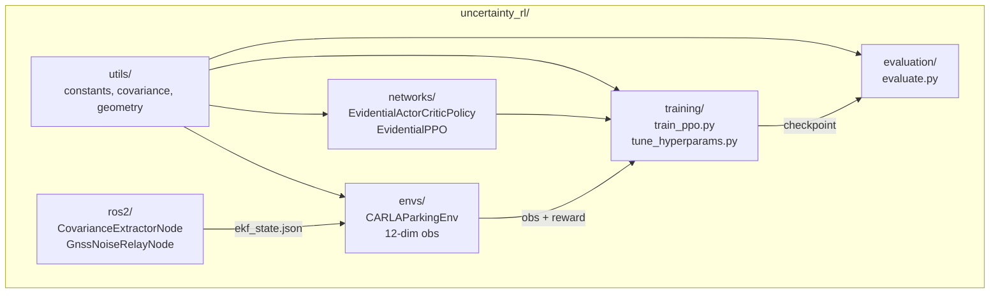

# uncertainty_rl/

Main Python package. Trains, evaluates, and deploys an uncertainty-conditioned RL parking agent using evidential deep learning.

## At a glance

- 12-dimensional observation: vyaw + 3 EKF covariance features + 3 relative target-pose features + 5 LiDAR obstacle features
- 2-dimensional action space: [steering, drive] (drive is bipolar: positive = throttle, negative = brake; no reverse gear)
- PPO with a Normal-Inverse-Gamma evidential actor head; standard MLP critic
- Dual-encoder path processes state and covariance features separately before fusion
- Evaluates across 9 GNSS degradation conditions (nominal RTK-fixed to worst-case RTK loss)
- Sim-to-real capable: all observations come from the EKF and LiDAR, not CARLA ground truth

## Package layout

| Subpackage | Responsibility |
|-----------|---------------|
| `networks/` | Evidential deep learning policy: NIG distributions, EvidentialPPO, dual-encoder actor |
| `envs/` | CARLA Gymnasium parking environment with real EKF covariance in observations |
| `training/` | PPO training loop and Optuna hyperparameter tuning |
| `evaluation/` | Condition sweep across 9 GNSS degradation scenarios |
| `ros2/` | ROS 2 bridge: EKF covariance extraction, GNSS/IMU noise relay |
| `utils/` | Shared constants, covariance tools, geometry helpers, logging, visualisation |

## Internal data flow



## Key imports

```python
# Networks
from uncertainty_rl.networks import (
    EvidentialLayer,
    EvidentialActorCriticPolicy,
    EvidentialPPO,
)

# Environment
from uncertainty_rl.envs import CARLAParkingEnv

# Training
from uncertainty_rl.training import train, load_config, TrainResult

# Evaluation
from uncertainty_rl.evaluation import evaluate_across_conditions

# Constants and utilities
from uncertainty_rl.utils import (
    TOTAL_OBS_DIM,             # 12
    ACTION_DIM,                # 2
    VEHICLE_STATE_DIM,         # 1
    COVARIANCE_FEATURES_DIM,   # 3
    extract_2d_covariance_features,
)
```

## Configuration keys consumed

| Config file | Keys |
|-------------|------|
| `configs/train_config.yaml` | `learning_rate`, `n_steps`, `batch_size`, `n_epochs`, `net_arch`, `activation`, `total_timesteps`, `policy_type`, `evidential.*`, `seed` |
| `configs/deployment/sim/env_config.yaml` | `carla_host`, `carla_port`, `max_steps`, `include_covariance`, `include_obstacle_obs`, `carla_sensors.*`, `parking_scenarios.*` |
| `configs/eval_config.yaml` | `eval_conditions`, `n_episodes`, `deterministic`, `output_dir` |
| `configs/gnss_noise_profiles.yaml` | RTK fix-state tiers and per-episode sampling weights |
| `configs/layouts/*.yaml` | Floor plan geometry (corners, bays, spawn points, patrol paths) |

<!-- gif:placeholder name="training_overview" caption="Training convergence across 1M steps with uncertainty logging" -->


## See also

- [networks/README.md](networks/README.md) - NIG actor, dual-encoder, EvidentialPPO
- [envs/README.md](envs/README.md) - Gymnasium env, 12-dim obs, reward function
- [training/README.md](training/README.md) - training loop, Optuna tuning
- [evaluation/README.md](evaluation/README.md) - 9-condition degradation sweep
- [ros2/README.md](ros2/README.md) - EKF covariance extraction, GNSS noise relay
- [utils/README.md](utils/README.md) - constants, covariance tools, geometry helpers
- [Root README](../README.md) - system overview, Docker quick start
