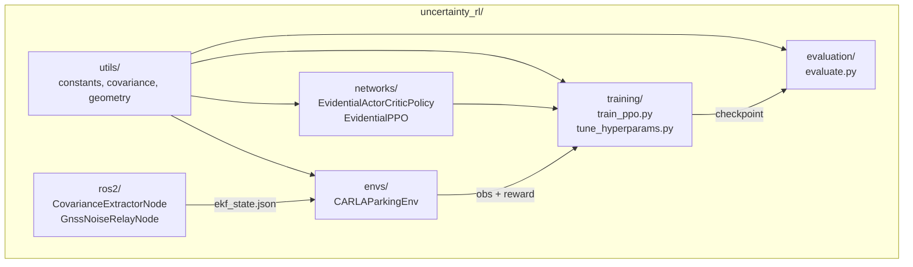

# uncertainty_rl/

Main Python package. Trains, evaluates, and deploys an uncertainty-conditioned RL parking agent using evidential deep learning.

## At a glance

- Continuous observation comprising EKF speed and yaw rate, EKF covariance features, the relative target-bay pose in the ego body frame, and hemispheric LiDAR clearance features. Observation flags toggle the covariance and obstacle blocks, and the active dimension is computed at runtime by `compute_obs_dim()` in [`envs/_parking_core.py`](envs/_parking_core.py) from the structural constants in [`utils/constants.py`](utils/constants.py).
- Continuous action space `[steering, throttle, brake]` with no reverse gear, covering forward perpendicular bay parking only. See [envs/README.md](envs/README.md#action-space).
- PPO with a Normal-Inverse-Gamma evidential actor head and a standard MLP critic.
- A seven-condition evaluation sweep, varying the GNSS fix state, LiDAR noise, bay occupancy and floor plan one factor at a time. The conditions are listed in [`configs/eval_config.yaml`](../configs/eval_config.yaml).
- Sim-to-real capable, since all observations come from the EKF and LiDAR rather than CARLA ground truth.

## Package layout

| Subpackage | Responsibility |
|-----------|---------------|
| `networks/` | Evidential deep learning policy: NIG distributions, EvidentialPPO, NIG actor head |
| `envs/` | CARLA Gymnasium parking environment with real EKF covariance in observations |
| `training/` | PPO training loop and Optuna hyperparameter tuning |
| `evaluation/` | Condition sweep across GNSS degradation scenarios |
| `ros2/` | ROS 2 bridge: EKF covariance extraction, GNSS/IMU noise relay |
| `utils/` | Shared constants, covariance tools, geometry helpers, logging, visualisation |

## Internal data flow



## Key imports

```python
# Networks
from uncertainty_rl.networks import (
    EvidentialLayer,
    EvidentialActorCriticPolicy,
    EvidentialPPO,
)

# Environment
from uncertainty_rl.envs import CARLAParkingEnv, make_env, SafetyWrapper

# Training
from uncertainty_rl.training import (
    train, load_config, load_env_config, merge_configs, TrainResult,
)

# Evaluation
from uncertainty_rl.evaluation import evaluate_across_conditions

# Constants and utilities
from uncertainty_rl.utils import (
    TOTAL_OBS_DIM,
    ACTION_DIM,
    VEHICLE_STATE_DIM,
    COVARIANCE_FEATURES_DIM,
    extract_2d_covariance_features,
)
```

Concrete values for the dimension constants live in
[`utils/constants.py`](utils/constants.py), the single source of
truth for the system's structural shape.

## Configuration keys consumed

Settings change as the project iterates - read the YAMLs directly for live
values rather than relying on this list.

| Config file | Section it owns |
|-------------|-----------------|
| [`configs/train_config.yaml`](../configs/train_config.yaml) | PPO hyperparameters, evidential settings, training schedule |
| [`configs/deployment/sim/env_config.yaml`](../configs/deployment/sim/env_config.yaml) | CARLA env, sensors, parking scenarios, curriculum overrides |
| [`configs/eval_config.yaml`](../configs/eval_config.yaml) | Evaluation condition sweep |
| [`configs/deployment/sim/gnss_noise_profiles.yaml`](../configs/deployment/sim/gnss_noise_profiles.yaml) | RTK fix-state tiers and per-episode sampling weights |
| [`configs/layouts/*.yaml`](../configs/layouts/) | Floor plan geometry (corners, bays, spawn points, patrol paths) |

## See also

- [networks/README.md](networks/README.md) - NIG actor, EvidentialPPO
- [envs/README.md](envs/README.md) - Gymnasium env, observation space, reward function
- [training/README.md](training/README.md) - training loop, Optuna tuning
- [evaluation/README.md](evaluation/README.md) - condition degradation sweep
- [ros2/README.md](ros2/README.md) - EKF covariance extraction, GNSS noise relay
- [utils/README.md](utils/README.md) - constants, covariance tools, geometry helpers
- [envs/real/README.md](envs/real/README.md) - real-vehicle deployment and inference loop
- [Root README](../README.md) - system overview, Docker quick start
