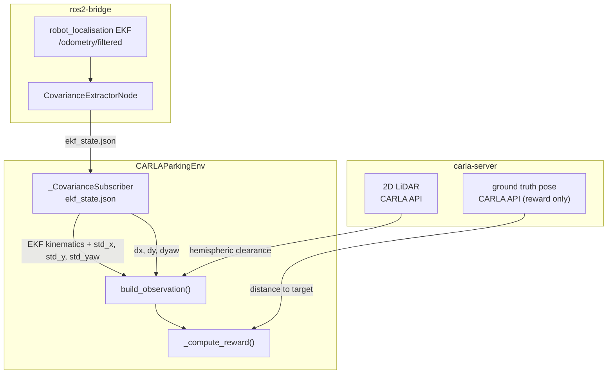

# envs/

Gymnasium-compatible CARLA parking environment with real EKF covariance from `robot_localisation` embedded in the observation space.

## At a glance

- Observation comprises EKF kinematics, EKF covariance features, the relative target-bay pose in the ego body frame, and hemispheric LiDAR clearance. The active dimension is derived from the structural constants in [`uncertainty_rl/utils/constants.py`](../utils/constants.py) and the `include_covariance` / `include_obstacle_obs` ablation flags; use `compute_obs_dim()` rather than hardcoding.
- Continuous action space `[steering, throttle, brake]`. Steering is bipolar; throttle and brake are independent non-negative axes. No reverse gear: forward perpendicular bay parking only.
- Reward shaped by localisation quality: per-step shaping is attenuated when EKF position covariance is large.
- Three pre-computed floor plans: `rectangle`, `trapezoid` (training), and `irregular_a` (OOD only).
- Sim-to-real capable: all observation features come from EKF and LiDAR, never CARLA ground truth.
- Requires the full Docker stack for training (carla-server + ros2-bridge + training).

## Modules

| Module | Class / purpose |
|--------|----------------|
| `sim/carla_parking.py` | `CARLAParkingEnv` - main Gymnasium env |
| `covariance_subscriber.py` | `_CovarianceSubscriber` - file-based EKF state reader (no DDS) |
| `safety_wrapper.py` | `SafetyWrapper` - action modulation at eval time based on evidential uncertainty |
| `_parking_core.py` | Pure helper functions shared by sim and real-world deployment |
| `sim/helpers/_lot_spawner.py` | `LotSpawner` - per-episode static actor spawning (cones, parked vehicles) |
| `sim/helpers/_npc_controller.py` | `NPCController` - patrol vehicle and pedestrian lifecycle |
| `sim/helpers/_sensor_manager.py` | `SensorManager` - sensor spawning, callbacks, and cleanup |
| `real/deployment_utils.py` | `RealWorldDeployment` - surveyed datum loading and actuator calibration |
| `real/inference_loop.py` | `RealWorldInferenceLoop` - policy inference loop for physical vehicle |

## Internal data flow



## State space

CARLA ground truth is used **only** in `_compute_reward()` - never in the observation.
Absolute EKF position is excluded: it drifts across episodes in the odom frame and carries
no consistent signal. Navigation intent is encoded by the relative target-bay pose.

Feature blocks (in order of indices):

| Block | Source | Description |
|-------|--------|-------------|
| Vehicle state | EKF filtered twist | Body-frame longitudinal speed and yaw rate |
| EKF covariance | EKF | Diagonal standard deviations $\sigma_x, \sigma_y, \sigma_\psi$ (when `include_covariance=True`) |
| Relative target pose | Bay layout + EKF pose | $dx, dy, d\psi$ of the target bay in the ego body frame |
| Hemispheric LiDAR clearance | LiDAR scan | Nearest left, right, and forward obstacle features (when `include_obstacle_obs=True`) |

Structural constants and their concrete values live in
[`uncertainty_rl/utils/constants.py`](../utils/constants.py)
(`VEHICLE_STATE_DIM`, `COVARIANCE_FEATURES_DIM`, `TARGET_POSE_DIM`,
`OBSTACLE_FEATURES_DIM`, `TOTAL_OBS_DIM`). At runtime call
`compute_obs_dim(include_covariance, include_obstacle_obs)` for the
flag-aware dimension.

## Action space

```math
a = [\text{steering},\ \text{throttle},\ \text{brake}]
\qquad
\text{steering} \in [-1,1],\quad \text{throttle},\ \text{brake} \in [0,1]
```

Throttle and brake are independent non-negative axes so a held stop
(throttle = 0, brake > 0) is a stable region of the action space. No
reverse gear: forward perpendicular bay parking only.

## Target pose computation

$(dx, dy, d\psi)$ is recomputed every step from the current EKF pose and the fixed world-frame
target bay coordinates selected at episode start. See
[`uncertainty_rl/utils/geometry.py`](../utils/geometry.py) for the exact
expression and the CARLA-vs-REP-103 chirality handling.

## Reward function

Per-step potential-based shaping (Ng et al. 1999) scaled by localisation
quality, plus a bounded approach reward peak co-located with the target
bay so the success state is the unique per-step optimum. Terminal events
(success, collision) and the approach peak bypass the uncertainty scaling
so they are not down-weighted under high EKF covariance.

The reward coefficients (proximity weight, alignment weight, approach
radius and peak, terminal magnitudes, success thresholds) change as the
project iterates. Read the live values from
[`configs/deployment/sim/env_config.yaml`](../../configs/deployment/sim/env_config.yaml),
[`configs/train_config.yaml`](../../configs/train_config.yaml), and
[`uncertainty_rl/utils/constants.py`](../utils/constants.py)
rather than relying on a duplicate in this README. The exact source of
truth for the reward computation is `CARLAParkingEnv._compute_reward()`
in [`sim/carla_parking.py`](sim/carla_parking.py).

## Floor plans

| Floor plan | Shape | Role |
|-----------|-------|------|
| `rectangle` | Standard rectangular perimeter | Training |
| `trapezoid` | Widened at one end | Training |
| `irregular_a` | Nine-sided irregular polygon | OOD only (never seen during training) |

Geometry (corners, bay positions, spawn transform, patrol waypoints, pedestrian zones) is
pre-computed offline. Regenerate with `make generate-layouts`. Bay counts and exact bay
identifiers live in the layout YAMLs in [`configs/layouts/`](../../configs/layouts/).

## Episode randomisation

| Condition | Range | Effect |
|-----------|-------|--------|
| RTK fix-state tier | Per-episode sample from `gnss_noise_profiles.yaml` | Primary EKF uncertainty source |
| NPC patrol vehicles | Configurable in `parking_scenarios` | Dynamic LiDAR obstacles |
| Pedestrians | Configurable in `parking_scenarios` | Moving LiDAR obstacles |
| Bay occupancy rate | Configurable | Static parked vehicle density |
| No weather | N/A | FlatPlane does not render weather |

When the `fixed_*` keys in `parking_scenarios` are set, the random sampler is bypassed
and the named floor plan / bay / tier is used every episode. This is how curriculum
overrides are expressed.

## Key interfaces

```python
from uncertainty_rl.envs import CARLAParkingEnv

env = CARLAParkingEnv(
    ros2_config=ros2_cfg,
    carla_sensors_config=sensor_cfg,
    parking_scenarios_config=scenario_cfg,
    include_covariance=True,
    include_obstacle_obs=True,
)

obs, info = env.reset()
obs, reward, terminated, truncated, info = env.step(action)
```

## `_parking_core.py` helpers

| Function | Purpose |
|----------|---------|
| `compute_obs_dim` | Active obs dimension from ablation flags |
| `build_observation` | Fill pre-allocated obs buffer from EKF state, uncertainty, and LiDAR |
| `extract_obstacle_features` | Hemispheric LiDAR clearance (5-element buffer) |
| `load_floor_plan` | Select and cache a floor plan YAML for one episode |
| `wait_for_ekf` | Block until LiDAR and EKF data are both available |
| `calibrate_ekf_frame_offset` | Odom-to-world 2D rigid body transform |

## Configuration keys consumed

| Config file | Keys |
|-------------|------|
| [`configs/deployment/sim/env_config.yaml`](../../configs/deployment/sim/env_config.yaml) | `carla_host`, `carla_port`, `max_steps`, `action_repeat`, `include_covariance`, `include_obstacle_obs`, `carla_sensors.*`, `parking_scenarios.*` |
| [`configs/deployment/sim/gnss_noise_profiles.yaml`](../../configs/deployment/sim/gnss_noise_profiles.yaml) | RTK fix-state tiers and per-episode sampling weights |
| [`configs/layouts/*.yaml`](../../configs/layouts/) | Floor plan geometry (corners, bays, spawn, patrol, zones) |
| [`uncertainty_rl/utils/constants.py`](../utils/constants.py) | Structural dimensions and success thresholds |

<!-- gif:placeholder name="parking_episode" caption="Bird's-eye view of a parking episode under RTK float conditions" -->


## See also

- [uncertainty_rl/README.md](../README.md) - package overview
- [networks/README.md](../networks/README.md) - evidential actor that consumes this observation
- [ros2/README.md](../ros2/README.md) - EKF covariance extraction pipeline
- [docs/detailed_notes/observation_space.md](../../docs/detailed_notes/observation_space.md) - observation design rationale
- [docs/detailed_notes/layout.md](../../docs/detailed_notes/layout.md) - floor plan geometry and DSL
