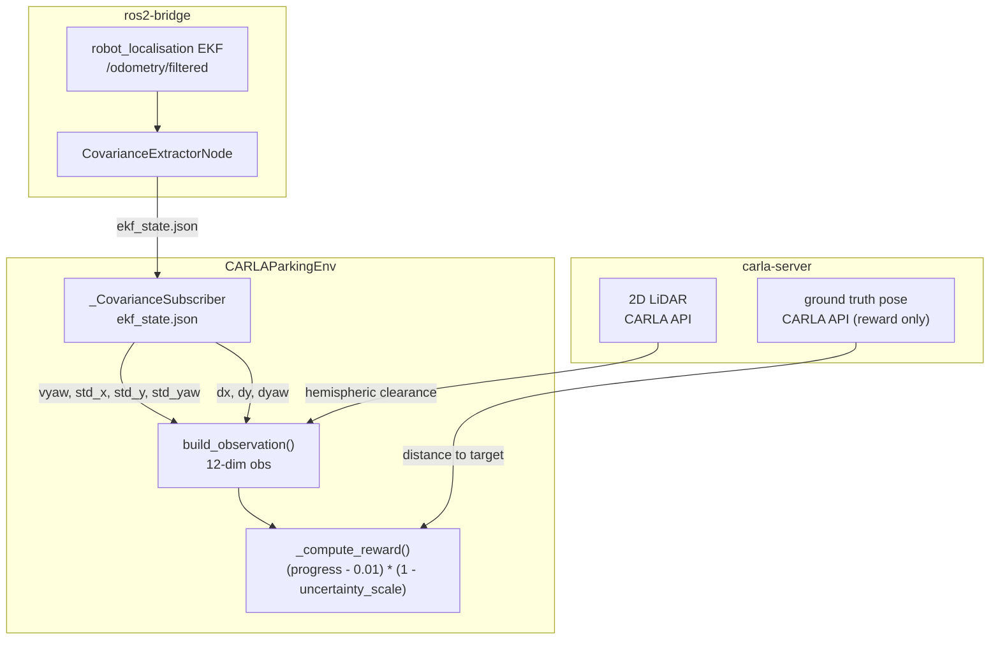

# envs/

Gymnasium-compatible CARLA parking environment with real EKF covariance from `robot_localisation` embedded in the observation space.

## At a glance

- 12-dimensional observation (default): vyaw + EKF std devs + relative target pose + hemispheric LiDAR clearance
- 3-dimensional action space: steering $\in [-1,1]$, drive $\in [-1,1]$, brake $\in [0,1]$
- Reward shaped by localisation quality: progress attenuated when $\max(\sigma_x, \sigma_y)$ is large
- Three pre-computed floor plans: `rectangle` (53 bays), `trapezoid` (39 bays), `irregular_a` (58 bays, OOD only)
- Sim-to-real capable: all observation features come from EKF and LiDAR, never CARLA ground truth
- Requires the full Docker stack for training (carla-server + ros2-bridge + training)

## Modules

| Module | Class / purpose |
|--------|----------------|
| `sim/carla_parking.py` | `CARLAParkingEnv` - main Gymnasium env |
| `covariance_subscriber.py` | `_CovarianceSubscriber` - file-based EKF state reader (no DDS) |
| `safety_wrapper.py` | `SafetyWrapper` - action modulation at eval time based on evidential uncertainty |
| `_parking_core.py` | Pure helper functions shared by sim and real-world deployment |
| `sim/helpers/_lot_spawner.py` | `LotSpawner` - per-episode static actor spawning (cones, parked vehicles) |
| `sim/helpers/_npc_controller.py` | `NPCController` - patrol vehicle and pedestrian lifecycle |
| `sim/helpers/_sensor_manager.py` | `SensorManager` - sensor spawning, callbacks, and cleanup |
| `real/deployment_utils.py` | `RealWorldDeployment` - surveyed datum loading and actuator calibration |
| `real/inference_loop.py` | `RealWorldInferenceLoop` - policy inference loop for physical vehicle |

## Internal data flow



## State space (12-dimensional default)

CARLA ground truth is used **only** in `_compute_reward()` - never in the observation.
Absolute EKF position is excluded: it drifts across episodes in the odom frame and carries
no consistent signal. Navigation intent is encoded by $dx, dy, d\psi$ (indices 4-6).

| Index | Feature | Source | Description |
|-------|---------|--------|-------------|
| 0 | $\dot\psi$ (vyaw) | EKF filtered pose | Yaw rate estimate (rad/s) |
| 1-3 | $\sigma_x, \sigma_y, \sigma_\psi$ | EKF covariance | Localisation std devs |
| 4-6 | $dx, dy, d\psi$ | Target bay (relative) | Target bay pose in ego body frame |
| 7-8 | $d_\text{left}, \theta_\text{left}$ | LiDAR scan | Nearest obstacle in left hemisphere |
| 9-10 | $d_\text{right}, \theta_\text{right}$ | LiDAR scan | Nearest obstacle in right hemisphere |
| 11 | $d_\text{fwd}$ | LiDAR scan | Nearest obstacle in forward cone ($\pm 15$ deg) |

**Ablation flags** (`include_covariance`, `include_obstacle_obs`):

| `include_covariance` | `include_obstacle_obs` | Obs dim |
|---------------------|----------------------|---------|
| True | True | 12 (default) |
| False | True | 9 |
| True | False | 7 |
| False | False | 4 |

Use `compute_obs_dim()` from `_parking_core.py` rather than hardcoding.

## Action space (3-dimensional)

```math
a = [\text{steering},\ \text{drive},\ \text{brake}]
\qquad
\text{steering} \in [-1,1],\quad \text{drive} \in [-1,1],\quad \text{brake} \in [0,1]
```

Negative drive engages reverse throttle. Brake is applied independently of drive direction.

## Target pose computation

$(dx, dy, d\psi)$ is recomputed every step from the current EKF pose and the fixed world-frame
target bay coordinates selected at episode start:

```math
\begin{aligned}
dx   &=  \cos(\psi_\text{ego})(x_t - x_\text{ego}) + \sin(\psi_\text{ego})(y_t - y_\text{ego}) \\
dy   &= -\sin(\psi_\text{ego})(x_t - x_\text{ego}) + \cos(\psi_\text{ego})(y_t - y_\text{ego}) \\
d\psi &= \mathrm{wrap}(\psi_t - \psi_\text{ego})
\end{aligned}
```

## Reward function

Potential-based shaping scaled by localisation quality:

```math
\begin{aligned}
\text{progress} &= \frac{d_{t-1} - d_t}{D_\text{max}} \\[6pt]
s &= \mathrm{clip}\!\left(\frac{\max(\sigma_x, \sigma_y)}{\sigma_\text{max}},\ 0,\ 1\right) \\[6pt]
r &= \text{progress} \cdot (1 - s) - 0.01
\end{aligned}
```

where $D_\text{max} = 20.0$ m (`OUT_OF_BOUNDS_THRESHOLD`) and $\sigma_\text{max} = 2.0$ m
(`uncertainty_std_max`). When `include_covariance=False`, $s = 0$ (no attenuation).

**Terminal rewards:**

| Event | Reward | `terminated` |
|-------|--------|-------------|
| Successful park | $+10.0$ | True |
| Collision (ego fault) | $-10.0$ | True |
| Collision (non-ego fault) | $0.0$ | True |
| Timeout (`max_steps`) | none | False (`truncated=True`) |

**Success criteria:** position error $< 0.75$ m, orientation error $< 10$ deg, speed $< 0.1$ m/s. All three thresholds must hold for `success_dwell_steps` consecutive steps (default 5 = 0.25 s at 20 Hz) before the episode terminates as a success - this prevents a fast drive-through that momentarily satisfies the bounds from being counted as a park.

## Floor plans

| Floor plan | Bays | Shape | Role |
|-----------|------|-------|------|
| `rectangle` | 53 | Standard rectangular perimeter | Training |
| `trapezoid` | 39 | Widened at one end | Training |
| `irregular_a` | 58 | Nine-sided irregular polygon | OOD only (never seen during training) |

Geometry (corners, bay positions, spawn transform, patrol waypoints, pedestrian zones) is
pre-computed offline. Regenerate with `make generate-layouts`.

## Episode randomisation

| Condition | Range | Effect |
|-----------|-------|--------|
| RTK fix-state tier | Per-episode sample from `gnss_noise_profiles.yaml` | Primary EKF uncertainty source |
| NPC patrol vehicles | 0-3 per episode | Dynamic LiDAR obstacles |
| Pedestrians | 0-4 per episode | Moving LiDAR obstacles |
| Bay occupancy rate | Configurable | Static parked vehicle density |
| No weather | N/A | FlatPlane does not render weather |

## Key interfaces

```python
from uncertainty_rl.envs import CARLAParkingEnv

env = CARLAParkingEnv(
    ros2_config=ros2_cfg,
    carla_sensors_config=sensor_cfg,
    parking_scenarios_config=scenario_cfg,
    include_covariance=True,
    include_obstacle_obs=True,
)

obs, info = env.reset()
obs, reward, terminated, truncated, info = env.step(action)
```

## `_parking_core.py` helpers

| Function | Purpose |
|----------|---------|
| `compute_obs_dim` | Active obs dimension from ablation flags |
| `build_observation` | Fill pre-allocated obs buffer from EKF state, uncertainty, and LiDAR |
| `extract_obstacle_features` | Hemispheric LiDAR clearance (5-element buffer) |
| `load_floor_plan` | Select and cache a floor plan YAML for one episode |
| `wait_for_ekf` | Block until LiDAR and EKF data are both available |
| `calibrate_ekf_frame_offset` | Odom-to-world 2D rigid body transform; returns $(t_x, t_y, \cos r, \sin r, r)$ |

## Configuration keys consumed

| Config file | Keys |
|-------------|------|
| `configs/deployment/sim/env_config.yaml` | `carla_host`, `carla_port`, `max_steps`, `success_dwell_steps`, `include_covariance`, `include_obstacle_obs`, `carla_sensors.*`, `parking_scenarios.*` |
| `configs/gnss_noise_profiles.yaml` | RTK fix-state tiers and per-episode sampling weights |
| `configs/layouts/*.yaml` | Floor plan geometry (corners, bays, spawn, patrol, zones) |
| `uncertainty_rl/utils/constants.py` | `VEHICLE_STATE_DIM` (1), `COVARIANCE_FEATURES_DIM` (3), `TARGET_POSE_DIM` (3), `OBSTACLE_FEATURES_DIM` (5), `TOTAL_OBS_DIM` (12), `ACTION_DIM` (3) |

<!-- gif:placeholder name="parking_episode" caption="Bird's-eye view of a parking episode under RTK float conditions" -->


## See also

- [uncertainty_rl/README.md](../README.md) - package overview
- [networks/README.md](../networks/README.md) - evidential actor that consumes this observation
- [ros2/README.md](../ros2/README.md) - EKF covariance extraction pipeline
- [docs/detailed_notes/observation_space.md](../../docs/detailed_notes/observation_space.md) - observation design rationale
- [docs/detailed_notes/layout.md](../../docs/detailed_notes/layout.md) - floor plan geometry and DSL
