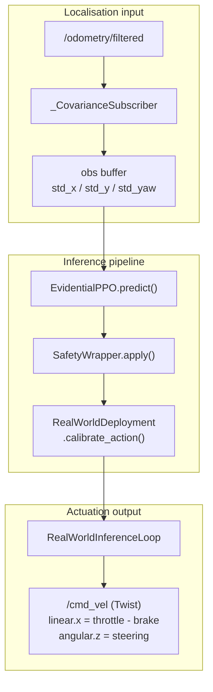

# envs/real/

Real-world deployment stubs for the uncertainty-conditioned parking policy. Sister package
to `envs/sim/` (CARLA training environment). Provides the localisation, actuation, and
inference scaffolding needed to run a trained policy on a physical instrumented vehicle.

**Status: never run on hardware.** The pipeline is implemented and unit-tested, but it
has never driven a physical vehicle, so nothing in this package is empirically validated.
Three things are outstanding before a first closed-loop trial: the LiDAR hardware callback
(`_get_lidar_scan`) and the vehicle command interface, both hardware-specific; the surveyed
lot datum; and the actuator calibration. The last two ship as placeholders that reduce to
identity transforms. See `docs/detailed_notes/deployment/real_world_deployment.md` for the
code map and Appendix B of the dissertation for the pre-deployment sequence.

---

## At a glance

- Maps EKF-estimated pose to the surveyed lot frame via a calibrated rigid-body offset
- Scales raw policy actions to physical actuator commands via `ActuationCalibration`
- Runs the same `SafetyWrapper` used in simulation (no retraining required)
- File-based EKF subscriber (`_CovarianceSubscriber`) - identical to the sim path
- No CARLA dependency, with all CARLA imports confined to `envs/sim/`

---

## Data flow



---

## Modules

| File | Class | Responsibility |
|------|-------|---------------|
| [deployment_utils.py](deployment_utils.py) | `RealWorldDeployment` | Loads the surveyed datum and actuation calibration, and maps policy actions to physical commands |
| [inference_loop.py](inference_loop.py) | `RealWorldInferenceLoop` | Drives the trained policy and publishes `geometry_msgs/Twist` to the configured actuation topic, `/cmd_vel` by default. The loop is not rate-limited in code and runs as fast as the observation read returns |
| [__init__.py](__init__.py) | - | Exports `RealWorldDeployment` only. `RealWorldInferenceLoop` is imported from its own module |

---

## Key interfaces

### RealWorldDeployment

```python
from uncertainty_rl.envs.real import RealWorldDeployment

# Load from config files. The datum path is the surveyed file copied from
# real_world_datum.yaml.example; a missing file degrades to an identity transform.
deployment = RealWorldDeployment.from_config(
    datum_path="configs/deployment/real/real_world_datum.yaml",
    calibration_path="configs/deployment/real/actuation_calibration.yaml",
)

# Load from mission file. Returns a 2-tuple: the deployment and the resolved
# target bay dict read from the layout YAML.
deployment, target_bay = RealWorldDeployment.from_mission(
    mission_path="configs/deployment/real/mission.yaml",
    datum_path="configs/deployment/real/real_world_datum.yaml",
    calibration_path="configs/deployment/real/actuation_calibration.yaml",
)

# Map policy action to physical command (steering, throttle, brake)
steering, throttle, brake = deployment.calibrate_action(
    raw_action[0], raw_action[1], raw_action[2]
)

# Reference pose in lot frame (used for EKF frame calibration)
lot_x, lot_y, heading_rad = deployment.reference_pose()
```

### RealWorldInferenceLoop

```python
from uncertainty_rl.envs.real.inference_loop import RealWorldInferenceLoop

# The model path, deployed baseline, safety threshold and ROS 2 topics all come
# from agent_config.yaml. Only the mission is passed positionally.
loop = RealWorldInferenceLoop.from_config(
    mission_path="configs/deployment/real/mission.yaml",
    agent_config_path="configs/deployment/agent_config.yaml",
)
loop.prepare()       # calibrate EKF frame offset, wait for sensor readiness
result = loop.run()  # blocks until success, timeout, or handoff
# result: {steps, handoff_count, terminated, truncated}

loop.request_stop()  # operator abort; publishes a zero-velocity command
```

`from_config` reads `baseline` from `agent_config.yaml` and takes
`include_covariance` / `include_obstacle_obs` from that baseline file. These must match
the arm the checkpoint was trained as, or the observation shape will not match the
weights.

---

## Configuration files

| File | Purpose |
|------|---------|
| `configs/deployment/agent_config.yaml` | The entry point for `from_config`. Holds `model_path`, the deployed `baseline`, `safety_handoff_threshold`, `max_steps`, the `ros2` block and the paths to the two files below |
| `configs/deployment/real/real_world_datum.yaml` | Surveyed lot origin. Not tracked in the repository: copy `real_world_datum.yaml.example` and fill in the survey. A missing file degrades silently to an identity transform |
| `configs/deployment/real/actuation_calibration.yaml` | Steering and longitudinal gain, deadband and bias for the physical vehicle |
| `configs/deployment/real/mission.yaml` | Target bay identifier and layout file for a deployment run |

---

## EKF frame calibration

On `prepare()`, `RealWorldInferenceLoop` calls `calibrate_ekf_frame_offset()` from
`_parking_core.py`. This computes the 2D rigid-body transform between the EKF odometry
frame and the surveyed lot frame, using the datum coordinates from `real_world_datum.yaml`.
The transform is applied at every step so that `dx/dy/dyaw` (obs indices 5-7) point to
the correct target bay.

See `docs/detailed_notes/deployment/real_world_deployment.md` for the full calibration
derivation and the EKF convergence loop parameters.

---

## Known stub

`RealWorldInferenceLoop._get_lidar_scan()` returns `None` until a hardware-specific
ROS 2 subscriber is wired up. When `None`, the obstacle features (obs indices 8-12)
are zeroed. The safety wrapper remains active for total-uncertainty handoffs, but
obstacle avoidance relies on the human safety operator during initial testing.

---

## See also

- `uncertainty_rl/envs/sim/` - CARLA training environment (shared `_parking_core.py`)
- `uncertainty_rl/envs/safety_wrapper.py` - `SafetyWrapper.apply()` static method
- `uncertainty_rl/utils/actuation_calibration.py` - `ActuationCalibration` class
- `docs/detailed_notes/deployment/real_world_deployment.md` - full deployment guide
- `docs/detailed_notes/deployment/sim_to_real_transfer.md` - sim-to-real gap analysis
