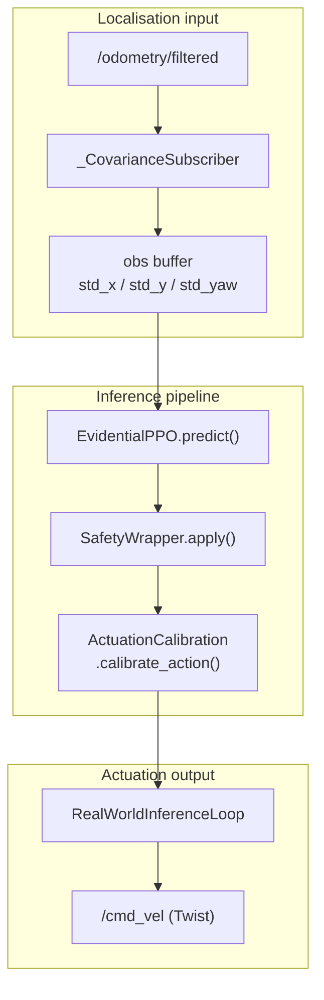

# envs/real/

Real-world deployment stubs for the uncertainty-conditioned parking policy. Sister package
to `envs/sim/` (CARLA training environment). Provides the localisation, actuation, and
inference scaffolding needed to run a trained policy on a physical instrumented vehicle.

**Status:** Stubs complete. LiDAR hardware callback (`_get_lidar_scan`) requires
hardware-specific implementation before closed-loop testing. See
`docs/detailed_notes/deployment/real_world_deployment.md` for the pre-deployment checklist.

---

## At a Glance

- Maps EKF-estimated pose to the surveyed lot frame via a calibrated rigid-body offset
- Scales raw policy actions to physical actuator commands via `ActuationCalibration`
- Runs the same `SafetyWrapper` used in simulation (no retraining required)
- File-based EKF subscriber (`_CovarianceSubscriber`) - identical to the sim path
- No CARLA dependency; all CARLA imports confined to `envs/sim/`

---

## Data Flow



---

## Modules

| File | Class | Responsibility |
|------|-------|---------------|
| [deployment_utils.py](deployment_utils.py) | `RealWorldDeployment` | Loads surveyed datum and actuation calibration; maps policy actions to physical commands |
| [inference_loop.py](inference_loop.py) | `RealWorldInferenceLoop` | Runs trained policy at 20 Hz; publishes `geometry_msgs/Twist` to `/cmd_vel` |
| [__init__.py](__init__.py) | - | Exports `RealWorldDeployment`, `RealWorldInferenceLoop` |

---

## Key Interfaces

### RealWorldDeployment

```python
from uncertainty_rl.envs.real import RealWorldDeployment

# Load from config files
deployment = RealWorldDeployment.from_config(
    datum_path="configs/deployment/real/real_world_datum.yaml",
    calibration_path="configs/deployment/real/actuation_calibration.yaml",
)

# Load from mission file (resolves target bay from layout YAML)
deployment = RealWorldDeployment.from_mission(
    mission_path="configs/deployment/real/mission.yaml",
    datum_path="configs/deployment/real/real_world_datum.yaml",
    calibration_path="configs/deployment/real/actuation_calibration.yaml",
)

# Map policy action to physical command (steering, throttle, brake)
steering, throttle, brake = deployment.calibrate_action(
    raw_action[0], raw_action[1], raw_action[2]
)

# Reference pose in lot frame (used for EKF frame calibration)
lot_x, lot_y, heading_rad = deployment.reference_pose()
```

### RealWorldInferenceLoop

```python
from uncertainty_rl.envs.real import RealWorldInferenceLoop

loop = RealWorldInferenceLoop.from_config(
    model_path="outputs/checkpoints/best_model.zip",
    config_path="configs/deployment/real/mission.yaml",
)
loop.prepare()       # calibrate EKF frame offset, wait for sensor readiness
result = loop.run()  # blocks until success, timeout, or handoff
# result: {steps, handoff_count, terminated, truncated}
```

---

## Configuration Files

| File | Purpose |
|------|---------|
| `configs/deployment/real/real_world_datum.yaml` | Surveyed lot origin: UTM easting/northing, heading, lot_x/lot_y |
| `configs/deployment/real/actuation_calibration.yaml` | Steering and longitudinal gain/deadband/bias for the physical vehicle |
| `configs/deployment/real/mission.yaml` | Target bay ID and layout file for a deployment run |

---

## EKF Frame Calibration

On `prepare()`, `RealWorldInferenceLoop` calls `calibrate_ekf_frame_offset()` from
`_parking_core.py`. This computes the 2D rigid-body transform between the EKF odometry
frame and the surveyed lot frame, using the datum coordinates from `real_world_datum.yaml`.
The transform is applied at every step so that `dx/dy/dyaw` (obs indices 4-6) point to
the correct target bay.

See `docs/detailed_notes/deployment/real_world_deployment.md` for the full calibration
derivation and the EKF convergence loop parameters.

---

## Known Stub

`RealWorldInferenceLoop._get_lidar_scan()` returns `None` until a hardware-specific
ROS 2 subscriber is wired up. When `None`, the obstacle features (obs indices 7-11)
are zeroed. The safety wrapper remains active for total-uncertainty handoffs;
obstacle avoidance relies on the human safety operator during initial testing.

---

## See Also

- `uncertainty_rl/envs/sim/` - CARLA training environment (shared `_parking_core.py`)
- `uncertainty_rl/envs/safety_wrapper.py` - `SafetyWrapper.apply()` static method
- `uncertainty_rl/utils/actuation_calibration.py` - `ActuationCalibration` class
- `docs/detailed_notes/deployment/real_world_deployment.md` - full deployment guide
- `docs/detailed_notes/deployment/sim_to_real_transfer.md` - sim-to-real gap analysis
