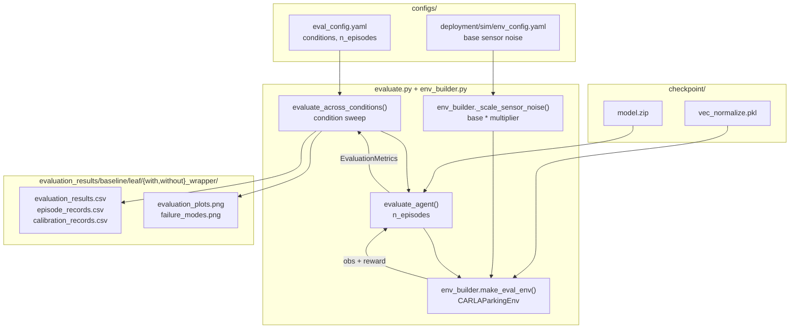
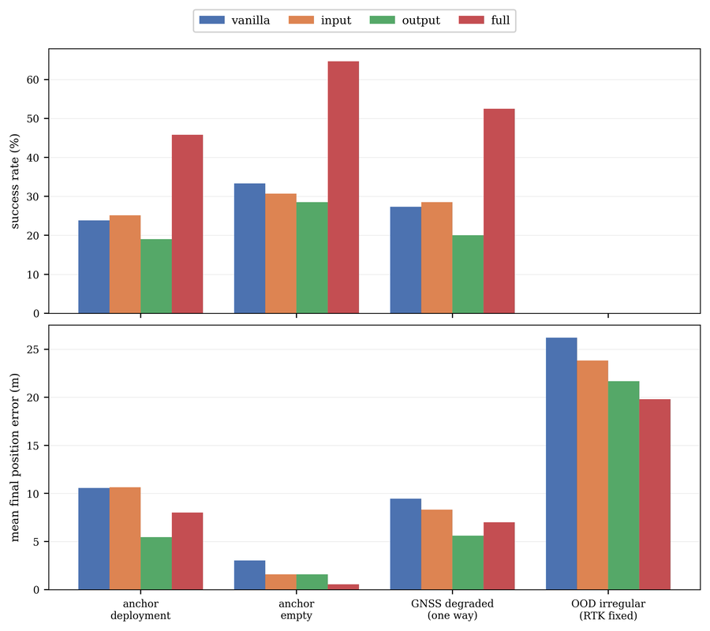

# evaluation/

Performance evaluation across varying physical conditions. Tests whether the uncertainty-conditioned policy degrades more gracefully than baselines as localisation uncertainty increases.

## At a glance

- 7 conditions: 6 de-confounded single-factor conditions plus one mid-episode degradation condition. Each de-confounded condition varies exactly ONE factor against the in-distribution anchor (rectangle lot, occupancy 0.5, no dynamic actors)
- Base noise from `env_config.yaml`; per-condition multipliers applied by `_scale_sensor_noise()` (LiDAR noise always enabled at eval, matching the training realism floor)
- Success: every corner of the ego bounding box inside the bay polygon (`car_fully_inside_bay()` at `STRICT_BAY_MARGIN`) with speed $< 0.1$ m/s, held for `SUCCESS_DWELL_STEPS`
- `n_episodes = 10` per condition by default (use 200+ for headline runs), deterministic (mean) actions
- OOD conditions use `irregular_a` floor plan (never seen during training)
- No weather variation - FlatPlane does not render weather effects

## Modules

| Module | Class / purpose |
|--------|----------------|
| `evaluate.py` | Orchestration: `evaluate_agent()` - single-condition episode loop; `evaluate_across_conditions()` - full condition sweep (returns `(DataFrame, run_output_dir)`); `main()` - CLI. Re-exports the moved symbols below so `...evaluation.evaluate.*` import paths stay stable |
| `metrics.py` | `EvaluationMetrics` - per-condition results dataclass (success rate, outcome taxonomy rates, uncertainty stats, per-episode records); `_classify_outcome()` - failure-mode taxonomy. No torch / stable-baselines3 dependency |
| `env_builder.py` | The condition -> env contract: `_scale_sensor_noise()` - `base * multiplier`; `build_eval_env_factory()` - single source of truth, returns the BARE env factory + SafetyWrapper params; `make_eval_env()` - wraps it in SafetyWrapper + DummyVecEnv for the sweep |
| `plots.py` | `plot_evaluation_results()` - seaborn bar charts + stacked failure-mode figure (the only module pulling in matplotlib/seaborn) |
| `__init__.py` | Lazily re-exports `EvaluationMetrics`, `evaluate_agent`, `evaluate_across_conditions`, `plot_evaluation_results` |

## Internal data flow



## Evaluation conditions

De-confounded sweep: every condition varies exactly ONE factor against the
in-distribution anchor (rectangle lot, bay occupancy 0.5, no dynamic actors).
GNSS multipliers derive from `configs/deployment/sim/gnss_noise_profiles.yaml`
as `metric_stddev_m / 0.020` (the RTK-fixed base); a condition with a multiplier
resolves to the matching fix-state tier and HOLDS it for the whole episode (the
relay's Markov drift is suppressed via the per-episode `hold_tier` flag), so the
level is a clean independent variable. The held conditions still go through the
exact per-episode publish training uses (tier signal + GNSS datum re-latch),
which is why no condition needs a separate code path. The anchor leaves the flag
off and runs the training noise process itself (per-episode tier sampling +
mid-episode Markov drift). The exact list lives in `configs/eval_config.yaml`.

### Anchor (training noise process, rectangle)

The two anchor conditions both run the full training GNSS process (per-episode
tier sampling + mid-episode Markov drift); they differ only in occupancy. The
empty-lot control removes the LiDAR neighbour-car crutch so the policy must park
on localisation alone - the `anchor` / `anchor_empty` pair isolates how much the
policy leans on neighbours versus localisation.

| Condition | GNSS | Bay occ. | Notes |
|-----------|------|----------|-------|
| `anchor_deployment` | training Markov process | 0.5 | The deployment condition |
| `anchor_empty` | training Markov process | 0.0 | No-obstacle control (LiDAR sees nothing) |

### GNSS axis - degradation-slope endpoints (occupancy 0.5, rectangle)

Hold one RTK fix-state tier constant all episode (`held_gnss_tier`, bypassing the
Markov chain) so the localisation level is a controlled independent variable. Only
the slope ENDPOINTS are kept: the intermediate float/standalone tiers (~0.36/0.47 m
EKF error) sit inside the bay's lateral slack at occupancy 0.5, so the covariance
arms and the blind arms are indistinguishable there.

| Condition | Held tier | Approx. noise | Notes |
|-----------|-----------|---------------|-------|
| `gnss_fixed` | `rtk_fixed` | ~0.02 m | Clean baseline (slope start) |
| `gnss_degraded` | `degraded` | ~5.0 m | Worst tier; safety handoff expected (slope end) |

### LiDAR axis (GNSS held at RTK fixed, occupancy 0.5, rectangle)

Degrades only the obstacle channel (obs 8-12). The EKF fuses GNSS + IMU and
never consumes LiDAR, so the localisation stds stay at the RTK-fixed floor:
an EKF-std safety gate is structurally blind to this condition, while the
evidential head sees the corrupted obstacle features.

| Condition | LiDAR mult | Approx. noise | Notes |
|-----------|------------|---------------|-------|
| `lidar_degraded` | 25.0x | 0.5 m 1-sigma | EKF-blind sensor degradation |

### OOD layout generalisation (GNSS held at RTK fixed, occupancy 0.5)

Training uses the `rectangle` floor plan only; `irregular_a` (five-sided lot with
a diagonal top wall) is the designated OOD layout. Held at RTK fixed so the only
OOD factor is the layout - isolating generalisation from localisation degradation.

| Condition | Floor plan | Held tier |
|-----------|-----------|-----------|
| `ood_irregular_rtk_fixed` | `irregular_a` | `rtk_fixed` |

### Mid-episode degradation (occupancy 0.5, rectangle)

Unlike the held-tier conditions, this one starts clean and drifts one-way into the
degraded tier mid-episode (`degrade_one_way`, never recovering). It is the causal
test for handover TIMING: does the controller hand over soon AFTER the localisation
crosses into the degraded regime, rather than from the spawn? See
`scripts/evaluation/handover_timing.py` (switch regime).

| Condition | GNSS | Bay occ. | Notes |
|-----------|------|----------|-------|
| `gnss_degrade_one_way` | RTK fixed -> degraded, one-way | 0.5 | Onset mid-episode; handover-timing money shot |

## Metrics collected

| Metric | Source |
|--------|--------|
| Success rate | `info["success"]` from `CARLAParkingEnv.step()` |
| Mean episode reward | Accumulated per episode |
| Mean steps to termination | Episode length |
| Epistemic uncertainty | `get_action_with_uncertainty()` mean over episode (evidential only) |
| Aleatoric uncertainty | `get_action_with_uncertainty()` mean over episode (evidential only) |

**Success criteria**: judged geometrically in the env, not by scalar thresholds.
Every corner of the ego bounding box must lie inside the target bay polygon
(`car_fully_inside_bay()` with `STRICT_BAY_MARGIN` at evaluation) and speed must be
below `SUCCESS_THRESHOLD_VELOCITY`, held for `SUCCESS_DWELL_STEPS` consecutive steps.
See `uncertainty_rl/utils/constants.py`.

## Key interfaces

```python
from uncertainty_rl.evaluation import (
    EvaluationMetrics,
    evaluate_agent,
    evaluate_across_conditions,
    plot_evaluation_results,
)

df, run_output_dir = evaluate_across_conditions(
    model_path="checkpoints/full_method/seed42_12062026-0536/final_model",
    eval_config_path="configs/eval_config.yaml",
    env_config_path="configs/deployment/sim/env_config.yaml",
    train_config_path="configs/train_config.yaml",
)
# df: one row per condition; run_output_dir:
# evaluation_results/<baseline>/<leaf>/<with|without>_wrapper
# (the wrapper variant is set by EVAL_DISABLE_SAFETY_WRAPPER / NO_SAFETY=1)
plot_evaluation_results(df, output_dir=run_output_dir)
```

Run via Make:

```bash
make docker-eval          # Full 7-condition sweep (n_episodes per condition; 200+ for headlines)
make eval-visualise-2d    # Detachable 2D bird's-eye replay after evaluation
```

## Configuration keys consumed

| Config file | Keys |
|-------------|------|
| `configs/eval_config.yaml` | `model_path`, `n_episodes`, `deterministic`, `debug`, `near_miss_threshold_m`, `eval_conditions` (connection/timing come from env_config) |
| `configs/deployment/sim/env_config.yaml` | `carla_sensors.gnss.*`, `carla_sensors.imu.*` (base noise, scaled by condition multipliers) |
| `configs/baselines/<arm>.yaml` | `policy_type`, `include_covariance`, `include_obstacle_obs` (model class + obs shape of the evaluated checkpoint) |
| `uncertainty_rl/utils/constants.py` | `SUCCESS_THRESHOLD_VELOCITY`, `STRICT_BAY_MARGIN` (the strict margin applied during evaluation/demo/inspector; training reads `bay_margin` from config, relaxed per curriculum stage). Success is tested geometrically via `car_fully_inside_bay()` in `utils/geometry.py`. |

<!-- img:placeholder name="eval_degradation" caption="Success rate and epistemic uncertainty across the 9 evaluation conditions" -->


<!-- gif:placeholder name="baseline_comparison" caption="Vanilla PPO vs full method side by side under degraded GNSS" -->


<!-- gif:placeholder name="safety_handoff" caption="SafetyWrapper under rtk_lost conditions - total predictive uncertainty crosses the handoff threshold and the vehicle brakes to a stop" -->


## See also

- [uncertainty_rl/README.md](../README.md) - package overview
- [training/README.md](../training/README.md) - training the model evaluated here
- [networks/README.md](../networks/README.md) - evidential policy providing uncertainty estimates
- [docs/detailed_notes/envs/observation_space.md](../../docs/detailed_notes/envs/observation_space.md) - observation design that underpins the evaluation metrics
