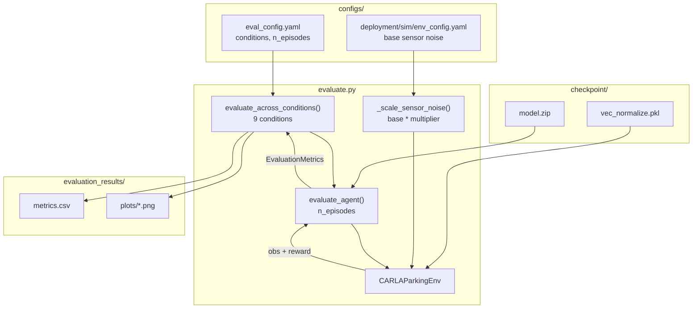

# evaluation/

Performance evaluation across varying physical conditions. Tests whether the uncertainty-conditioned policy degrades more gracefully than baselines as localisation uncertainty increases.

## At a glance

- 9 evaluation conditions sweep GNSS noise from $1\times$ (RTK fixed, ~2 cm) to $250\times$ (~5 m)
- Base noise from `env_config.yaml`; per-condition multipliers applied by `_scale_sensor_noise()`
- Success: every corner of the ego bounding box inside the bay polygon (`car_fully_inside_bay()` at `EVAL_BAY_MARGIN`) with speed $< 0.1$ m/s, held for `success_dwell_steps`
- `n_episodes = 100` per condition, deterministic (mean) actions
- OOD conditions use `irregular_a` floor plan (never seen during training)
- No weather variation - FlatPlane does not render weather effects

## Modules

| Module | Class / purpose |
|--------|----------------|
| `evaluate.py` | `EvaluationMetrics` - per-condition results dataclass; `evaluate_agent()` - single-condition episode loop; `evaluate_across_conditions()` - full 9-condition sweep; `plot_evaluation_results()` - seaborn bar charts and CSV export |
| `__init__.py` | Re-exports `EvaluationMetrics`, `evaluate_agent`, `evaluate_across_conditions`, `plot_evaluation_results` |

## Internal data flow



## Evaluation conditions

Primary uncertainty axis: GNSS noise tier (RTK fix state). `gnss_noise_multiplier` scales the base RTK-fixed stddev (0.02 m). No weather variation.

### Condition ladder

```
GNSS noise escalation (base stddev = 0.02 m at 1x):

  mult      approx. noise   condition
  -------   -------------   ---------------------------------------------------
     1.0x       ~0.02 m    nominal_empty  (RTK fixed, empty lot)
     1.0x       ~0.02 m    nominal_busy   (RTK fixed, full traffic)
    15.0x       ~0.30 m    rtk_float      (marginal localisation)
    15.0x       ~0.30 m    rtk_float_busy (RTK float + elevated IMU)
   100.0x       ~2.00 m    rtk_standalone (policy should decline to park)
   250.0x       ~5.00 m    rtk_lost       (safety handoff expected)
   250.0x       ~5.00 m    worst_case     (RTK lost + IMU 6x, handoff demo)
                  OOD       ood_layout           (irregular_a, RTK fixed)
                  OOD       ood_layout_degraded  (irregular_a, RTK float)
```

### Performance sweep (in-distribution floor plans)

| Condition | GNSS mult | IMU mult | Patrol | Ped. prob | Bay occ. | Notes |
|-----------|-----------|----------|--------|-----------|----------|-------|
| `nominal_empty` | $1.0\times$ | $1.0\times$ | 0 | 0.0 | 0.6 | RTK fixed, best-case |
| `nominal_busy` | $1.0\times$ | $1.0\times$ | 1 | 1.0 | 0.8 | RTK fixed, full traffic |
| `rtk_float` | $15.0\times$ | $1.0\times$ | 1 | 0.8 | 0.6 | Marginal localisation |
| `rtk_float_busy` | $15.0\times$ | $1.5\times$ | 1 | 1.0 | 0.8 | Compound degradation |
| `rtk_standalone` | $100.0\times$ | $1.0\times$ | 1 | 0.8 | 0.6 | Policy should decline |
| `rtk_lost` | $250.0\times$ | $2.0\times$ | 1 | 1.0 | 0.8 | Safety handoff expected |

### Held-out layout generalisation (unseen geometries)

Training uses the `rectangle` floor plan only, so the `trapezoid` (moderate OOD)
and `irregular_a` (strong OOD, nine-sided irregular polygon) layouts are never
seen during training. Success here measures generalisation; the `irregular_a`
conditions additionally test whether epistemic uncertainty rises on the strongly
out-of-distribution geometry.

| Condition | Floor plan | GNSS mult | IMU mult | Patrol | Ped. prob | Bay occ. |
|-----------|-----------|-----------|----------|--------|-----------|----------|
| `heldout_trapezoid` | `trapezoid` | $1.0\times$ | $1.0\times$ | 0 | 0.0 | 0.6 |
| `heldout_trapezoid_degraded` | `trapezoid` | $15.0\times$ | $1.5\times$ | 0 | 0.0 | 0.6 |
| `ood_layout` | `irregular_a` | $1.0\times$ | $1.0\times$ | 1 | 1.0 | 0.6 |
| `ood_layout_degraded` | `irregular_a` | $15.0\times$ | $1.5\times$ | 1 | 1.0 | 0.6 |

### Safety handoff demonstration

Beyond the training distribution on all axes simultaneously.

| Condition | Floor plan | GNSS mult | IMU mult | Patrol | Ped. prob | Bay occ. |
|-----------|-----------|-----------|----------|--------|-----------|----------|
| `worst_case` | `rectangle` | $250.0\times$ | $6.0\times$ | 0 | 1.0 | 0.0 |

## Metrics collected

| Metric | Source |
|--------|--------|
| Success rate | `info["success"]` from `CARLAParkingEnv.step()` |
| Mean episode reward | Accumulated per episode |
| Mean steps to termination | Episode length |
| Epistemic uncertainty | `get_action_with_uncertainty()` mean over episode (evidential only) |
| Aleatoric uncertainty | `get_action_with_uncertainty()` mean over episode (evidential only) |

**Success criteria**: judged geometrically in the env, not by scalar thresholds.
Every corner of the ego bounding box must lie inside the target bay polygon
(`car_fully_inside_bay()` with `EVAL_BAY_MARGIN`) and speed must be below
`SUCCESS_THRESHOLD_VELOCITY`, held for `success_dwell_steps` consecutive steps. See
`uncertainty_rl/utils/constants.py`.

## Key interfaces

```python
from uncertainty_rl.evaluation import (
    EvaluationMetrics,
    evaluate_agent,
    evaluate_across_conditions,
    plot_evaluation_results,
)

metrics = evaluate_across_conditions(
    model_path="checkpoints/final_model",
    eval_config=eval_cfg,
    env_config=env_cfg,
    train_config=train_cfg,
)
# metrics: List[EvaluationMetrics], one per condition
plot_evaluation_results(metrics, output_dir="evaluation_results/")
```

Run via Make:

```bash
make docker-eval          # Full 9-condition sweep (100 episodes per condition)
make eval-visualise-2d    # Detachable 2D bird's-eye replay after evaluation
```

## Configuration keys consumed

| Config file | Keys |
|-------------|------|
| `configs/eval_config.yaml` | `model_path`, `n_episodes`, `deterministic`, `debug`, `eval_conditions`, `output_dir` (connection/timing come from env_config) |
| `configs/deployment/sim/env_config.yaml` | `carla_sensors.gnss.*`, `carla_sensors.imu.*` (base noise, scaled by condition multipliers) |
| `configs/train_config.yaml` | `policy_type` (selects evidential vs standard path for uncertainty logging) |
| `uncertainty_rl/utils/constants.py` | `SUCCESS_THRESHOLD_VELOCITY`, `STRICT_BAY_MARGIN` (the strict margin applied during evaluation/demo/inspector; training reads `bay_margin` from config, relaxed per curriculum stage). Success is tested geometrically via `car_fully_inside_bay()` in `utils/geometry.py`. |

<!-- gif:placeholder name="eval_degradation" caption="Success rate and epistemic uncertainty across the 9 evaluation conditions" -->


## See also

- [uncertainty_rl/README.md](../README.md) - package overview
- [training/README.md](../training/README.md) - training the model evaluated here
- [networks/README.md](../networks/README.md) - evidential policy providing uncertainty estimates
- [docs/detailed_notes/envs/observation_space.md](../../docs/detailed_notes/envs/observation_space.md) - observation design that underpins the evaluation metrics
