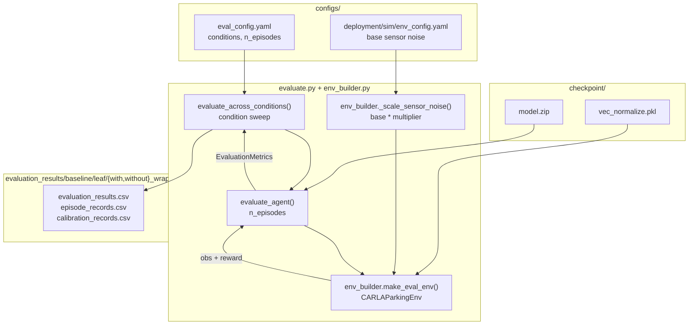

# evaluation/

Performance evaluation across varying physical conditions. Tests whether the uncertainty-conditioned policy degrades more gracefully than baselines as localisation uncertainty increases.

## At a glance

- 4 conditions, each varying exactly ONE factor against the in-distribution anchor (rectangle lot, occupancy 0.5, no dynamic actors): a reference pair, a generalisation probe and a within-episode drift condition
- Base noise from `env_config.yaml`, with per-condition multipliers applied by `_scale_sensor_noise()`. LiDAR noise is always enabled at eval, matching the training realism floor
- Success is the geometric criterion evaluated at `STRICT_BAY_MARGIN`, defined in [utils/README.md](../utils/README.md#the-success-criterion)
- `n_episodes = 200` per condition in `eval_config.yaml`, falling back to 100 when the key is unset, with deterministic (mean) actions. Pooling three seeds gives the 600 episodes per condition behind the reported results
- OOD conditions use `irregular_a` floor plan (never seen during training)
- No weather variation - FlatPlane does not render weather effects

## Modules

| Module | Class / purpose |
|--------|----------------|
| `evaluate.py` | Orchestration: `evaluate_agent()` - single-condition episode loop, `evaluate_across_conditions()` - full condition sweep (returns `(DataFrame, run_output_dir)`), and `main()` - CLI. Re-exports the moved symbols below so `...evaluation.evaluate.*` import paths stay stable |
| `metrics.py` | `EvaluationMetrics` - per-condition results dataclass (success rate, outcome taxonomy rates, uncertainty stats, per-episode records), plus `_classify_outcome()` - failure-mode taxonomy. No torch / stable-baselines3 dependency |
| `env_builder.py` | The condition -> env contract: `_scale_sensor_noise()` - `base * multiplier`, `build_eval_env_factory()` - single source of truth, returning the BARE env factory + SafetyWrapper params, and `make_eval_env()` - wraps it in SafetyWrapper + DummyVecEnv for the sweep |
| `__init__.py` | Lazily re-exports `EvaluationMetrics`, `evaluate_agent`, `evaluate_across_conditions` |

This package writes **CSVs only** and imports no plotting library. The per-run
panels (`evaluation_plots.png`, `failure_modes.png`) are rendered from
`evaluation_results.csv` by `scripts/analysis/figures/run_figures.py` (`make run-figures`),
so a run's figures can be redrawn without re-running the sweep.

## Internal data flow



## Evaluation conditions

Four conditions are reported, each varying exactly ONE factor against the
in-distribution anchor (rectangle lot, bay occupancy 0.5, no dynamic actors) so any
difference is attributable to that factor. They group into a reference pair, a
generalisation probe and a within-episode drift condition. The exact list lives in
`configs/eval_config.yaml`.

Two mechanisms set the condition. `held_gnss_tier` names one fix-state tier from
`configs/deployment/sim/gnss_noise_profiles.yaml` and holds it for the whole episode by
suppressing the relay's Markov drift through the per-episode `hold_tier` flag. Leaving
the flag off instead runs the training noise process itself (per-episode tier sampling
plus mid-episode Markov drift). There is no GNSS noise multiplier; only
`lidar_noise_multiplier` scales a sensor stddev directly. Every condition goes through
the same per-episode publish training uses (tier signal + GNSS datum re-latch), so none
needs a separate code path.

### Reference pair (training noise process, rectangle)

Both run the full training GNSS process, differing only in occupancy. The empty-lot
control removes the LiDAR neighbour-car crutch so the policy must park on localisation
alone, which isolates how much it leans on neighbours versus localisation.

| Condition | GNSS | Bay occ. | Notes |
|-----------|------|----------|-------|
| `anchor_deployment` | training Markov process | 0.5 | In-distribution reference |
| `anchor_empty` | training Markov process | 0.0 | No-obstacle control (LiDAR sees nothing) |

### Generalisation probe (occupancy 0.5)

Training uses the `rectangle` floor plan only, so `irregular_a` (five-sided lot with
a diagonal top wall) is the designated OOD layout. Held at RTK fixed so geometry is the
only OOD factor, isolating generalisation from localisation degradation.

| Condition | Floor plan | Held tier |
|-----------|-----------|-----------|
| `ood_irregular_rtk_fixed` | `irregular_a` | `rtk_fixed` |

### Within-episode drift (occupancy 0.5, rectangle)

This condition starts clean and drifts one-way into the degraded tier mid-episode
(`degrade_one_way`, never recovering), which is the ecologically valid form of
degradation: a fix is lost during a manoeuvre rather than being absent from the start.
It is the causal test for handover TIMING: does the controller hand over soon AFTER the
localisation crosses into the degraded regime, rather than from the spawn? See
`scripts/analysis/handover_timing.py` (switch regime).

| Condition | GNSS | Bay occ. | Notes |
|-----------|------|----------|-------|
| `gnss_degrade_one_way` | RTK fixed -> degraded, one-way | 0.5 | Onset mid-episode, the handover-timing test |

## Metrics collected

| Metric | Source |
|--------|--------|
| Success rate | `info["success"]` from `CARLAParkingEnv.step()` |
| Mean episode reward | Accumulated per episode |
| Mean steps to termination | Episode length |
| Epistemic uncertainty | `get_action_with_uncertainty()` mean over episode (evidential only; NaN for the heteroscedastic head, which has no epistemic channel) |
| Aleatoric uncertainty | `get_action_with_uncertainty()` mean over episode (evidential and heteroscedastic heads; for the latter the raw `exp(2 * log_std)`) |
| Action std | `sqrt(aleatoric)` per decision for the evidential and heteroscedastic heads; the constant `exp(log_std)` for the standard head |

**Heteroscedastic arms run without the SafetyWrapper only.** With no epistemic channel
there is nothing for the handoff gate to read, so `evaluate_across_conditions()` raises
`ValueError` for a heteroscedastic checkpoint unless `EVAL_DISABLE_SAFETY_WRAPPER=1`
(`make docker-eval NO_SAFETY=1`). The CSV schema is the same for every head.

**Success criteria**: judged geometrically in the env rather than by scalar thresholds,
and evaluated here at `STRICT_BAY_MARGIN`, the published criterion behind every reported
figure. The full definition is in
[utils/README.md](../utils/README.md#the-success-criterion).

## Key interfaces

```python
from uncertainty_rl.evaluation import (
    EvaluationMetrics,
    evaluate_agent,
    evaluate_across_conditions,
)

df, run_output_dir = evaluate_across_conditions(
    model_path="checkpoints/full_method/6_42_12062026-0536/final_model",
    eval_config_path="configs/eval_config.yaml",
    env_config_path="configs/deployment/sim/env_config.yaml",
    train_config_path="configs/train_config.yaml",
)
# df: one row per condition; run_output_dir:
# evaluation_results/<baseline>/<leaf>/<with|without>_wrapper
# (the wrapper variant is set by EVAL_DISABLE_SAFETY_WRAPPER / NO_SAFETY=1)
```

Run via Make:

```bash
make docker-eval          # Full 7-condition sweep (n_episodes per condition; 200+ for headlines)
make run-figures          # Redraw the per-run panels from the CSVs (no sweep needed)
make eval-visualise-2d    # Detachable 2D bird's-eye replay after evaluation
```

## Configuration keys consumed

| Config file | Keys |
|-------------|------|
| `configs/eval_config.yaml` | `model_path`, `n_episodes`, `deterministic`, `debug`, `near_miss_threshold_m`, `eval_conditions` (connection/timing come from env_config) |
| `configs/deployment/sim/env_config.yaml` | `carla_sensors.gnss.*`, `carla_sensors.imu.*` (base noise, scaled by condition multipliers) |
| `configs/baselines/<arm>.yaml` | `policy_type`, `include_covariance`, `include_obstacle_obs` (model class + obs shape of the evaluated checkpoint) |
| `uncertainty_rl/utils/constants.py` | `SUCCESS_THRESHOLD_VELOCITY`, `STRICT_BAY_MARGIN` (the strict margin applied during evaluation, demo and inspector runs, where training instead reads the per-stage `bay_margin`). Success is tested geometrically via `car_fully_inside_bay()` in `utils/geometry.py`. |

## Results by condition

Success rate (top) and mean final position error (bottom) for each arm, per
condition. `full_method` leads on success in every condition that any arm solves, and all four
original arms score 0% on `ood_irregular_rtk_fixed`, which is why that group is empty in the top
panel and appears only in the position-error panel below.

<p align="center">
  
</p>

To regenerate:

```bash
make analyse-ablation STAGE=6
make figures FIG=ablation_by_condition
cp outputs/main_analysis/figures/ablation_by_condition.png docs/media/eval_degradation.png
```

### On illustrating the safety handoff

There is deliberately no "uncertainty crosses the threshold and the vehicle stops" clip.
The handoff gate is a **negative result**: scored as a failure detector over 1800 episodes,
the evidential total predictive uncertainty reaches ROC AUC 0.55 (`full_method`) and 0.52
(`output_uncertainty`) - effectively chance - while the EKF position std, available to every
arm, scores 0.57 and 0.63 on the same episodes. The policy's own confidence does **not** beat
the covariance gate a covariance-blind system could already build.

A clip of a single handoff firing would present that as a working mechanism. The defensible
figure is `gate_roc`, which shows both signals scored against each other:

```bash
make analyse-gate STAGE=6
make figures FIG=gate_roc      # -> outputs/main_analysis/figures/gate_roc.png
```

The wrapper itself remains correct as a *controller*: a severity-graded response off one
signal (total uncertainty), not two signals claimed to be different kinds of uncertainty.
@see the uncertainty-channels section of the dissertation
(`docs/AntonioGaldes_Dissertation.pdf`), which reports the gate AUC results.

## See also

- [uncertainty_rl/README.md](../README.md) - package overview
- [training/README.md](../training/README.md) - training the model evaluated here
- [networks/README.md](../networks/README.md) - evidential policy providing uncertainty estimates
- [docs/detailed_notes/envs/observation_space.md](../../docs/detailed_notes/envs/observation_space.md) - observation design that underpins the evaluation metrics
