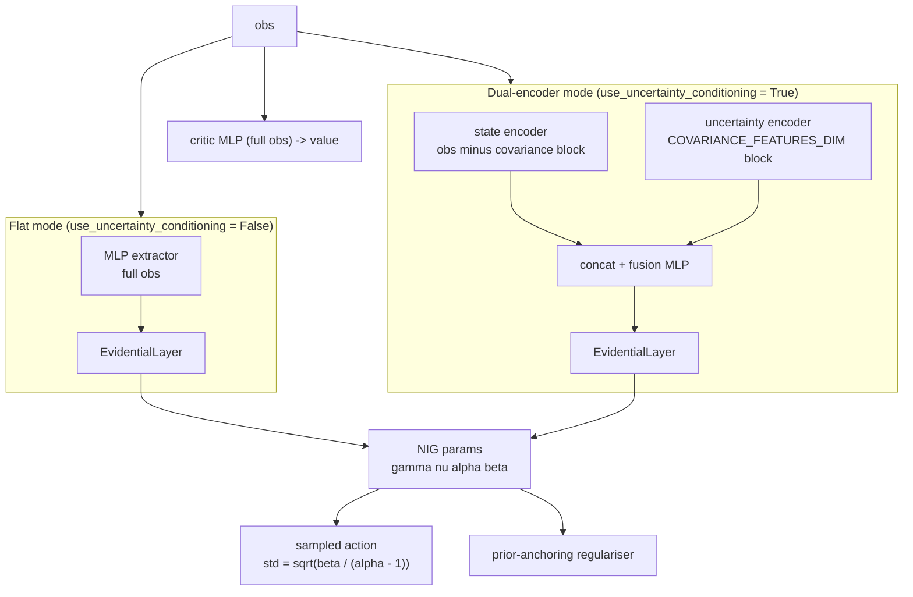

# networks/

Core novel component. Evidential deep learning policy networks for uncertainty-aware parking action selection.

## At a glance

- NIG evidential actor outputs four parameters per action dimension: $\gamma$ (mean), $\nu$, $\alpha$, $\beta$.
- Aleatoric uncertainty (data noise): $\beta / (\alpha - 1)$. Action std uses $\sqrt{\text{aleatoric}}$ only.
- Epistemic uncertainty (model confidence): $\beta / (\nu(\alpha - 1))$. Not added to action noise.
- Softplus-clamped NIG parameters with an additional aleatoric ceiling enforced before the sqrt in the action distribution.
- Two actor modes: flat MLP or dual-encoder (state and covariance through separate pathways before fusion).
- Evidential loss applies to the actor only. Critic is a standard Gaussian MLP.
- Prior-anchoring quadratic-ratio regularisation (RL-stable, replaces the Amini 2020 supervised term).

## Modules

| Module | Classes / functions |
|--------|-------------------|
| `evidential_policy.py` | `EvidentialLayer`, `EvidentialPolicyNetwork`, `UncertaintyConditionedActor` |
| `sb3_integration.py` | `EvidentialDistribution`, `EvidentialActorCriticPolicy`, `EvidentialPPO` |
| `__init__.py` | Re-exports the public names |

## Internal data flow



> In dual-encoder mode the observation is split into two blocks. The
> covariance block (`obs[:, VEHICLE_STATE_DIM : VEHICLE_STATE_DIM +
> COVARIANCE_FEATURES_DIM]`) flows into the uncertainty encoder; the rest
> of the observation (speed, yaw rate, relative target pose, LiDAR
> clearances) flows into the state encoder. Both encoders feed a shared
> fusion MLP before the `EvidentialLayer` head.

## NIG uncertainty decomposition

```math
\begin{aligned}
\sigma^2_{\text{aleatoric}} &= \frac{\beta}{\alpha - 1} && \text{(data noise, } \mathbb{E}[\sigma^2] \text{)} \\[6pt]
\sigma^2_{\text{epistemic}} &= \frac{\beta}{\nu(\alpha - 1)} && \text{(model uncertainty, } \mathrm{Var}[\mu] \text{)} \\[6pt]
\sigma_{\text{action}}      &= \sqrt{\sigma^2_{\text{aleatoric}}} && \text{(epistemic NOT included in action noise)}
\end{aligned}
```

## Key interfaces

### Inference and deployment

```python
action, uncertainty_dict = policy.get_action_with_uncertainty(obs_tensor)
# uncertainty_dict keys: epistemic, aleatoric, total, gamma, nu, alpha, beta
```

### Training (SB3 integration)

```python
from uncertainty_rl.networks import EvidentialActorCriticPolicy, EvidentialPPO

model = EvidentialPPO(
    policy=EvidentialActorCriticPolicy,
    env=env,
    # All hyperparameters come from configs/train_config.yaml
)
model.learn(total_timesteps=total_timesteps)
```

### Standalone test harness (unit tests only)

```python
from uncertainty_rl.networks import EvidentialPolicyNetwork
from uncertainty_rl.utils.constants import TOTAL_OBS_DIM, ACTION_DIM

# Not used in the RL training pipeline - test harness only
net = EvidentialPolicyNetwork(
    state_dim=TOTAL_OBS_DIM,
    action_dim=ACTION_DIM,
    hidden_dims=[256, 256],
)
action, uncertainty_dict = net.get_action(obs_tensor)
```

## NIG parameter constraints

The activation, offset, and clamp constants for $\gamma, \nu, \alpha, \beta$
live in `EvidentialLayer.forward()` and `EvidentialDistribution.proba_distribution()`.
They are tuned to keep the head in a well-behaved region for RL training -
in particular the alpha offset keeps `alpha - 1` bounded away from zero so
the aleatoric variance cannot diverge. See the source files and
[docs/detailed_notes/networks/evidential_nig_initialisation.md](../../docs/detailed_notes/networks/evidential_nig_initialisation.md)
for the derivation.

## Evidential regularisation

**Prior-anchoring quadratic-ratio penalty** applied to $\nu, \alpha, \beta$:

```math
\mathcal{L}_{\text{reg}} = \left\langle (\nu/\nu_0 - 1)^2 + (\alpha/\alpha_0 - 1)^2 + (\beta/\beta_0 - 1)^2 \right\rangle
```

The priors $\nu_0, \alpha_0, \beta_0$ are derived from the bias initialisation in
`EvidentialLayer.__init__`. The total training loss is:

```math
\mathcal{L} = \mathcal{L}_{\text{PPO}} + \lambda_{\text{reg}} \cdot \mathcal{L}_{\text{reg}}
```

$\lambda_{\text{reg}}$ is linearly annealed from $0$ over `lambda_reg_warmup_steps` (both in
`configs/train_config.yaml` under `evidential`).

**Why not the supervised term?**

```math
\mathcal{L}_{\text{Amini}} = \left\langle |\text{action} - \gamma| \cdot (2\nu + \alpha) \right\rangle \quad \text{ill-defined in RL}
```

In RL there are no ground-truth action targets. $|\text{action} - \gamma|$ is policy sampling
noise, not prediction error, so this term grows unboundedly. The prior-anchoring penalty is
bounded and keeps $\nu, \alpha, \beta$ near their initialisation without requiring target labels.

## Actor modes

| `use_uncertainty_conditioning` | Actor class | Observation routed to actor |
|-------------------------------|-------------|------------------------------|
| `False` | Flat MLP + `EvidentialLayer` | All blocks via shared MLP latent |
| `True` | `UncertaintyConditionedActor` | All blocks, but split: covariance block to the uncertainty encoder; remaining blocks (speed, yaw rate, relative target pose, LiDAR clearances) to the state encoder |

## TensorBoard logs (evidential-specific)

| Tag | Expression logged |
|-----|------------------|
| `train/evidential_reg_loss` | Mean prior-anchoring penalty |
| `train/epistemic_uncertainty` | $\langle \beta / (\nu(\alpha - 1)) \rangle$ |
| `train/aleatoric_uncertainty` | $\langle \beta / (\alpha - 1) \rangle$ |
| `train/lambda_reg` | Current annealed $\lambda_{\text{reg}}$ |
| `train/ent_coef` | Current value of the linear ent_coef decay schedule |

## Configuration keys consumed

| Config file | Keys |
|-------------|------|
| [`configs/train_config.yaml`](../../configs/train_config.yaml) | `net_arch`, `activation`, `evidential.lambda_reg`, `evidential.lambda_reg_warmup_steps`, `evidential.use_uncertainty_conditioning` |
| [`uncertainty_rl/utils/constants.py`](../utils/constants.py) | `VEHICLE_STATE_DIM`, `COVARIANCE_FEATURES_DIM`, `ACTION_DIM` |

<!-- gif:placeholder name="uncertainty_evolution" caption="Epistemic and aleatoric uncertainty during a parking episode" -->


## See also

- [uncertainty_rl/README.md](../README.md) - package overview
- [envs/README.md](../envs/README.md) - observation layout that feeds this network
- [training/README.md](../training/README.md) - how EvidentialPPO is wired into the training loop
- [docs/detailed_notes/networks/evidential_nig_initialisation.md](../../docs/detailed_notes/networks/evidential_nig_initialisation.md) - derivation of NIG initialisation and clamping choices
