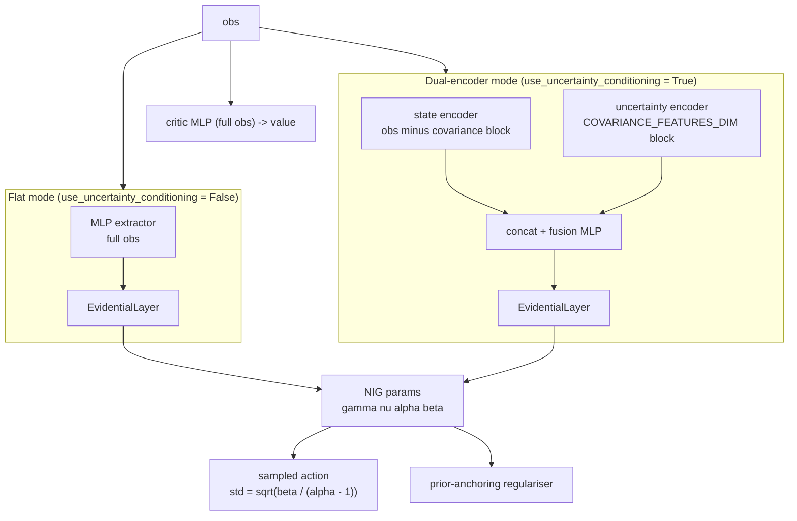

# networks/

Core novel component. Evidential deep learning policy networks for uncertainty-aware parking action selection.

## At a glance

- NIG evidential actor outputs four parameters per action dimension: $\gamma$ (mean), $\nu$, $\alpha$, $\beta$.
- Aleatoric uncertainty (data noise): $\beta / (\alpha - 1)$. Action std uses $\sqrt{\text{aleatoric}}$ only.
- Epistemic uncertainty (model confidence): $\beta / (\nu(\alpha - 1))$. Not added to action noise.
- Softplus-clamped NIG parameters with an aleatoric floor and ceiling enforced before the sqrt in the action distribution (the floor stops the action std collapsing, and the ceiling clamps the variance at 1.0).
- Two actor modes: flat MLP or dual-encoder (state and covariance through separate pathways before fusion).
- Evidential loss applies to the actor only. Critic is a standard Gaussian MLP.
- Prior-anchoring quadratic-ratio regularisation (RL-stable, replaces the Amini 2020 supervised term).

## Modules

| Module | Classes / functions |
|--------|-------------------|
| `evidential_policy.py` | `EvidentialLayer`, `EvidentialPolicyNetwork`, `UncertaintyConditionedActor` |
| `sb3_integration.py` | `EvidentialDistribution`, `EvidentialActorCriticPolicy`, `EvidentialPPO`, `ScheduledEntCoefPPO`, `LayerNormActorCriticPolicy` |
| `__init__.py` | Re-exports the public names |

## Internal data flow



> In dual-encoder mode the observation is split into two blocks. The
> covariance block (`obs[:, VEHICLE_STATE_DIM : VEHICLE_STATE_DIM +
> COVARIANCE_FEATURES_DIM]`) flows into the uncertainty encoder, and the rest
> of the observation (speed, yaw rate, relative target pose, LiDAR
> clearances) flows into the state encoder. Both encoders feed a shared
> fusion MLP before the `EvidentialLayer` head. The actor works on the
> **raw observation** - the dual-encoder bypasses the SB3 MLP extractor's
> policy branch entirely. The critic is unchanged: it still consumes the
> full observation through the MLP extractor's value branch.

## Dual-encoder actor (`use_uncertainty_conditioning = True`)

This is the architecture that realises the project's central idea on the policy side:
the covariance block (the EKF's "how sure am I about where I am?") enters through a
**dedicated pathway** so it can modulate the action without being mixed into the
navigation features early on.

**Wiring** (in `EvidentialActorCriticPolicy._build` / `_get_nig_from_obs`):

- The observation is split directly, not via the MLP extractor's `policy_net`:
  - **Navigation-state block** = `cat(obs[:, :VEHICLE_STATE_DIM], obs[:, cov_end:])` -
    speed and yaw rate (before the covariance) concatenated with the relative target bay
    pose and the LiDAR clearances (after it). Width `obs_dim - COVARIANCE_FEATURES_DIM`.
  - **Covariance block** = `obs[:, VEHICLE_STATE_DIM : VEHICLE_STATE_DIM + COVARIANCE_FEATURES_DIM]`
    (`std_x, std_y, std_yaw`). Width `COVARIANCE_FEATURES_DIM`.
- Each block goes through its own encoder (`Linear -> ReLU -> LayerNorm`) to `hidden_dim // 2`.
  The two halves are concatenated to `hidden_dim` and passed through the fusion MLP, then
  the shared `EvidentialLayer` head emits the NIG parameters.
- `hidden_dim` is taken from `self.mlp_extractor.latent_dim_pi`, so **`net_arch` in
  `train_config.yaml` controls both encoders symmetrically** - there is no separate
  encoder-width knob.

**Why split rather than concatenate everything?** The covariance is a *confidence* input
that should modulate the action, not stand in for the goal-direction signal. An actor that
could not see `dx / dy / dyaw` would have no way to drive to the bay. Keeping the covariance
on its own pathway lets the network learn an uncertainty-conditioned response (drive more
conservatively when `std_*` is high) while the navigation block carries the where-to-go
signal.

**Off by default, opt-in.** `use_uncertainty_conditioning` is `false` in
`train_config.yaml` - the main 2x2 ablation deliberately keeps it off so the covariance
enters identically (as plain obs features) for both the standard and evidential heads,
isolating the head as the only difference. The dual-encoder is a separate architectural
variant you enable explicitly.

**Requires `include_covariance = True`.** The split assumes the covariance block sits at
indices `[VEHICLE_STATE_DIM : VEHICLE_STATE_DIM + COVARIANCE_FEATURES_DIM]`. With covariance
absent from the observation those indices hold navigation features instead. `train_ppo.py`
enforces this: if `use_uncertainty_conditioning=True` is requested without
`include_covariance`, it logs a warning and forces the flag back to `False` rather than
build a mis-indexed actor. Of the 2x2 baselines, only `input_uncertainty` and `full_method`
carry covariance, so only those two can use the dual-encoder.

## NIG uncertainty decomposition

```math
\begin{aligned}
\sigma^2_{\text{aleatoric}} &= \frac{\beta}{\alpha - 1} && \text{(data noise, } \mathbb{E}[\sigma^2] \text{)} \\[6pt]
\sigma^2_{\text{epistemic}} &= \frac{\beta}{\nu(\alpha - 1)} && \text{(model uncertainty, } \mathrm{Var}[\mu] \text{)} \\[6pt]
\sigma_{\text{action}}      &= \sqrt{\sigma^2_{\text{aleatoric}}} && \text{(epistemic NOT included in action noise)}
\end{aligned}
```

## Key interfaces

### Inference and deployment

```python
action, uncertainty_dict = policy.get_action_with_uncertainty(obs_tensor)
# uncertainty_dict keys: epistemic, aleatoric, total, gamma, nu, alpha, beta
```

### Training (SB3 integration)

```python
from uncertainty_rl.networks import EvidentialActorCriticPolicy, EvidentialPPO

model = EvidentialPPO(
    policy=EvidentialActorCriticPolicy,
    env=env,
    # All hyperparameters come from configs/train_config.yaml
)
model.learn(total_timesteps=total_timesteps)
```

### Standalone test harness (unit tests only)

```python
from uncertainty_rl.networks import EvidentialPolicyNetwork
from uncertainty_rl.utils.constants import TOTAL_OBS_DIM, ACTION_DIM

# Not used in the RL training pipeline - test harness only
net = EvidentialPolicyNetwork(
    state_dim=TOTAL_OBS_DIM,
    action_dim=ACTION_DIM,
    hidden_dims=[256, 256],
)
action, uncertainty_dict = net.get_action(obs_tensor)
```

## NIG parameter constraints

The activation, offset, and clamp constants for $\gamma, \nu, \alpha, \beta$
live in `EvidentialLayer.forward()` and `EvidentialDistribution.proba_distribution()`.
They are tuned to keep the head in a well-behaved region for RL training. In
particular the offset of 1.5, rather than the usual 1.0, keeps `alpha - 1 >= 0.5`
by construction, so the aleatoric variance cannot diverge. See the source files and
[docs/detailed_notes/networks/evidential_nig_initialisation.md](../../docs/detailed_notes/networks/evidential_nig_initialisation.md)
for the derivation.

## Evidential regularisation

**Prior-anchoring quadratic-ratio penalty** applied to $\alpha$ and $\beta$ only:

```math
\mathcal{L}_{\text{reg}} = \left\langle (\alpha/\alpha_0 - 1)^2 + (\beta/\beta_0 - 1)^2 \right\rangle
```

The penalty is zero at the prior, with a restoring gradient growing linearly with
distance. The priors match the bias initialisation in `EvidentialLayer.__init__` plus
the offsets, giving $\alpha_0 = 2.741$ and $\beta_0 = 0.693$. $\nu$ is excluded here and
left to the evidence term below.

The full training loss carries five terms beyond the PPO surrogate:

```math
\mathcal{L} = \mathcal{L}_{\text{policy}}
  + c_2 \mathcal{L}_{\text{entropy}}
  + c_1 \mathcal{L}_{\text{value}}
  + \lambda_{\text{reg}}(t) \mathcal{L}_{\text{reg}}
  + \lambda_{\text{evidence}}(t) \mathcal{L}_{\text{evidence}}
  + \lambda_{\nu} \mathcal{L}_{\nu\text{-anchor}}
```

$\lambda_{\text{reg}}$ and $\lambda_{\text{evidence}}$ are annealed linearly from $0$
over their own warmup step counts, all configured in `configs/train_config.yaml` under
`evidential`.

The last two act on $\nu$ in opposition: an advantage-gated accrual term that raises
$\nu$ for well-predicted actions, against a log-space anchor pulling it back toward its
sub-unit prior. $\gamma$ is detached in the accrual term, so PPO retains sole ownership
of the action mean.

> **Both $\lambda_{\text{evidence}}$ and $\lambda_{\nu}$ are `0.0` in the shipped
> configuration and were inactive in the reported experiments**, which therefore ran
> three active terms. RL supplies no ground-truth action target, so neither term can
> make $\nu$ state-dependent, and neither can disentangle epistemic from aleatoric.
> They are retained for that experiment alone.

**Why not the supervised term?**

```math
\mathcal{L}_{\text{Amini}} = \left\langle |\text{action} - \gamma| \cdot (2\nu + \alpha) \right\rangle \quad \text{ill-defined in RL}
```

In RL there are no ground-truth action targets. $|\text{action} - \gamma|$ is policy sampling
noise, not prediction error, so this term grows unboundedly. The prior-anchoring penalty is
bounded and keeps $\nu, \alpha, \beta$ near their initialisation without requiring target labels.

## Actor modes

Both modes share the same `EvidentialLayer` head and standard critic, differing only in
how the actor consumes the observation. The wiring is described under
[Dual-encoder actor](#dual-encoder-actor-use_uncertainty_conditioning-true) above.

| `use_uncertainty_conditioning` | Actor class | Observation routed to actor | Requires |
|-------------------------------|-------------|------------------------------|----------|
| `False` | Flat MLP + `EvidentialLayer` | Full observation via the shared MLP extractor latent | - |
| `True` | `UncertaintyConditionedActor` | Raw observation, split: covariance block to the uncertainty encoder, remaining blocks (speed, yaw rate, relative target pose, LiDAR clearances) to the state encoder, with the MLP extractor policy branch bypassed | `include_covariance = True` |

## TensorBoard logs (evidential-specific)

| Tag | Expression logged |
|-----|------------------|
| `train/evidential_reg_loss` | Mean prior-anchoring penalty |
| `train/evidence_loss` | Mean advantage-gated evidence-accrual term |
| `train/nu_anchor_loss` | Mean log-space $\nu$ anchor |
| `train/epistemic_uncertainty` | $\langle \beta / (\nu(\alpha - 1)) \rangle$ |
| `train/aleatoric_uncertainty` | $\langle \beta / (\alpha - 1) \rangle$ |
| `train/lambda_reg` | Current annealed $\lambda_{\text{reg}}$ |
| `train/lambda_evidence` | Current annealed $\lambda_{\text{evidence}}$ |
| `train/lambda_nu_anchor` | Configured $\lambda_{\nu}$ |
| `train/ent_coef` | Current value of the linear ent_coef decay schedule |

## Configuration keys consumed

| Config file | Keys |
|-------------|------|
| [`configs/train_config.yaml`](../../configs/train_config.yaml) | `net_arch`, `activation`, and under `evidential`: `lambda_reg`, `lambda_reg_warmup_steps`, `lambda_evidence`, `lambda_evidence_warmup_steps`, `lambda_nu_anchor`, `aleatoric_floor`, `use_uncertainty_conditioning` |
| [`uncertainty_rl/utils/constants.py`](../utils/constants.py) | `VEHICLE_STATE_DIM`, `COVARIANCE_FEATURES_DIM`, `ACTION_DIM` |

### On plotting epistemic against aleatoric

There is deliberately no "epistemic vs aleatoric over an episode" figure. The two are tied
by construction:

```
epistemic = beta / (nu * (alpha - 1)) = aleatoric / nu
```

so they are one scalar under two names, separating only as far as `nu` varies across
states. RL supplies no ground-truth action target, so `nu` has no well-posed training
signal and collapses to a state-independent constant, leaving
`corr(epistemic, aleatoric)` around 0.9 in every run. Plotting the two channels side by
side would imply a separation documented as absent. This is a finished negative result
rather than a missing figure.
@see `documentation/detailed_notes/epistemic_aleatoric_disentanglement.md`.

The defensible alternative is `gate_roc`, which scores the evidential uncertainty as a
safety gate against the EKF position std. Its AUC figures and regeneration recipe are in
[evaluation/README.md](../evaluation/README.md#on-illustrating-the-safety-handoff).

## See also

- [uncertainty_rl/README.md](../README.md) - package overview
- [envs/README.md](../envs/README.md) - observation layout that feeds this network
- [training/README.md](../training/README.md) - how EvidentialPPO is wired into the training loop
- [docs/detailed_notes/networks/evidential_nig_initialisation.md](../../docs/detailed_notes/networks/evidential_nig_initialisation.md) - derivation of NIG initialisation and clamping choices
