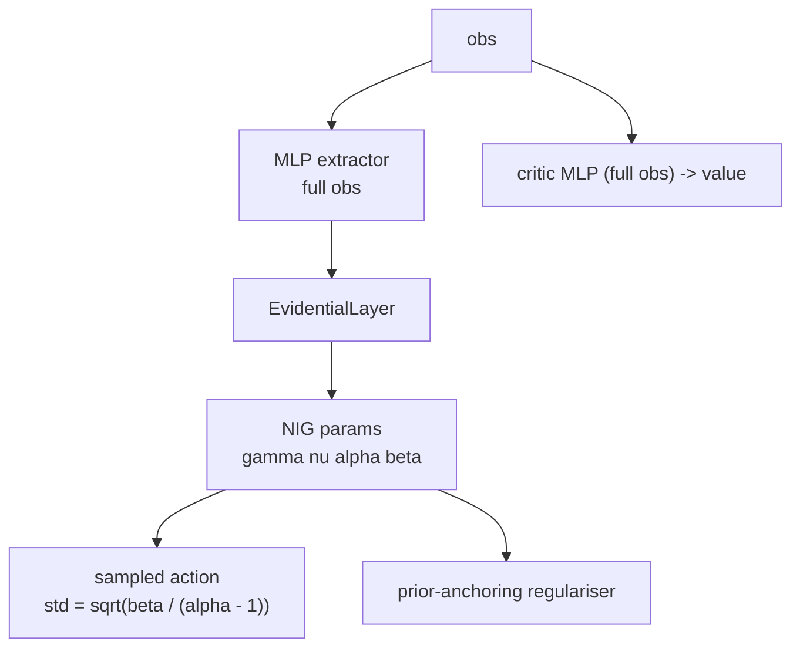

# networks/

Core novel component. Evidential deep learning policy networks for uncertainty-aware parking action selection.

## At a glance

- NIG evidential actor outputs four parameters per action dimension: $\gamma$ (mean), $\nu$, $\alpha$, $\beta$.
- Aleatoric uncertainty (data noise): $\beta / (\alpha - 1)$. Action std uses $\sqrt{\text{aleatoric}}$ only.
- Epistemic uncertainty (model confidence): $\beta / (\nu(\alpha - 1))$. Not added to action noise.
- Softplus-clamped NIG parameters with an aleatoric floor and ceiling enforced before the sqrt in the action distribution (the floor stops the action std collapsing, and the ceiling clamps the variance at 1.0).
- The actor is a flat MLP over the full observation.
- Evidential loss applies to the actor only. Critic is a standard Gaussian MLP.
- Prior-anchoring quadratic-ratio regularisation (RL-stable, replaces the Amini 2020 supervised term).

## Modules

| Module | Classes / functions |
|--------|-------------------|
| `evidential_policy.py` | `EvidentialLayer`, `EvidentialPolicyNetwork`, `UncertaintyConditionedActor` |
| `sb3_integration.py` | `EvidentialDistribution`, `EvidentialActorCriticPolicy`, `EvidentialPPO`, `ScheduledEntCoefPPO`, `LayerNormActorCriticPolicy` |
| `__init__.py` | Re-exports the public names |

## Internal data flow



> The covariance features enter as ordinary observation dimensions, alongside
> speed, yaw rate, the relative target pose and the LiDAR clearances. The
> critic consumes the same full observation through the MLP extractor's value
> branch.

## Unused capability: `use_uncertainty_conditioning`

`UncertaintyConditionedActor` routes the covariance block through its own encoder before
fusing it with the navigation features, rather than letting it enter as plain observation
features. It is implemented and unit-tested but **was never used**:
`use_uncertainty_conditioning` is `false` in `train_config.yaml` and no reported result
enables it.

The flag is off because the 2x2 ablation requires the covariance to enter identically for
the standard and evidential heads, leaving the head as the only difference between arms.
A dedicated pathway on one side would confound that comparison, so it is a separate
architectural variant rather than part of the method under test.

It also requires `include_covariance = True`, since the split assumes the covariance sits
at `[VEHICLE_STATE_DIM : VEHICLE_STATE_DIM + COVARIANCE_FEATURES_DIM]`. `train_ppo.py`
enforces this, logging a warning and forcing the flag back to `False` rather than building
a mis-indexed actor.

## NIG uncertainty decomposition

```math
\begin{aligned}
\sigma^2_{\text{aleatoric}} &= \frac{\beta}{\alpha - 1} && \text{(data noise, } \mathbb{E}[\sigma^2] \text{)} \\[6pt]
\sigma^2_{\text{epistemic}} &= \frac{\beta}{\nu(\alpha - 1)} && \text{(model uncertainty, } \mathrm{Var}[\mu] \text{)} \\[6pt]
\sigma_{\text{action}}      &= \sqrt{\sigma^2_{\text{aleatoric}}} && \text{(epistemic NOT included in action noise)}
\end{aligned}
```

## Key interfaces

### Inference and deployment

```python
action, uncertainty_dict = policy.get_action_with_uncertainty(obs_tensor)
# uncertainty_dict keys: epistemic, aleatoric, total, gamma, nu, alpha, beta
```

### Training (SB3 integration)

```python
from uncertainty_rl.networks import EvidentialActorCriticPolicy, EvidentialPPO

model = EvidentialPPO(
    policy=EvidentialActorCriticPolicy,
    env=env,
    # All hyperparameters come from configs/train_config.yaml
)
model.learn(total_timesteps=total_timesteps)
```

### Standalone test harness (unit tests only)

```python
from uncertainty_rl.networks import EvidentialPolicyNetwork
from uncertainty_rl.utils.constants import TOTAL_OBS_DIM, ACTION_DIM

# Not used in the RL training pipeline - test harness only
net = EvidentialPolicyNetwork(
    state_dim=TOTAL_OBS_DIM,
    action_dim=ACTION_DIM,
    hidden_dims=[256, 256],
)
action, uncertainty_dict = net.get_action(obs_tensor)
```

## NIG parameter constraints

The activation, offset, and clamp constants for $\gamma, \nu, \alpha, \beta$
live in `EvidentialLayer.forward()` and `EvidentialDistribution.proba_distribution()`.
They are tuned to keep the head in a well-behaved region for RL training. In
particular the offset of 1.5, rather than the usual 1.0, keeps `alpha - 1 >= 0.5`
by construction, so the aleatoric variance cannot diverge. See the source files and
[docs/detailed_notes/networks/evidential_nig_initialisation.md](../../docs/detailed_notes/networks/evidential_nig_initialisation.md)
for the derivation.

## Evidential regularisation

**Prior-anchoring quadratic-ratio penalty** applied to $\alpha$ and $\beta$ only:

```math
\mathcal{L}_{\text{reg}} = \left\langle (\alpha/\alpha_0 - 1)^2 + (\beta/\beta_0 - 1)^2 \right\rangle
```

The penalty is zero at the prior, with a restoring gradient growing linearly with
distance. The priors match the bias initialisation in `EvidentialLayer.__init__` plus
the offsets, giving $\alpha_0 = 2.741$ and $\beta_0 = 0.693$.

$\nu$ is deliberately excluded. Anchoring it would bind the epistemic evidence to its
initial value, defeating the purpose of the head, whose epistemic estimate should rise
in unfamiliar states and fall as familiarity grows.

This is the only evidential term added to the PPO surrogate:

```math
\mathcal{L} = \mathcal{L}_{\text{policy}}
  + c_2 \mathcal{L}_{\text{entropy}}
  + c_1 \mathcal{L}_{\text{value}}
  + \lambda_{\text{reg}}(t) \mathcal{L}_{\text{reg}}
```

$\lambda_{\text{reg}}$ anneals linearly from $0$ to 0.02 over the first 50,000 decisions
of each stage, so the batch averages stabilise under PPO before the anchor takes effect.
It is configured in `configs/train_config.yaml` under `evidential`.

**Why not the supervised term?**

```math
\mathcal{L}_{\text{Amini}} = \left\langle |\text{action} - \gamma| \cdot (2\nu + \alpha) \right\rangle \quad \text{ill-defined in RL}
```

In RL there are no ground-truth action targets. $|\text{action} - \gamma|$ is policy sampling
noise, not prediction error, so this term grows unboundedly. The prior-anchoring penalty is
bounded and keeps $\nu, \alpha, \beta$ near their initialisation without requiring target labels.

## TensorBoard logs (evidential-specific)

| Tag | Expression logged |
|-----|------------------|
| `train/evidential_reg_loss` | Mean prior-anchoring penalty |
| `train/epistemic_uncertainty` | $\langle \beta / (\nu(\alpha - 1)) \rangle$ |
| `train/aleatoric_uncertainty` | $\langle \beta / (\alpha - 1) \rangle$ |
| `train/lambda_reg` | Current annealed $\lambda_{\text{reg}}$ |
| `train/ent_coef` | Current value of the linear ent_coef decay schedule |

## Configuration keys consumed

| Config file | Keys |
|-------------|------|
| [`configs/train_config.yaml`](../../configs/train_config.yaml) | `net_arch`, `activation`, and under `evidential`: `lambda_reg`, `lambda_reg_warmup_steps`, `aleatoric_floor` |
| [`uncertainty_rl/utils/constants.py`](../utils/constants.py) | `VEHICLE_STATE_DIM`, `COVARIANCE_FEATURES_DIM`, `ACTION_DIM` |

### On plotting epistemic against aleatoric

There is deliberately no "epistemic vs aleatoric over an episode" figure. The two are tied
by construction:

```
epistemic = beta / (nu * (alpha - 1)) = aleatoric / nu
```

so they are one scalar under two names, separating only as far as `nu` varies across
states. RL supplies no ground-truth action target, so `nu` has no well-posed training
signal and collapses to a state-independent constant, leaving
`corr(epistemic, aleatoric)` around 0.9 in every run. Plotting the two channels side by
side would imply a separation documented as absent. This is a finished negative result
rather than a missing figure.
@see the uncertainty-channels section of the dissertation
(`docs/AntonioGaldes_Dissertation.pdf`).

The defensible alternative is `gate_roc`, which scores the evidential uncertainty as a
safety gate against the EKF position std. Its AUC figures and regeneration recipe are in
[evaluation/README.md](../evaluation/README.md#on-illustrating-the-safety-handoff).

## See also

- [uncertainty_rl/README.md](../README.md) - package overview
- [envs/README.md](../envs/README.md) - observation layout that feeds this network
- [training/README.md](../training/README.md) - how EvidentialPPO is wired into the training loop
- [docs/detailed_notes/networks/evidential_nig_initialisation.md](../../docs/detailed_notes/networks/evidential_nig_initialisation.md) - derivation of NIG initialisation and clamping choices
