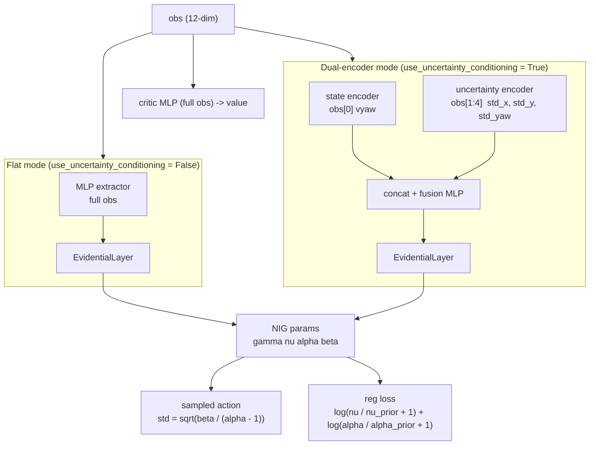

# networks/

Core novel component. Evidential deep learning policy networks for uncertainty-aware parking action selection.

## At a glance

- NIG evidential actor outputs four parameters per action dimension: $\gamma$ (mean), $\nu$, $\alpha$, $\beta$
- Aleatoric uncertainty (data noise): $\beta / (\alpha - 1)$ -- action std uses $\sqrt{\text{aleatoric}}$ only
- Epistemic uncertainty (model confidence): $\beta / (\nu(\alpha - 1))$ -- not added to action noise
- All NIG params clamped to $\max = 100.0$ for RL stability
- Two actor modes: flat MLP or dual-encoder (state and covariance through separate pathways)
- Evidential loss applies to the actor only -- standard Gaussian critic unchanged
- Prior-anchoring log-penalty regularisation (RL-stable; replaces the Amini 2020 supervised term)

## Modules

| Module | Classes / functions |
|--------|-------------------|
| `evidential_policy.py` | `EvidentialLayer`, `EvidentialPolicyNetwork`, `UncertaintyConditionedActor` |
| `sb3_integration.py` | `EvidentialDistribution`, `EvidentialActorCriticPolicy`, `EvidentialPPO` |
| `__init__.py` | Re-exports all six public names above |

## Internal data flow



> In dual-encoder mode, only `obs[0]` (vyaw) and `obs[1:4]` (std_x, std_y, std_yaw) reach the
> actor. Indices 4-11 (target pose, LiDAR) feed the critic but not the actor.

## NIG uncertainty decomposition

```math
\begin{aligned}
\sigma^2_{\text{aleatoric}} &= \frac{\beta}{\alpha - 1} && \text{(data noise, } \mathbb{E}[\sigma^2] \text{)} \\[6pt]
\sigma^2_{\text{epistemic}} &= \frac{\beta}{\nu(\alpha - 1)} && \text{(model uncertainty, } \mathrm{Var}[\mu] \text{)} \\[6pt]
\sigma_{\text{action}}      &= \sqrt{\sigma^2_{\text{aleatoric}}} && \text{(epistemic NOT included in action noise)}
\end{aligned}
```

## Key interfaces

### Inference and deployment

```python
action, uncertainty_dict = policy.get_action_with_uncertainty(obs_tensor)
# uncertainty_dict keys: epistemic, aleatoric, total, gamma, nu, alpha, beta
```

### Training (SB3 integration)

```python
from uncertainty_rl.networks import EvidentialActorCriticPolicy, EvidentialPPO

model = EvidentialPPO(
    policy=EvidentialActorCriticPolicy,
    env=env,
    # All hyperparameters come from configs/train_config.yaml
)
model.learn(total_timesteps=1_000_000)
```

### Standalone test harness (unit tests only)

```python
from uncertainty_rl.networks import EvidentialPolicyNetwork

# Not used in the RL training pipeline -- test harness only
net = EvidentialPolicyNetwork(state_dim=12, action_dim=3, hidden_dims=[256, 256])
action, uncertainty_dict = net.get_action(obs_tensor)
```

## NIG parameter constraints

| Param | Activation | Offset | Clamp |
|-------|-----------|--------|-------|
| `gamma` | none | 0 | none |
| `nu` | softplus | `+1e-6` | `max 100.0` |
| `alpha` | softplus | `+1.0` | `max 100.0` |
| `beta` | softplus | `+1e-6` | `max 100.0` |

Clamping prevents divergence in RL training where no ground-truth action targets exist to
bound the supervised NIG loss term.

## Evidential regularisation

**Prior-anchoring log-penalty**:

```math
\mathcal{L}_{\text{reg}} = \left\langle \log\!\left(\frac{\nu}{\nu_0} + 1\right) + \log\!\left(\frac{\alpha}{\alpha_0} + 1\right) \right\rangle
\qquad \nu_0 = 1.24,\quad \alpha_0 = 2.24
```

Total training loss:

```math
\mathcal{L} = \mathcal{L}_{\text{PPO}} + \lambda_{\text{reg}} \cdot \mathcal{L}_{\text{reg}}
```

$\lambda_{\text{reg}}$ is linearly annealed from $0$ over `lambda_reg_warmup_steps` (both in
`configs/train_config.yaml` under `evidential`).

**Why not the supervised term?**

```math
\mathcal{L}_{\text{Amini}} = \left\langle |\text{action} - \gamma| \cdot (2\nu + \alpha) \right\rangle \quad \text{-- ill-defined in RL}
```

In RL there are no ground-truth action targets. $|\text{action} - \gamma|$ is policy sampling
noise, not prediction error, so this term grows unboundedly. The log-penalty is bounded and
keeps $\nu$ and $\alpha$ near their initialisation priors without requiring target labels.

## Actor modes

| `use_uncertainty_conditioning` | Actor class | Obs consumed by actor |
|-------------------------------|-------------|----------------------|
| `False` | Flat MLP + `EvidentialLayer` | Full obs (all 12 dims) |
| `True` | `UncertaintyConditionedActor` | `obs[0:1]` (vyaw) + `obs[1:4]` (std_x, std_y, std_yaw) only |

## TensorBoard logs (evidential-specific)

| Tag | Expression logged |
|-----|------------------|
| `train/evidential_reg_loss` | $\langle \log(\nu/\nu_0 + 1) + \log(\alpha/\alpha_0 + 1) \rangle$ |
| `train/epistemic_uncertainty` | $\langle \beta / (\nu(\alpha - 1)) \rangle$ |
| `train/aleatoric_uncertainty` | $\langle \beta / (\alpha - 1) \rangle$ |
| `train/lambda_reg` | Current annealed $\lambda_{\text{reg}}$ |

## Configuration keys consumed

| Config file | Keys |
|-------------|------|
| `configs/train_config.yaml` | `net_arch`, `activation`, `evidential.lambda_reg`, `evidential.lambda_reg_warmup_steps`, `evidential.use_uncertainty_conditioning` |
| `uncertainty_rl/utils/constants.py` | `VEHICLE_STATE_DIM` (1), `COVARIANCE_FEATURES_DIM` (3), `ACTION_DIM` (3) |

<!-- gif:placeholder name="uncertainty_evolution" caption="Epistemic and aleatoric uncertainty during a parking episode" -->


## See also

- [uncertainty_rl/README.md](../README.md) - package overview
- [envs/README.md](../envs/README.md) - observation layout that feeds this network
- [training/README.md](../training/README.md) - how EvidentialPPO is wired into the training loop
- [documentation/detailed_notes/evidential_nig_initialisation.md](../../documentation/detailed_notes/evidential_nig_initialisation.md) - derivation of NIG initialisation and clamping choices
