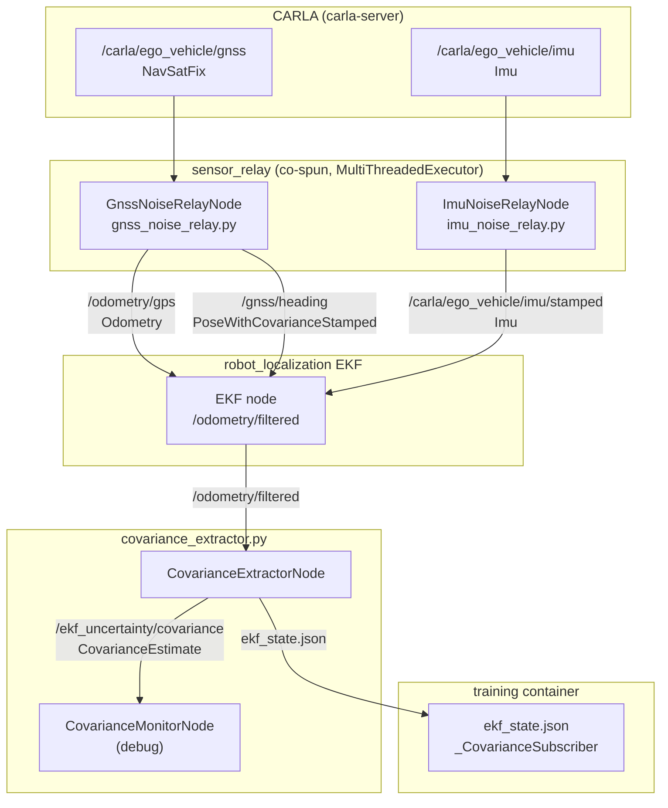

# ros2/

ROS 2 ament_python package bridging CARLA sensors to the `robot_localization` EKF and extracting localisation uncertainty for the RL agent.

## At a glance

- `GnssNoiseRelayNode` injects per-episode GNSS noise (with optional mid-episode Markov tier transitions loaded from `gnss_noise_profiles.yaml`) and projects lat/lon to metric Odometry via flat-earth (replaces `navsat_transform_node`); also derives a forward-only COG heading from successive noisy fixes
- `ImuNoiseRelayNode` stamps covariance on the CARLA IMU
- Both sensor relay nodes are co-spun in one process via `MultiThreadedExecutor`
- `CovarianceExtractorNode` extracts the $3 \times 3$ $[x, y, \psi]$ submatrix from the EKF's $6 \times 6$ covariance and writes `ekf_state.json` for the training container
- ROS 2 Jazzy (ros2-bridge container) communicates with ROS 2 Humble (training container) via DDS on `ROS_DOMAIN_ID=42`
- Node code lives in one place only: `uncertainty_rl_ros2/` (used by both colcon and Python imports)

## Package structure

| Path | Purpose |
|------|---------|
| `__init__.py` | Conditional re-export of `CovarianceExtractorNode`, `CovarianceMonitorNode` (graceful fallback without rclpy) |
| `package.xml` | ament_python manifest: rclpy, nav_msgs, uncertainty_rl_msgs, robot_localization, tf2_ros |
| `setup.py` / `setup.cfg` | Entry points: `covariance_extractor`, `covariance_monitor`, `sensor_relay` |
| `resource/uncertainty_rl_ros2` | Empty ament_index marker (required by ament) |
| `uncertainty_rl_msgs/` | Custom message package (ament_cmake): `CovarianceEstimate.msg` |
| `uncertainty_rl_ros2/` | Single source of truth for node code |
| `launch/carla_bridge.launch.py` | Simulation pipeline: CARLA bridge + static TFs + sensor relay + EKF + covariance extractor |
| `launch/real_vehicle.launch.py` | Real-vehicle pipeline: navsat_transform + EKF + covariance extractor (no sim nodes) |

## Internal data flow



## Nodes

| Node | File | Purpose |
|------|------|---------|
| `GnssNoiseRelayNode` | `sensor_relay/gnss_noise_relay.py` | Injects per-episode Gaussian noise on `/carla/ego_vehicle/gnss`; projects lat/lon to Odometry via flat-earth; derives COG heading |
| `ImuNoiseRelayNode` | `sensor_relay/imu_noise_relay.py` | Stamps noise covariance on the CARLA IMU; applies gyro/accel ZUPT |
| `CovarianceExtractorNode` | `covariance_extractor.py` | Subscribes to `/odometry/filtered`; extracts $[x, y, \psi]$ submatrix; writes `ekf_state.json`; publishes `CovarianceEstimate`; resets EKF via `/set_pose` at episode boundaries |
| `CovarianceMonitorNode` | `covariance_extractor.py` | Debug node: logs pose and uncertainty statistics from `CovarianceEstimate` |

## Topics

| Topic | Type | Direction | Node |
|-------|------|-----------|------|
| `/carla/ego_vehicle/gnss` | `NavSatFix` | in | `GnssNoiseRelayNode` |
| `/gnss/noisy` | `NavSatFix` | out | `GnssNoiseRelayNode` (diagnostics) |
| `/odometry/gps` | `Odometry` | out | `GnssNoiseRelayNode` -> EKF |
| `/gnss/heading` | `PoseWithCovarianceStamped` | out | `GnssNoiseRelayNode` -> EKF |
| `/carla/ego_vehicle/imu` | `Imu` | in | `ImuNoiseRelayNode` |
| `/carla/ego_vehicle/imu/stamped` | `Imu` | out | `ImuNoiseRelayNode` -> EKF |
| `/odometry/filtered` | `Odometry` | in | `CovarianceExtractorNode` |
| `/ekf_uncertainty/covariance` | `CovarianceEstimate` | out | `CovarianceExtractorNode` |

## `CovarianceEstimate.msg`

Custom message (`uncertainty_rl_msgs`). Published by `CovarianceExtractorNode`, consumed by `_CovarianceSubscriber` in the training container.

```
std_msgs/Header header
float64 x           # Position X (m, CARLA world frame)
float64 y           # Position Y (m, CARLA world frame)
float64 yaw         # Heading (rad, wrapped to [-pi, pi])
float64 vyaw        # Yaw rate (rad/s, body frame)
float64[9] covariance  # 3x3 [x, y, yaw] submatrix, row-major
```

Indices `[0, 1, 5]` of the EKF's $6 \times 6$ pose covariance select the $[x, y, \psi]$ submatrix. Field order is fixed - ROS 2 message serialisation depends on declaration order.

## EKF sensor fusion

**RTK-GNSS + IMU**, `two_d_mode: true`.

| EKF input | Source | Provides |
|-----------|--------|---------|
| `odom0: /odometry/gps` | `GnssNoiseRelayNode` flat-earth output | $x$, $y$ position correction |
| `pose0: /gnss/heading` | `GnssNoiseRelayNode` COG | $\psi$ yaw correction |
| `imu0: /carla/ego_vehicle/imu/stamped` | `ImuNoiseRelayNode` | $\dot\psi$ prediction |

EKF frequency: 20 Hz (matches CARLA simulation timestep).

## GNSS noise tier signalling

At each episode reset the training container writes `episode_config.json` to the shared volume (`/workspace/outputs/`):

```json
{
  "seq": 42,
  "tier_name": "rtk_float",
  "datum_lat": 0.0,
  "datum_lon": 0.0,
  "spawn_yaw": 1.5707963
}
```

`GnssNoiseRelayNode` polls this file on every GNSS callback (gated by `seq` and mtime), applies the noise tier, re-latches the datum, and seeds the COG heading. This allows per-episode RTK fix-state variation without restarting ROS 2 nodes.

## TF tree

```
ego_vehicle (root body frame)
  +-- ego_vehicle/gnss
  +-- ego_vehicle/imu
  +-- ego_vehicle/lidar
```

Static TF publishers are launched by `carla_bridge.launch.py`.

## QoS

`CovarianceExtractorNode` uses `RELIABLE` reliability for its subscription to `/odometry/filtered` and `BEST_EFFORT` for outputs to `robot_localization`.

## Configuration keys consumed

All ROS 2 parameters are loaded from `configs/ros2_config.yaml`:

| Key prefix | Controls |
|------------|---------|
| `ekf.*` | EKF frequency, `two_d_mode`, fusion matrix configs (`odom0_config`, `imu0_config`, `pose0_config`) |
| `gnss_noise_relay.*` | Input/output topics, `enable_gnss_noise`, `enable_markov_transitions`, `base_metric_stddev_m`, `cog_min_displacement_m`, `noise_profiles_path` (path to the YAML providing the per-step transition matrix), flat-earth datum |
| `imu_noise_relay.*` | IMU topic, `enable_imu_noise` (single master flag for covariance stamping, value noise, and per-episode bias), noise variances, ZUPT thresholds |
| `odom_topic` | Input odometry topic for `CovarianceExtractorNode` (default: `/odometry/filtered`) |
| `covariance_topic` | Output covariance topic (default: `/ekf_uncertainty/covariance`) |
| `publish_rate` | Covariance publish rate in Hz (default: 10) |

## Key interfaces

```python
# Available inside ROS 2 containers only (rclpy required)
from uncertainty_rl.ros2 import CovarianceExtractorNode, CovarianceMonitorNode

# Standalone run (inside ros2-bridge container)
ros2 run uncertainty_rl_ros2 covariance_extractor \
    --ros-args -p odom_topic:=/odometry/filtered

# Full simulation stack
make docker-up          # starts carla-server + ros2-bridge + training
make docker-logs-ros2   # follow ros2-bridge logs
make docker-shell-ros2  # interactive shell in ros2-bridge
```

## See also

- [uncertainty_rl/README.md](../README.md) - package overview
- [envs/README.md](../envs/README.md) - `_CovarianceSubscriber` that reads `ekf_state.json`
- [docs/detailed_notes/ros2_architecture.md](../../docs/detailed_notes/ros2_architecture.md) - pipeline design rationale
- [docs/detailed_notes/sensor_noise_models.md](../../docs/detailed_notes/sensor_noise_models.md) - GNSS and IMU noise model derivation
