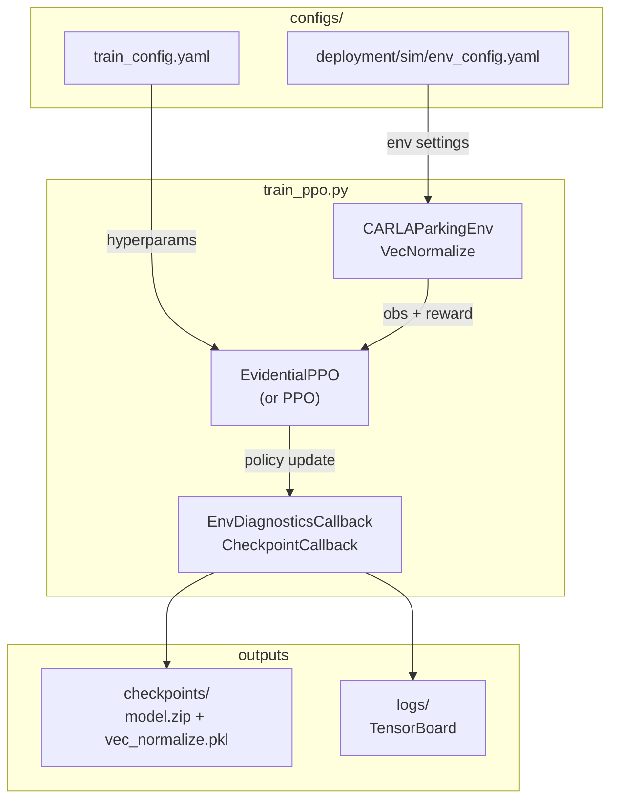
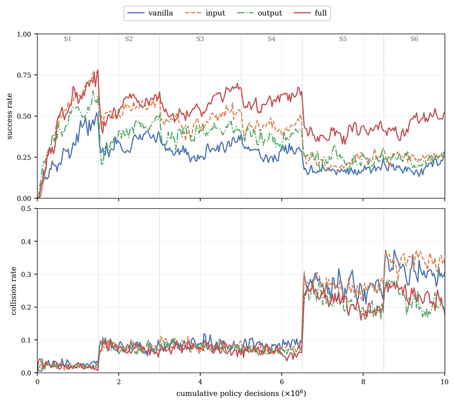

# training/

PPO training loop and Optuna hyperparameter tuning for the uncertainty-conditioned parking agent.

## At a glance

- `train_ppo.py` is config-driven: all hyperparameters come from [`configs/train_config.yaml`](../../configs/train_config.yaml).
- `policy_type: "evidential"` selects `EvidentialPPO` + `EvidentialActorCriticPolicy`, while `"standard"` selects `ScheduledEntCoefPPO` + `LayerNormActorCriticPolicy` (the baseline must match the evidential backbone for fair ablation).
- `VecNormalize` does REWARD normalisation only (`norm_obs=False`, `norm_reward=True`), which keeps the near-bimodal return, with its large terminals over dense shaping, in a range the critic can track. Observations are instead normalised by fixed physical ranges inside `build_observation`, as described in [envs/README.md](../envs/README.md#_parking_corepy-helpers).
- $\lambda_{\text{reg}}$ is linearly annealed from $0$ over the warmup window. The learning rate and entropy coefficient are linear decay schedules wired in `train_ppo.py`, restarted per curriculum stage from each stage's per-policy `standard_overrides` / `evidential_overrides` block (selected by `policy_type`, identical at init).
- Training follows the single-phase ADR curriculum (6 stages): each stage is selected with `make docker-train STAGE=N` and resumes from the previous stage's checkpoint via `CHECKPOINT=` (or `--resume-from`), carrying over weights and `VecNormalize` reward statistics. The GNSS degradation process is a fixed, stage-invariant Markov chain rather than a ramped axis, and the curriculum ramps bays + margin then obstacle occupancy.
- Runs are seeded from `seed` in `train_config.yaml` (the ablation sweeps seeds via `--seed`), and the training entry point restarts the run if the CARLA stack crashes mid-episode.
- Optuna TPE + MedianPruner study with the search space defined in [`configs/training/tuning_config.yaml`](../../configs/training/tuning_config.yaml).
- No evaluation environment during training - two CARLA clients on a synchronous server deadlock.

## Modules

| Module | Class / purpose |
|--------|----------------|
| `train_ppo.py` | `train()` - main training loop, config loading, VecNormalize, checkpointing, TensorBoard, resume |
| `tune_hyperparams.py` | `run_study()` - Optuna study, plus `sample_hyperparams()`, `objective()`, `TrialEvalCallback`, `apply_best_params()` and `main()` |
| `__init__.py` | Re-exports `train`, `load_config`, `load_env_config`, `merge_configs`, `TrainResult` |

## Internal data flow



## Configuration

All training hyperparameters are tuneable and live in
[`configs/train_config.yaml`](../../configs/train_config.yaml). Read that
file directly for the live values - it changes as the project iterates,
and the Optuna tuner writes back into it.

The structural choices that must stay stable across resumes
(`net_arch`, `activation`, `policy_type`, `include_covariance`,
`include_obstacle_obs`, action / observation dimensions) are documented
in the [curriculum stage README](../../configs/deployment/sim/curriculum/README.md).

## PPO objective

The clipped surrogate loss with value function and entropy terms:

```math
\mathcal{L}(\theta) = \mathbb{E}\!\left[
    \min\!\left(r_t(\theta)\hat{A}_t,\;
    \mathrm{clip}\!\left(r_t(\theta),\,1-\epsilon,\,1+\epsilon\right)\hat{A}_t\right)
    - c_1 \mathcal{L}_{\text{VF}} + c_2 \mathcal{H}[\pi_\theta]
\right]
```

where $r_t(\theta) = \pi_\theta(a_t | s_t) / \pi_{\theta_{\text{old}}}(a_t | s_t)$,
and $\epsilon$, $c_1$, $c_2$ come from `clip_range`, `vf_coef`, `ent_coef`
in the config. The entropy coefficient is a linear decay schedule, not a
constant. Training stops early in each epoch when the KL exceeds
`target_kl`.

## Evidential regularisation annealing

$\lambda_{\text{reg}}$ ramps linearly from $0$ to its configured target over the
warmup window to avoid destabilising early training:

```math
\lambda_{\text{reg}}(t) = \lambda_{\text{reg}} \cdot \min\!\left(1,\; \frac{t}{t_{\text{warmup}}}\right)
```

$\lambda_{\text{evidence}}$ follows the same ramp over its own warmup window, while
$\lambda_{\nu}$ is not annealed. Both are `0.0` in the shipped configuration.

The loss these coefficients weight, and the full set of terms, are given in
[networks/README.md](../networks/README.md#evidential-regularisation).

## Policy type switching

| `policy_type` | Agent | Policy | Observation routed to actor |
|---------------|-------|--------|------------------------------|
| `"evidential"` | `EvidentialPPO` | `EvidentialActorCriticPolicy` | Full observation, with the covariance entering as ordinary observation dimensions |
| `"standard"` | `ScheduledEntCoefPPO` | `LayerNormActorCriticPolicy` | Full obs |

`include_covariance` and `include_obstacle_obs` flags (set per baseline) control
observation dimensionality. The active dimension is derived from the structural
constants in [`uncertainty_rl/utils/constants.py`](../utils/constants.py). Use
`compute_obs_dim()` rather than hardcoding.

## Key interfaces

```python
from uncertainty_rl.training import (
    train, load_config, load_env_config, merge_configs, TrainResult,
)

cfg = merge_configs(
    load_config("configs/train_config.yaml"),
    load_env_config("configs/deployment/sim/env_config.yaml"),
)
result: TrainResult = train(cfg)
# result.model_path, result.log_dir, result.final_metrics
```

Training via Make:

```bash
make docker-train STAGE=1 BASELINE=full_method                       # curriculum head (random init)
make docker-train STAGE=2 BASELINE=full_method CHECKPOINT=seed42_11062026-0628  # resume next stage (bare leaf name)
make docker-train-short                                              # short smoke-test
make docker-tune                                                    # Optuna hyperparameter search
```

## Hyperparameter tuning (Optuna)

TPE sampler + MedianPruner study. The full study configuration and search-space
bounds live in [`configs/training/tuning_config.yaml`](../../configs/training/tuning_config.yaml).

Trials are scored by `_composite_objective()`, which returns `env/success_rate` when it
is non-zero and otherwise falls back to a scaled `env/mean_progress_reward` tiebreaker,
so trials that never park remain comparable. The scale is small enough that any non-zero
success rate dominates the fallback. Both metrics come from `EnvDiagnosticsCallback`. After the study completes, `apply_best_params()` writes the
winning values back to `configs/train_config.yaml` and creates a timestamped
backup in `logs/tuning/backups/`. To resume a paused study, just re-run
`make docker-tune` - SQLite persists the trial history.

## Ablation study

The 2 by 2 ablation runs `train_ppo.py` once per baseline config. Each file in
[`configs/baselines/`](../../configs/baselines/) overrides only the keys that
differ from `train_config.yaml`:

| Baseline | `policy_type` | `include_covariance` |
|----------|--------------|----------------------|
| `vanilla_ppo` | `standard` | `false` |
| `input_uncertainty` | `standard` | `true` |
| `output_uncertainty` | `evidential` | `false` |
| `full_method` | `evidential` | `true` |

All four baselines share identical PPO hyperparameters from `train_config.yaml`.
Active observation dimensions are derived at runtime.

## Configuration keys consumed

| Config file | Keys |
|-------------|------|
| [`configs/train_config.yaml`](../../configs/train_config.yaml) | All PPO hyperparameters, `net_arch`, `activation`, `evidential.*`, `policy_type`, `total_timesteps`, `seed`, `checkpoint_freq` |
| [`configs/deployment/sim/env_config.yaml`](../../configs/deployment/sim/env_config.yaml) | `carla_host`, `carla_port`, `max_steps`, `include_covariance`, `include_obstacle_obs`, `carla_sensors.*`, `parking_scenarios.*` |
| [`configs/training/tuning_config.yaml`](../../configs/training/tuning_config.yaml) | `study_name`, `n_trials`, `timesteps_per_trial`, `seed`, search-space bounds |
| [`uncertainty_rl/utils/constants.py`](../utils/constants.py) | `TOTAL_OBS_DIM`, `ACTION_DIM`, `VEHICLE_STATE_DIM`, `COVARIANCE_FEATURES_DIM` |

## Training curves

Success and collision rate for all four arms across the six curriculum stages, with the
stage boundaries marked. `full_method` holds a clear success margin from stage 1 onward,
and the step changes at each boundary are the difficulty ramping, not instability.

<p align="center">
  
</p>

The two panels are the only tags exported by `METRIC_TAGS` in
`scripts/analysis/tb_curves.py`. Episode reward and the evidential uncertainty scalars are
logged to TensorBoard during training (see the metrics table above) but are not part of this
figure. Add them to `METRIC_TAGS` and `_PANELS` if they are wanted.

To regenerate - the first command exports the scalars from the TensorBoard event files to
CSV, the second draws them:

```bash
make training-curves
make figures FIG=training_curves
cp outputs/main_analysis/figures/training_curves.png docs/media/training_curves.png
```

## See also

- [uncertainty_rl/README.md](../README.md) - package overview
- [networks/README.md](../networks/README.md) - EvidentialPPO and EvidentialActorCriticPolicy
- [evaluation/README.md](../evaluation/README.md) - evaluation after training completes
- [docs/detailed_notes/training/hyperparameter_search.md](../../docs/detailed_notes/training/hyperparameter_search.md) - search space design rationale
- [docs/detailed_notes/networks/evidential_nig_initialisation.md](../../docs/detailed_notes/networks/evidential_nig_initialisation.md) - NIG init and regularisation derivation
